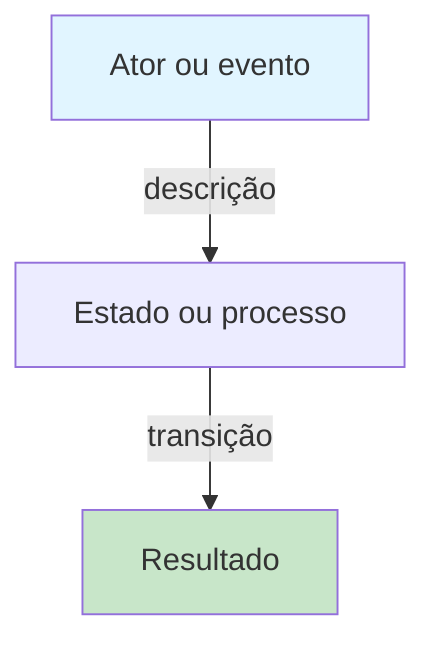

# <!-- título igual a "titulo" do front matter -->

## Contexto

<!-- Por que esse conceito existe no projeto? Qual problema resolve? Quais são os atores envolvidos? -->

## Como funciona

<!-- Descrição passo a passo ou conceitual. Se complexo, adicione diagrama Mermaid abaixo. -->

<!-- Diagrama opcional: escolha um tipo apropriado e limite a ~15 nós. Sempre um parágrafo antes explicando o que mostra. -->

<!--
O diagrama abaixo mostra como o fluxo acontece. (REMOVA ESTE COMENTÁRIO E DESCOMENTE O MERMAID SE HOUVER):

-->

## Por que é assim

<!-- Links para as ADRs que fundamentam essa decisão. Explique os trade-offs. -->

## Limitações e trade-offs

<!-- O que esse projeto _não_ faz bem? Quais alternativas foram descartadas e por quê? -->

## Veja também

<!-- Links para documentos relacionados, guias que usam este conceito, ou conceitos dependentes. -->
