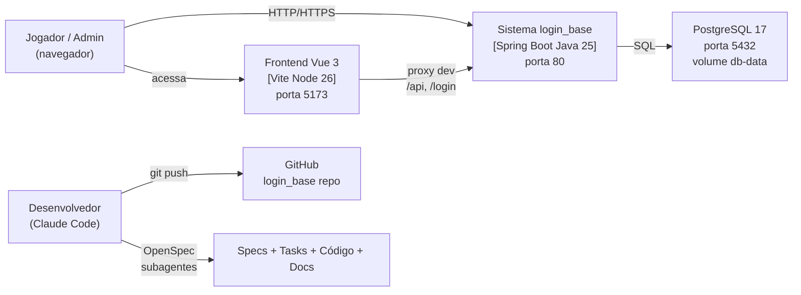

# Visão do Produto

| Campo | Valor |
|---|---|
| Versão | 1.0.0 |
| Data | 2026-09-27 |
| Status | Vigente — baseline do commit `454ae58` |
| Modelo/norma | Vision & Scope (Wiegers) + ISO/IEC/IEEE 29148 (StRS) |
| Público | Todos, stakeholders |
| Fontes | README.md; CLAUDE.md; 6 proposals e designs OpenSpec; pom.xml; docker-compose.yml; frontend/package.json |

> Parte da [documentação do login_base](README.md). Visão e objetivos do sistema; stakeholders; escopo de produto.

---

## 1. Contexto e problema

O **login_base** começou como uma aplicação de referência para **autenticação de usuários** com Spring Boot 4 e PostgreSQL. Desde a criação (2026-09-23), evoluiu em 6 changes sequenciais, passando por infraestrutura Docker em profile, interface Vue 3 moderna, e agora integra um **sistema completo de jogo: construtor de cidades tático** com gerenciamento de recursos, construção de prédios, forja de itens, treino de tropas e combate em masmorras.

O projeto serve como **foundation didática e de referência** para:
- Padrão de evolução incremental com OpenSpec (spec-driven development);
- Orquestração por subagentes (Opus para arquitetura, Sonnet para código, Haiku para documentação);
- Demonstração de boas práticas em segurança, testes, versionamento de dados e gerenciamento de estado em aplicações web modernas.

## 2. Declaração de visão

Construir um **jogo de estratégia e construção de cidades baseado na web**, autenticado e persistido em banco de dados, que demonstre a evolução de uma aplicação Spring Boot/Vue 3 sob spec-driven development com orquestração de subagentes, servindo simultaneamente como **jogo funcional** e **referência de padrões de desenvolvimento**.

## 3. Stakeholders e personas

| Persona | Descrição | Necessidades principais |
|---|---|---|
| **Jogador** | Usuário autenticado com perfil vigente. Acessa via navegador web. | Jogar (construir vila, forjar itens, treinar tropas, combate em masmorras); interface responsiva; mecânicas claras; progressão visível |
| **Administrador do sistema** | Criado na primeira inicialização por variáveis de ambiente; usuário especial com perfil `ADMIN`. | Gerenciar usuários (futura); auditar ações; resetar dados |
| **Desenvolvedor** | Codifica com Claude Code; segue OpenSpec; executa subagentes. | Estrutura clara de código; specs detalhadas; ambiente reproduzível (Docker); testes passando |
| **Revisor/Arquiteto** | Valida decisões, documentação, aderência a requisitos. | Rastreabilidade; cobertura de testes; ADRs; consistência entre código e spec |

## 4. Objetivos de negócio/produto

| Objetivo | Origem | Status |
|---|---|---|
| Demonstrar autenticação segura com Spring Security | change `add-user-authentication` | Implementado |
| Fornecer infraestrutura reproduzível com Docker + Makefile | changes `add-docker-compose-profiles`, `add-vue-frontend` | Implementado |
| Interface moderna em Vue 3 + PrimeVue | change `add-vue-frontend` | Implementado |
| Orquestração de desenvolvimento por subagentes | change `add-subagent-dev-skill` | Implementado |
| Sistema de jogo completo: economia, construção, combate | change `add-city-builder-game` | Implementado (arquivado em 2026-09-27) |

## 5. Escopo da versão atual (baseline 454ae58)

### Funcionalidades por capability

| Capability | Status | Descrição |
|---|---|---|
| `access-control-data` | Vigente | Tabelas `usuarios`, `perfis`, `permissoes`, `usuario_rel_perfis`, `perfis_rel_permissoes`, `sessoes` com auditoria |
| `user-authentication` | Vigente + delta | Login por e-mail ou celular + senha; sessão HTTP; logout; admin inicial; proteção de rotas; CSRF para form e SPA |
| `docker-dev-environment` | Vigente | Profiles por serviço (`db`, `app`, `frontend`); Makefile; variáveis de ambiente; Compose com porta 5432/80/5173 |
| `frontend-app` | Vigente + delta | Projeto Vue 3 + PrimeVue 5; licença PrimeUI; container Node 26/npm 12; recarga automática; página inicial do jogo; proxy dev; history mode (telas e polling de 5 s ficam em `game-frontend`) |
| `subagent-dev-workflow` | Vigente | Orquestração por Opus/Sonnet/Haiku; sessão limpa; relatório de tokens; parallelismo |
| `game-data` | Delta | 8 tabelas do jogo (vilas, prédios, canteiros, sementes, itens, unidades, ordens, batalhas); constraints; auditoria |
| `game-village` | Delta | Criação automática de vila (estado inicial); sincronização lazy de produção; isolamento por usuário; catálogo de regras |
| `game-buildings` | Delta | 8 tipos de prédio (níveis 1–5); custos/tempos; efeitos (limite, produção, canteiros); validação de pré-requisitos |
| `game-farming` | Delta | Canteiros (nº = nível fazenda, máx. 5); 4 cultivos (trigo/milho/batata/abóbora); sementes; produção escalonada |
| `game-forge` | Delta | 5 modelos de item (espada, lança, arco, armaduras); níveis 1–5; atributos derivados; fila de 1 ordem |
| `game-army` | Delta | 3 tipos de tropa (soldado, arqueiro, lanceiro); liberação por nível; atributos derivados; capacidade escalonada; treino |
| `game-dungeon-combat` | Delta | Masmorras 1–5; mapa 8×8; 4 inimigos (goblin/esqueleto/orc/troll); combate tático por turnos; IA; 30 turnos máx.; vitória/derrota |
| `game-dungeon-loot` | Delta | Recursos garantidos por nível; rolagens de sementes/materiais/itens; distribuição por chance; liberação de níveis |
| `game-frontend` | Delta | 6 rotas interativas; painel de recursos; cards de prédios; canteiros; forja; quartel; masmorras; batalha com grade; Toast de erros |

Nomenclatura:
- **Vigente**: spec sincronizada em `openspec/specs/`.
- **Delta**: spec + requisitos adicionados/modificados em `openspec/changes/archive/2026-09-27-add-city-builder-game/specs/` (change Concluída (arquivada em 2026-09-27)).

## 6. Fora de escopo (Non-Goals)

Os seguintes itens foram explicitamente **excluídos** da versão atual e estão registrados em roadmap (`17-riscos-divida-roadmap.md`):

- **Cadastro e gestão de usuários**: apenas admin criado por variável de ambiente; sem CRUD.
- **Recuperação de senha**: não implementada; fora do escopo.
- **Autenticação multifator (MFA)**: não priorizado.
- **Bloqueio por tentativas de login**: sem rate limiting.
- **JWT / CORS**: autenticação por sessão HTTP stateful; CORS não necessário (mesma origem via proxy).
- **Cancelamento de ordens**: ordens são imutáveis após criação.
- **Colheita manual**: produção semanal sincroniza automaticamente ao consultar a vila.
- **Crítico / Esquiva**: combate determinístico, sem RNG além de loot.
- **Mapas procedurais**: masmorras com layouts fixos por nível.
- **Login em Vue**: página de login permanece em Thymeleaf (rotas `/login`, POST `/login`, `/logout`).
- **Testcontainers**: testes contra Postgres do Docker Compose (não containerizado dinamicamente).
- **OpenAPI / Swagger**: API documentada em Markdown (`06-api-rest.md`); sem geração automática.
- **Upkeep / Decaimento**: sem desgaste de recursos ou perda de prédios por inatividade.
- **Licença PrimeUI**: comunidade gratuita (requer renovação anual); sem suporte comercial.

## 7. Premissas e restrições

### Premissas

- Ambiente de desenvolvimento local (**WSL2** com Docker Desktop).
- Projeto armazenado no drive Windows (**`D:\desenvolvimento\projetos\login_base`**); Docker executa sempre no WSL.
- **Usuário único** criado ao iniciar (admin); sem multitenancy de usuários finais.
- Navegador moderno com suporte a **ES2020, WebSockets/polling** (Chrome/Firefox/Edge recentes).
- Plataforma de deployment não definida (desenvolvimento local apenas).

### Restrições técnicas

| Aspecto | Restrição |
|---|---|
| **Backend** | Java 25; Spring Boot 4.1.1; Security 7.1.1; Data JPA + Hibernate 7; Postgres 17 |
| **Frontend** | Vue 3.5; TypeScript 6; Vite 8; PrimeVue 5 (tema Aura); Node 26/npm 12 (em container) |
| **Banco de dados** | PostgreSQL 17; Flyway para migrações; `ddl-auto=validate` (sem auto-schema) |
| **Infraestrutura** | Docker Compose com profiles; Makefile; sem Kubernetes; sem CI/CD |
| **Idioma** | Português do Brasil (UI, mensagens, documentação) |
| **Segurança** | HTTPS configurável (HTTP em dev); cookies `HttpOnly`/`SameSite=Lax`; CSRF habilitado; BCrypt para senhas |

### Restrições organizacionais

- Desenvolvimento guiado por **OpenSpec** (spec-driven); cada change tem proposal, design, specs, tasks.
- Orquestração por **subagentes** (Claude): Opus (arquitetura), Sonnet (código), Haiku (docs).
- Commits com atribuição `Co-Authored-By: Claude <model> <noreply@anthropic.com>`.
- **Documentação viva** em `docs/`: mantida junto com cada change (docs-as-code).

## 8. Visão geral da solução

**Arquitetura em camadas:**
- **Apresentação**: Thymeleaf (login) + SPA Vue 3 (jogo).
- **API REST**: controllers em `jogo.api` + controllers web para autenticação.
- **Negócio**: serviços por domínio (`economia`, `construcao`, `fazenda`, `forja`, `quartel`, `masmorra`).
- **Dados**: entidades JPA + repositórios com lock pessimista; Flyway + Postgres.
- **Infraestrutura**: Docker Compose, Makefile, variáveis de ambiente.

Detalhes em [Arquitetura (04-arquitetura.md)](04-arquitetura.md).

## 9. Indicadores / Critério de sucesso

| Indicador | Critério | Status atual |
|---|---|---|
| **Testes automatizados** | Todos passando; 0 falhas; 0 erros | 239 testes, 27 classes, 0 falhas (2026-09-26) |
| **Validação de spec** | `openspec validate --strict` sem erros | Não registrado nas changes |
| **Cenário manual E2E** | Executar task 8.2 com `JOGO_VELOCIDADE=60` sem erros | Sim (corrigido em D-10) |
| **Cobertura de código** | Todos os RF verificáveis por teste automatizado ou inspeção | 101 RF cobertos (matriz em `15-rastreabilidade.md`) |
| **Build do frontend** | `npm run build` sem warnings | Não registrado nas changes |
| **Ambiente reproduzível** | `make up` sobe os serviços dos profiles ativos (padrão: `db` e `frontend`; `app` fica `desativado`) sem erros | Sim |

---

## Histórico de revisões

| Versão | Data | Descrição | Autor |
|---|---|---|---|
| 1.0.0 | 2026-09-27 | Versão inicial | Adiel, com apoio de agentes Claude |
