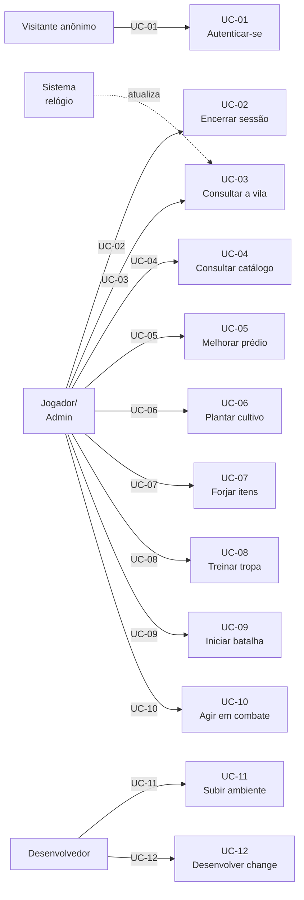

# Casos de Uso e Histórias de Usuário

| Campo | Valor |
|---|---|
| Versão | 1.0.0 |
| Data | 2026-09-27 |
| Status | Vigente — baseline do commit `454ae58` |
| Modelo/norma | Casos de Uso (Cockburn, formato casual/completo) + Histórias INVEST com critérios Gherkin |
| Público | QA, PO, desenvolvedores |
| Fontes | Specs OpenSpec (16); design do jogo; templates Thymeleaf; views Vue 3 (6) |

> Parte da [documentação do login_base](README.md). Especificação de casos de uso e histórias de usuário do sistema.

---

## 1. Atores

| Ator | Tipo | Descrição |
|---|---|---|
| **Jogador** | Principal | Usuário autenticado com perfil vigente. Acessa via navegador; interage com jogo (construção, combate). |
| **Visitante anônimo** | Principal | Usuário não autenticado. Acessa página de login. |
| **Administrador inicial** | Principal | Criado via variável `ADMIN_EMAIL`/`ADMIN_PASSWORD` na inicialização. Acesso idêntico ao Jogador (sem gestão de usuários no escopo). |
| **Desenvolvedor** | Secundário | Usa Claude Code para clonar, configurar, executar OpenSpec, codificar. Interage com repositório, Docker, Make, git. |
| **Sistema (relógio)** | Secundário | Sincroniza produção em background (sob demanda ao consultar vila); conclui ordens vencidas. |

---

## 2. Diagrama de casos de uso



---

## 3. Especificação de casos de uso

### UC-01: Autenticar-se

**Objetivo**: Visitante anônimo obtém acesso autenticado ao sistema.

**Ator primário**: Visitante anônimo  
**Ator secundário**: Sistema (validação)

**Pré-condições**:
- Usuário criado no banco com e-mail ou celular, senha BCrypt, perfil vigente.
- Sessão HTTP não existe ou expirou.

**Gatilho**: Visitante acessa `http://localhost:5173` (ou backend na porta 80) sem autenticação.

**Fluxo principal**:
1. Sistema exibe formulário de login (Thymeleaf `/login`).
2. Visitante insere e-mail ou celular no campo `login`.
3. Visitante insere senha no campo `senha`.
4. Visitante submete formulário (POST `/login` com `_csrf` do form).
5. Sistema valida credenciais:
   - Normaliza e-mail (minúsculas) ou celular (só dígitos).
   - Busca usuário por e-mail ou celular.
   - Compara senha com BCrypt.
   - Verifica perfil vigente (data_inicial ≤ hoje ≤ data_final).
6. Se válidas: cria sessão HTTP, registra em `sessoes` (IP, User-Agent), troca ID da sessão, redirect para `/` (ou SPA `/api/jogo/vila`).
7. Se inválidas: exibe mensagem "Usuário ou senha inválidos." e volta a `/login?error`.

**Fluxos alternativos**:
- A.1 (Usuário não existe): idem falha (mensagem genérica).
- A.2 (Senha incorreta): idem falha.
- A.3 (Conta sem perfil vigente): idem falha.
- A.4 (Sessão ativa): redirect direto para `/`.

**Pós-condições**:
- Sessão HTTP ativa (cookie `JSESSIONID` + `XSRF-TOKEN`).
- IP e User-Agent registrados em `sessoes`.

**Requisitos relacionados**: RF-AUT-001, RF-AUT-002, RF-AUT-003, RF-AUT-007, RF-AUT-008, RF-ACD-003, RNF-SEG-001, RNF-SEG-004, RNF-SEG-005, RNF-AUD-001.

**Tela/Endpoint**: Thymeleaf `/login` (GET); POST `/login` com fields `login`, `senha`, `_csrf`.

---

### UC-02: Encerrar sessão

**Objetivo**: Jogador encerra sua sessão.

**Ator primário**: Jogador  
**Ator secundário**: Sistema

**Pré-condições**:
- Sessão HTTP ativa.

**Gatilho**: Jogador clica em "Sair" no menu da SPA (ou acessa `POST /logout`).

**Fluxo principal**:
1. SPA submete um formulário POST `/logout` com o campo oculto `_csrf` (valor lido do cookie `XSRF-TOKEN`).
2. Sistema invalida sessão: remove cookie, fecha registro em `sessoes` (set `data_fim = agora`).
3. Redirect para `/login?logout`.
4. Sistema exibe mensagem "Você saiu do sistema."

**Fluxos alternativos**:
- A.1 (Sessão expirada): 302 `/login` automaticamente no próximo request.

**Pós-condições**:
- Cookie `JSESSIONID` expirado (ou deletado).
- Novo request anônimo recebe 401 em `/api/**`.

**Requisitos relacionados**: RF-AUT-006, RNF-SEG-002, RNF-SEG-004.

**Tela/Endpoint**: Menu SPA → "Sair"; POST `/logout` (formulário com `_csrf`).

---

### UC-03: Consultar a vila

**Objetivo**: Jogador visualiza estado atual de sua vila (recursos, prédios, ordens, batalha ativa).

**Ator primário**: Jogador  
**Ator secundário**: Sistema (sincronização)

**Pré-condições**:
- Jogador autenticado.
- Vila do jogador existe no banco (criada no 1º acesso).

**Gatilho**: Jogador acessa SPA rota `/` ou clica em "Vila" no menu.

**Fluxo principal**:
1. Frontend emite GET `/api/jogo/vila`.
2. Sistema sincroniza: conclui ordens vencidas (se houver), atualiza produção sob demanda.
3. Sistema retorna 200 com `VilaDto`: `{ agora, nome, recursos { comida, madeira, pedra, ferro }, capacidade, producaoPorHora, masmorraNivelLiberado, batalhaAtivaId, predios [], canteiros [], sementes, itens, unidades, capacidadeExercito, ordens [] }`.
4. Frontend renderiza painel de recursos, cards de prédios (com custo próx. nível), fila com contagem regressiva, canteiros.

**Fluxos alternativos**:
- A.1 (1º acesso): vila criada automaticamente com estado inicial; retorna vila vazia.
- A.2 (Recurso de outro usuário): 404 `NAO_ENCONTRADO`.
- A.3 (Anônimo): 401 sem corpo.

**Pós-condições**:
- Frontend sincronizado com estado atual do backend.

**Requisitos relacionados**: RF-VIL-001, RF-VIL-002, RF-VIL-003, RF-VIL-004, RF-VIL-005, RF-VIL-007, RNF-SEG-006, RNF-DES-001.

**Tela/Endpoint**: SPA rota `/` (VilaView.vue); GET `/api/jogo/vila`.

---

### UC-04: Consultar catálogo de regras

**Objetivo**: Jogador consulta tabelas estáticas (custos, cultivos, tropas, masmorras) para planejar estratégia.

**Ator primário**: Jogador  
**Ator secundário**: Sistema

**Pré-condições**:
- Jogador autenticado.

**Gatilho**: Jogador acessa SPA (componente `PainelRecursos` ou função `getCatalogo()` na composable `useVila`).

**Fluxo principal**:
1. Frontend emite GET `/api/jogo/catalogo`.
2. Sistema retorna 200 com `CatalogoDto`: prédios (custos/tempos/efeitos), cultivos (produção), itens (atributos/receitas), tropas (atributos/custo), masmorras (layout/inimigos).
3. Frontend usa dados para calcular custo-benefício (ex.: "próximo nível de ARMAZEM custa...").

**Fluxos alternativos**:
- A.1 (Anônimo): 401.

**Pós-condições**:
- Catálogo em cache no frontend (composable).

**Requisitos relacionados**: RF-VIL-008, RNF-DES-001.

**Tela/Endpoint**: GET `/api/jogo/catalogo`; consumido por composable `useVila.ts`.

---

### UC-05: Melhorar prédio

**Objetivo**: Jogador melhora um prédio para aumentar capacidade/produção/liberação.

**Ator primário**: Jogador  
**Ator secundário**: Sistema

**Pré-condições**:
- Jogador autenticado, vila existe.
- Prédio existe, nível < 5.
- Recursos suficientes (após sincronização).
- Nenhuma ordem de construção ativa.

**Gatilho**: Jogador clica botão "Melhorar" em card de prédio.

**Fluxo principal**:
1. Frontend exibe custo + tempo estimado (do catálogo × velocidade).
2. Jogador confirma.
3. Frontend emite POST `/api/jogo/predios/{tipo}/melhorar` sem corpo (tipo ∈ enums).
4. Sistema valida:
   - Prédio existe.
   - Nível < 5 (erro: `NIVEL_MAXIMO`).
   - Nível-alvo ≤ nível do CENTRO_VILA, exceto para o próprio centro (erro: `REQUISITO_NAO_ATENDIDO`).
   - Pré-requisitos: FORJA requer MINA_FERRO ≥1; QUARTEL requer FORJA ≥1 (erro: `REQUISITO_NAO_ATENDIDO`).
   - Nenhuma ordem `CONSTRUCAO` ativa (erro: `FILA_OCUPADA`).
   - Recursos (erro: `RECURSOS_INSUFICIENTES`).
5. Sistema debita recursos (transação), cria `Ordem` com tipo `CONSTRUCAO`, `data_conclusao = agora + tempo`.
6. Retorna 200 `VilaDto` atualizada.
7. Frontend atualiza UI: custo desaparecido, fila com contagem regressiva.

**Fluxos alternativos**:
- A.1 (Validação falha): 422 com código de erro.
- A.2 (Requisição concorrente da mesma vila): aguarda o lock pessimista e é validada depois; a segunda melhoria recebe 422 `FILA_OCUPADA`.

**Pós-condições**:
- Ordem criada e armazenada.
- Recursos debitados.
- Prédio efetuado ao concluir ordem.

**Requisitos relacionados**: RF-PRD-003, RF-PRD-004, RF-PRD-005, RF-PRD-006, RF-PRD-007, RF-VIL-003, RF-VIL-009, RF-VIL-010, RNF-CON-001, RNF-USA-001.

**Tela/Endpoint**: VilaView.vue, CartaoPredio.vue; POST `/api/jogo/predios/{tipo}/melhorar`.

---

### UC-06: Plantar cultivo

**Objetivo**: Jogador planta cultivo em canteiro para obter comida.

**Ator primário**: Jogador  
**Ator secundário**: Sistema

**Pré-condições**:
- Jogador autenticado, vila existe.
- Canteiro existe (posição 1–5, ≤ nível fazenda).
- Sementes disponíveis (se cultivo ≠ TRIGO).
- Cultivo permitido por nível masmorra liberado.

**Gatilho**: Jogador clica "Plantar" em canteiro na tela Fazenda.

**Fluxo principal**:
1. Frontend exibe seletor de cultivo (TRIGO/MILHO/BATATA/ABOBORA conforme nível liberado).
2. Jogador seleciona cultivo, clica "Plantar".
3. Frontend emite POST `/api/jogo/canteiros/{posicao}/plantar` com body `{ "cultivo": "MILHO" }`.
4. Sistema valida:
   - Canteiro existe (erro: `CANTEIRO_INEXISTENTE`).
   - Cultivo válido e permitido por masmorra (erro: `REQUISITO_NAO_ATENDIDO`).
   - Se cultivo ≠ TRIGO: semente disponível (erro: `SEMENTE_INDISPONIVEL`).
5. Sistema consome 1 semente (se necessário), atualiza canteiro (cultivo, `data_plantio = agora`).
6. Retorna 200 `VilaDto`.
7. Frontend atualiza UI: seletor desaparecido, canteiro mostra cultivo + produção/hora.

**Fluxos alternativos**:
- A.1 (Cultivo já plantado): sobrescreve e preserva produção acumulada.
- A.2 (Validação falha): 422.

**Pós-condições**:
- Canteiro com cultivo ativo.
- Semente consumida (se houver).

**Requisitos relacionados**: RF-FAZ-001, RF-FAZ-002, RF-FAZ-003, RF-FAZ-004, RNF-USA-001.

**Tela/Endpoint**: FazendaView.vue; POST `/api/jogo/canteiros/{posicao}/plantar`.

---

### UC-07: Forjar itens

**Objetivo**: Jogador forja armas/armaduras para equipar tropas.

**Ator primário**: Jogador  
**Ator secundário**: Sistema

**Pré-condições**:
- Jogador autenticado, vila existe.
- Forja criada (nivel ≥0).
- Recursos suficientes.
- Nenhuma ordem `FORJA` ativa.

**Gatilho**: Jogador acessa tela Forja, seleciona modelo/nível/quantidade.

**Fluxo principal**:
1. Frontend exibe seletores: modelo (ESPADA/LANCA/ARCO/ARMADURA_COURO/ARMADURA_FERRO), nível (1–5, max = nível forja), quantidade (1–5).
2. Jogador seleciona, clica "Forjar".
3. Frontend calcula custo (via catálogo × quantidade × nível), exibe tempo estimado.
4. Frontend emite POST `/api/jogo/forja/ordens` com body `{ "modelo": "ESPADA", "nivel": 2, "quantidade": 1 }`.
5. Sistema valida:
   - Modelo, nível, quantidade válidos (erro: `REQUISICAO_INVALIDA`).
   - Nível ≤ nível forja (erro: `REQUISITO_NAO_ATENDIDO`).
   - Nenhuma ordem `FORJA` ativa (erro: `FILA_OCUPADA`).
   - Recursos (erro: `RECURSOS_INSUFICIENTES`).
6. Sistema debita, cria ordem `FORJA`, data_conclusao = agora + tempo.
7. Retorna 200 `VilaDto`.
8. Frontend atualiza fila com contagem regressiva.

**Fluxos alternativos**:
- A.1 (Validação falha): 422.
- A.2 (Ordem conclui antes do próximo POST): item armazenado, fila vazia, próxima ordem possível.

**Pós-condições**:
- Ordem criada.
- Recursos debitados.
- Item criado ao concluir ordem com status `DISPONIVEL`.

**Requisitos relacionados**: RF-FOR-001, RF-FOR-002, RF-FOR-003, RF-FOR-004, RF-FOR-005, RF-FOR-006, RNF-USA-001.

**Tela/Endpoint**: ForjaView.vue; POST `/api/jogo/forja/ordens`.

---

### UC-08: Treinar tropa

**Objetivo**: Jogador treina tropas para formar exército.

**Ator primário**: Jogador  
**Ator secundário**: Sistema

**Pré-condições**:
- Jogador autenticado, vila existe.
- Quartel criado (nível ≥ 1 para SOLDADO, ≥2 para ARQUEIRO, ≥3 para LANCEIRO).
- Arma e armadura disponíveis (status `DISPONIVEL`).
- Recursos suficientes.
- Nenhuma ordem `TREINO` ativa.
- Capacidade do exército < máxima.

**Gatilho**: Jogador acessa tela Quartel, seleciona tipo/arma/armadura.

**Fluxo principal**:
1. Frontend exibe seletores: tipo (SOLDADO/ARQUEIRO/LANCEIRO, habilitados conforme nível), arma (lista itens com tipo apropriado), armadura (idem).
2. Jogador seleciona, clica "Treinar".
3. Frontend calcula custo (comida do tipo), exibe tempo.
4. Frontend emite POST `/api/jogo/quartel/ordens` com body `{ "tipo": "SOLDADO", "armaId": 1, "armaduraId": 2 }`.
5. Sistema valida:
   - Tipo válido e liberado por quartel (erro: `REQUISITO_NAO_ATENDIDO`).
   - Arma e armadura existem, não reservadas (erro: `ITEM_INDISPONIVEL`).
   - Nenhuma ordem `TREINO` (erro: `FILA_OCUPADA`).
   - Capacidade < máx (erro: `CAPACIDADE_EXERCITO`).
   - Recursos (erro: `RECURSOS_INSUFICIENTES`).
6. Sistema marca itens `RESERVADO`, debita, cria ordem `TREINO`.
7. Retorna 200 `VilaDto`.
8. Frontend atualiza fila.

**Fluxos alternativos**:
- A.1 (Ordem conclui): item alterado para `EQUIPADO`, tropa adicionada ao exército, capacidade verificada.

**Pós-condições**:
- Ordem criada, itens reservados.
- Tropa criada ao concluir ordem.

**Requisitos relacionados**: RF-EXE-001, RF-EXE-002, RF-EXE-003, RF-EXE-004, RF-EXE-005, RF-EXE-006, RNF-USA-001.

**Tela/Endpoint**: QuartelView.vue; POST `/api/jogo/quartel/ordens`.

---

### UC-09: Iniciar batalha em masmorra

**Objetivo**: Jogador seleciona até 4 tropas e inicia combate em masmorra.

**Ator primário**: Jogador  
**Ator secundário**: Sistema

**Pré-condições**:
- Jogador autenticado, vila existe.
- Masmorra nível liberado.
- Até 4 unidades disponíveis (status `DISPONIVEL`).
- Nenhuma batalha ativa (`status = EM_ANDAMENTO`).

**Gatilho**: Jogador acessa tela Masmorras, seleciona nível (liberado), clica "Entrar".

**Fluxo principal**:
1. Frontend exibe seletor de unidades (checkboxes, máx. 4).
2. Jogador seleciona unidades (ex.: IDs 3, 4, 5, 6).
3. Frontend emite POST `/api/jogo/masmorras/{nivel}/batalhas` com body `{ "unidadeIds": [3, 4, 5, 6] }` (retorna `201`).
4. Sistema valida:
   - Nível liberado (erro: `MASMORRA_BLOQUEADA`).
   - Até 4 IDs, válidos, status `DISPONIVEL` (erro: `UNIDADE_INDISPONIVEL` ou `ESQUADRAO_INVALIDO`).
   - Nenhuma batalha ativa (erro: `BATALHA_EM_ANDAMENTO`).
5. Sistema cria `Batalha` com mapa do nível, combatentes inicializados (posição inicial), status `EM_ANDAMENTO`, turno 0.
6. Retorna 201 `BatalhaDto` com ID, mapa, combatentes, log vazio.
7. Frontend redireciona para `/batalhas/{id}`.

**Fluxos alternativos**:
- A.1 (Batalha ativa): erro `BATALHA_EM_ANDAMENTO`.
- A.2 (Unidade em masmorra): erro `UNIDADE_INDISPONIVEL`.

**Pós-condições**:
- Batalha criada, status `EM_ANDAMENTO`.
- Unidades marcadas status `EM_MASMORRA`.

**Requisitos relacionados**: RF-COM-001, RF-COM-002, RF-COM-003, RNF-USA-001.

**Tela/Endpoint**: MasmorrasView.vue, BatalhaView.vue; POST `/api/jogo/masmorras/{nivel}/batalhas`.

---

### UC-10: Agir em combate (mover/atacar/defender/encerrar turno/render-se)

**Objetivo**: Jogador executa ações tácticas em turno de combate.

**Ator primário**: Jogador  
**Ator secundário**: Sistema (IA, motor de combate)

**Pré-condições**:
- Jogador em batalha ativa.
- Combatente da unidade escolhido.

**Gatilho**: Jogador clica célula no mapa ou botão de ação.

**Fluxo principal — Mover**:
1. Jogador seleciona combatente (J1..J4).
2. Clica célula alvo no mapa (8×8, com visualização de alcance).
3. Frontend emite POST `/api/jogo/batalhas/{id}/acoes` com body `{ "tipo": "MOVER", "turno": 3, "combatenteId": "J1", "x": 2, "y": 5 }`.
4. Sistema valida: célula em alcance BFS, não obstáculo, turno = turno banco.
5. Sistema move o combatente (marca `moveu`); o turno só avança em ENCERRAR_TURNO.
6. Retorna 200 `BatalhaDto` atualizada (posições, log).

**Fluxo principal — Atacar**:
1. Seleciona combatente com adversário em alcance.
2. Clica em inimigo (seletor visual ou grid).
3. Frontend emite POST `.../acoes` com `{ "tipo": "ATACAR", "turno": 3, "combatenteId": "J1", "alvoId": "I2" }`.
4. Sistema valida alcance, calcula dano, reduz HP, move para pós-turno do inimigo.
5. Retorna 200.

**Fluxo principal — Defender**:
1. Seleciona combatente.
2. Clica ação "Defender".
3. Frontend emite POST `.../acoes` com `{ "tipo": "DEFENDER", "turno": 3, "combatenteId": "J1" }`.
4. Sistema marca o combatente em defesa (defesa ×2 até o próximo turno do jogador) e marca `agiu`.
5. Retorna 200.

**Fluxo principal — Encerrar turno**:
1. Jogador clica "Encerrar turno".
2. Frontend emite POST `.../acoes` com `{ "tipo": "ENCERRAR_TURNO", "turno": 3 }` (sem combatenteId).
3. Sistema incrementa turno, executa IA (um inimigo por vez).
4. Retorna 200.

**Fluxo principal — Render**:
1. Jogador clica "Render-se".
2. Frontend emite POST `.../acoes` com `{ "tipo": "RENDER", "turno": 3 }`.
3. Sistema finaliza batalha com status `DERROTA`, sem loot, encerra.
4. Retorna 200 `BatalhaDto` com status `DERROTA`.

**Fluxos alternativos**:
- A.1 (Turno desatualizado): 409 `TURNO_DESATUALIZADO` (jogador reconecta).
- A.2 (Ação inválida): 422 `ACAO_INVALIDA`.
- A.3 (Movimento impossível): 422 `ACAO_INVALIDA`.
- A.4 (30 turnos atingidos): derrota automática.
- A.5 (Todos inimigos vencidos): vitória, loot gerado, nível próximo liberado.
- A.6 (Todas unidades do jogador vencidas): derrota, sem loot.

**Pós-condições**:
- Batalha atualizada (turno, posições, HP, log).
- Se vitória: loot, nível liberado, unidades disponíveis novamente.
- Se derrota/render: batalha encerrada, unidades disponíveis.

**Requisitos relacionados**: RF-COM-004, RF-COM-005, RF-COM-006, RF-COM-007, RF-COM-008, RF-COM-009, RF-LOO-001..006, RNF-CON-001, RNF-USA-001.

**Tela/Endpoint**: BatalhaView.vue com GradeBatalha.vue; POST `/api/jogo/batalhas/{id}/acoes`.

---

### UC-11: Subir o ambiente de desenvolvimento

**Objetivo**: Desenvolvedor prepara ambiente local para trabalho (clone, Docker, banco).

**Ator primário**: Desenvolvedor  
**Ator secundário**: Sistema (Docker, make)

**Pré-condições**:
- Windows + WSL2 com Docker Desktop.
- Git instalado.
- JDK 25, IntelliJ, Node (WSL) opcionais.

**Gatilho**: Desenvolvedor começa trabalho em nova máquina.

**Fluxo principal**:
1. Git clone `https://github.com/adielsantosaraujo/login_base.git`.
2. `cd login_base`.
3. `cp .env.example .env`.
4. Edita `.env`: `ADMIN_PASSWORD=senha_forte`.
5. `make up` (ou `docker compose --profile local up -d`).
6. Backend: abre projeto no IntelliJ, configura JDK 25, roda `LoginBaseApplication` ou `./mvnw spring-boot:run` com `.env` como env vars.
7. Frontend: já sobe em `localhost:5173`; verifica hot reload alterando arquivo Vue.
8. Testa: acessa `http://localhost:5173`, faz login com admin, vê vila inicial.

**Fluxos alternativos**:
- A.1 (Docker não está rodando): `docker daemon start` ou usar Docker Desktop.
- A.2 (Volume antigo): `make down && docker volume rm login_base_db-data && make up`.
- A.3 (Backend na IDE): `make up PROFILE_APP=desativado && make up PROFILE_FRONTEND=desativado` (só DB).

**Pós-condições**:
- `db` (Postgres), `frontend` (Vite dev server), backend (IDE ou Docker) rodando.
- Banco migrado (V1, V2, V3).
- Admin criado (se `ADMIN_PASSWORD` definido).

**Requisitos relacionados**: RF-AMB-001..006, RF-AUT-009, RNF-POR-001.

**Tela/Endpoint**: CLI (make, docker), browser `http://localhost:5173`.

---

### UC-12: Desenvolver uma change com OpenSpec e subagentes

**Objetivo**: Desenvolvedor implementa uma nova feature seguindo spec-driven development com orquestração de subagentes.

**Ator primário**: Desenvolvedor  
**Ator secundário**: Subagentes (Opus, Sonnet, Haiku)

**Pré-condições**:
- Ambiente subido (UC-11).
- Repositório sincronizado (main branch).
- `.claude/CLAUDE.md` e `.claude/skills/dev-subagentes/SKILL.md` existem.

**Gatilho**: Desenvolvedor quer implementar nova feature (ex.: "nova capability de jogo").

**Fluxo principal**:
1. **Explorar (Opus)**: Developer chama `/opsx:explore` no Claude Code, descreve objetivo.
   - Agente Opus analisa codebase, propõe arquitetura, registra questões abertas.
2. **Propor (Opus)**: Desenvolvedor refina e chama `/opsx:propose`.
   - Opus cria `openspec/changes/<change>/` com `proposal.md`, `design.md`, lista de 20–30 tasks.
3. **Criar tasks (Opus/Haiku)**: Organiza tasks em `tasks.md` (índice com checkboxes) + arquivos `tasks/<id>-<slug>.md` autocontidos.
   - Tarefas divididas: pensamento (Opus), código (Sonnet), docs (Haiku).
4. **Aplicar (Sonnet x N)**: Desenvolvedor chama `/opsx:apply` para cada task ou onda.
   - Cada subagente Sonnet recebe arquivo `.md` da task, roda em sessão limpa, implementa (código + testes), marca `[x]` no índice.
   - Tasks independentes rodam em paralelo (ondas).
5. **Sincronizar (Opus)**: `/opsx:sync` atualiza specs principais (`openspec/specs/*/spec.md`) com delta da change.
6. **Arquivar (Opus)**: `/opsx:archive` move change para `openspec/changes/archive/<data>-<nome>/`, sincroniza specs.
7. **Relatório (Haiku)**: Gravando `resumo_utilizacao_agentes.md` com lista de agentes, tokens por agente, status.

**Fluxos alternativos**:
- A.1 (Task falha): desenvolvedor investiga, corrige manualmente ou reabre task em novo subagente.
- A.2 (Conflito de merge): desenvolvedor resolve, reaplica change.
- A.3 (Spec requer ajuste): volta ao passo 3, atualiza design.

**Pós-condições**:
- Change concluída: todas tasks marcadas `[x]`.
- Specs sincronizadas (ou arquivadas).
- Testes passando (239+ testes).
- `openspec validate --strict` sem erros.
- Documentação atualizada em `docs/`.
- Relatório de agentes salvo.

**Requisitos relacionados**: RF-PRC-001..005.

**Tela/Endpoint**: Claude Code CLI (`/opsx:*`); arquivos OpenSpec em `openspec/changes/<change>/`.

---

## 4. Histórias de usuário

### HU-01: Autenticar com e-mail

**Como** Visitante anônimo,  
**Quero** fazer login com e-mail e senha,  
**Para** acessar minha vila e jogar.

**Critérios de aceite** (Gherkin):

```gherkin
Cenário: Login bem-sucedido com e-mail
  Dado que eu estou na página de login
  E um usuário "player@example.com" com senha "senha123" existe com perfil vigente
  Quando eu insiro "player@example.com" no campo login
  E insiro "senha123" no campo senha
  E clico em "Entrar"
  Então sou redirecionado para a página inicial da vila
  E vejo "Bem-vindo" na página

Cenário: Login falha com credenciais inválidas
  Dado que eu estou na página de login
  Quando eu insiro "inexistente@example.com" no campo login
  E insiro "senha_errada" no campo senha
  E clico em "Entrar"
  Então continuo na página de login
  E vejo mensagem "Usuário ou senha inválidos."
```

**Origem**: RF-AUT-001, RF-AUT-002, spec `user-authentication`, UC-01.

---

### HU-02: Autenticar com celular

**Como** Visitante anônimo,  
**Quero** fazer login com celular (11 dígitos) e senha,  
**Para** acessar o jogo sem usar e-mail.

**Critérios de aceite**:

```gherkin
Cenário: Login com celular válido
  Dado que eu estou na página de login
  E um usuário "11987654321" com senha "senha123" existe
  Quando eu insiro "11987654321" no campo login
  E insiro "senha123" no campo senha
  E clico em "Entrar"
  Então sou redirecionado para a página inicial da vila

Cenário: Login rejeita celular com formato inválido
  Dado que eu estou na página de login
  Quando eu insiro "1198765432" no campo login (10 dígitos)
  E insiro qualquer senha
  E clico em "Entrar"
  Então vejo mensagem "Usuário ou senha inválidos."
```

**Origem**: RF-AUT-002, spec `user-authentication`, UC-01.

---

### HU-03: Encerrar sessão

**Como** Jogador autenticado,  
**Quero** clicar "Sair" no menu,  
**Para** encerrar minha sessão com segurança.

**Critérios de aceite**:

```gherkin
Cenário: Logout bem-sucedido
  Dado que estou autenticado e na página da vila
  Quando clico em "Sair" no menu
  Então sou redirecionado para /login?logout
  E vejo mensagem "Você saiu do sistema."
  E um novo request retorna 401

Cenário: Sessão expirada após 30 min de inatividade
  Dado que estou autenticado
  Quando 30 minutos passam sem atividade
  E tento acessar /api/jogo/vila
  Então recebo 401
  E sou redirecionado para /login
```

**Origem**: RF-AUT-006, RF-AUT-007, UC-02.

---

### HU-04: Consultar estado da vila

**Como** Jogador,  
**Quero** ver recursos, prédios, ordens ativas, masmorra liberada,  
**Para** planejar próximas ações.

**Critérios de aceite**:

```gherkin
Cenário: Visualizar vila completa no 1º acesso
  Dado que sou novo jogador
  Quando acesso /
  Então a vila é criada automaticamente
  E vejo CENTRO_VILA nível 1, ARMAZEM nível 1, etc.
  E recursos = 300/400/300/50 (comida/madeira/pedra/ferro)
  E 1 canteiro com TRIGO
  E masmorraNivelLiberado = 1

Cenário: Produção sincroniza sob demanda
  Dado que estou em vila com produção ativa
  E 1 hora passou desde último acesso
  Quando acesso GET /api/jogo/vila
  Então a produção é calculada e adicionada aos recursos
  E vejo novo total
```

**Origem**: RF-VIL-001..005, RF-VIL-007, RNF-DES-001, UC-03.

---

### HU-05: Melhorar prédio

**Como** Jogador,  
**Quero** clicar "Melhorar" em um prédio,  
**Para** aumentar minha capacidade/produção.

**Critérios de aceite**:

```gherkin
Cenário: Melhoria bem-sucedida
  Dado que estou em vila com recursos suficientes
  E nenhuma ordem de construção ativa
  Quando clico "Melhorar" em ARMAZEM nível 1
  Então vejo custo (ex.: 100/60 madeira/pedra) e tempo (ex.: 60 s)
  E clico "Confirmar"
  Então a ordem é criada, recursos debitados, fila mostra contagem regressiva
  Após o tempo, ARMAZEM vai para nível 2 e capacidade aumenta

Cenário: Melhoria falha: recursos insuficientes
  Dado que tenho recursos < custo
  Quando clico "Melhorar"
  E clico "Confirmar"
  Então vejo Toast: "Recursos insuficientes."
  E nada é debitado

Cenário: Melhoria falha: nível máximo
  Dado que ARMAZEM está nível 5
  Quando clico "Melhorar"
  Então vejo Toast: "Nível máximo atingido."
```

**Origem**: RF-PRD-001..007, RF-VIL-003, RF-VIL-006, UC-05.

---

### HU-06: Plantar cultivo

**Como** Jogador,  
**Quero** selecionar um cultivo e plantá-lo em canteiro,  
**Para** produzir comida.

**Critérios de aceite**:

```gherkin
Cenário: Plantar TRIGO (sempre disponível)
  Dado que estou em Fazenda com canteiro vazio
  Quando seleciono "TRIGO"
  E clico "Plantar"
  Então o canteiro mostra TRIGO com produção 20/h
  E nenhuma semente é consumida

Cenário: Plantar MILHO (requer masmorra ≥1)
  Dado que masmorraNivelLiberado ≥ 1
  E tenho 1 semente de MILHO
  Quando seleciono "MILHO"
  E clico "Plantar"
  Então a semente é consumida, canteiro mostra MILHO 30/h

Cenário: Plantar MILHO bloqueado (masmorra < 1)
  Dado que masmorraNivelLiberado = 0
  Quando estou em Fazenda
  Então "MILHO" está desabilitado no seletor
```

**Origem**: RF-FAZ-001..004, UC-06.

---

### HU-07: Forjar item

**Como** Jogador,  
**Quero** forjar arma/armadura em níveis,  
**Para** equipar minhas tropas.

**Critérios de aceite**:

```gherkin
Cenário: Forjar ESPADA nível 1
  Dado que estou em Forja
  E FORJA está nível ≥ 1
  E tenho recursos: 20M 30F
  Quando seleciono "ESPADA", nível 1, quantidade 1
  Então vejo custo = 20M 30F, tempo = 60 s
  E clico "Forjar"
  Então ordem criada, recursos debitados, fila inicia contagem regressiva
  Após 60 s, ESPADA nível 1 aparece em "Itens" com status DISPONIVEL

Cenário: Nível máximo limitado pela FORJA
  Dado que FORJA está nível 2
  Quando tentou forjar "ARCO" nível 3
  Então vejo aviso "Máximo nível 2 (seu nível de Forja)"
  E o seletor de nível só deixa selecionar 1–2
```

**Origem**: RF-FOR-001..006, UC-07.

---

### HU-08: Treinar tropa

**Como** Jogador,  
**Quero** treinar soldado/arqueiro/lanceiro equipado,  
**Para** formar exército para masmorra.

**Critérios de aceite**:

```gherkin
Cenário: Treinar SOLDADO com ESPADA + ARMADURA_COURO
  Dado que estou em Quartel (nível ≥ 1)
  E tenho ESPADA N1 (status DISPONIVEL) e ARMADURA_COURO N1 (status DISPONIVEL)
  E tenho 50 comida
  Quando seleciono tipo SOLDADO, arma ESPADA N1, armadura ARMADURA_COURO N1
  Então vejo custo = 50 comida, tempo = 60 s
  E clico "Treinar"
  Então ordem criada, itens marcados RESERVADO, comida debitada
  Após 60 s, SOLDADO criado com ESPADA+ARMADURA equipadas (status EQUIPADO)

Cenário: Treinar bloqueado: capacidade cheia
  Dado que capacidadeExercito = máximo (ex.: 9 tropas para quartel nível 3)
  Quando clico "Treinar"
  Então vejo Toast: "Capacidade de exército atingida."
  E nada acontece
```

**Origem**: RF-EXE-001..006, UC-08.

---

### HU-09: Iniciar batalha em masmorra

**Como** Jogador,  
**Quero** selecionar até 4 tropas e entrar em masmorra,  
**Para** combater inimigos e ganhar loot.

**Critérios de aceite**:

```gherkin
Cenário: Iniciar batalha em masmorra nível 1
  Dado que estou em Masmorras
  E masmorraNivelLiberado ≥ 1
  E tenho 2 unidades DISPONIVEL
  Quando clico no botão "Nível 1"
  Então vejo seletor de unidades (checkboxes)
  E seleciono 2 unidades
  Então clico "Entrar"
  Então sou levado para /batalhas/:id
  E vejo grid 8×8, minhas unidades J1-J2 no canto inferior
  E 3 inimigos (ex.: GOBLIN, GOBLIN, ESQUELETO) no topo

Cenário: Entrar bloqueado: nível não liberado
  Dado que masmorraNivelLiberado = 1
  Quando tento clicar no botão "Nível 2"
  Então vejo botão desabilitado ("🔒 Bloqueado")
```

**Origem**: RF-COM-001..003, RF-LOO-001, UC-09.

---

### HU-10: Agir em combate tático

**Como** Jogador em batalha,  
**Quero** mover, atacar, defender, encerrar turno ou render-me,  
**Para** derrotar inimigos e vencer.

**Critérios de aceite**:

```gherkin
Cenário: Mover combatente
  Dado que estou em batalha, turno 1, J1 selecionado (alcance movimento 3)
  Quando clico em célula alcançável
  Então J1 se move

Cenário: Atacar inimigo em alcance
  Dado que J1 (ataque 6) está em alcance de I1 (defesa 2)
  Quando clico em I1 (ação "Atacar")
  Então dano = 6 - 2 = 4, I1 perde 4 HP

Cenário: Defender dobra defesa
  Dado que J1 com defesa 2 está em turno
  Quando clico "Defender"
  Então defesa efetiva = 4 (dobrada) até o próximo turno do jogador

Cenário: Vitória: todos inimigos derrotados
  Dado que todos os inimigos têm HP ≤ 0
  Quando turno avança
  Então batalha encerra com status VITORIA
  E loot é gerado (ex.: 40 comida, 50 madeira, 50 pedra, 20 ferro + resultado de 2 rolagens)
  E masmorraNivelLiberado aumenta para 2

Cenário: Derrota: todos os heróis derrotados
  Dado que todas as unidades J1..J4 têm HP ≤ 0
  Quando turno avança
  Então batalha encerra com status DERROTA
  E sem loot
  E unidades voltam para status DISPONIVEL
```

**Origem**: RF-COM-004..010, RF-LOO-001..006, UC-10.

---

### HU-11: Subir ambiente local

**Como** Desenvolvedor novo,  
**Quero** clonar, configurar e rodar a aplicação localmente,  
**Para** começar a desenvolver.

**Critérios de aceite**:

```gherkin
Cenário: Primeiro start em nova máquina
  Dado que tenho Git, Docker, JDK 25, IntelliJ
  Quando faço "git clone https://github.com/adielsantosaraujo/login_base.git"
  E "cp .env.example .env && echo ADMIN_PASSWORD=senha > .env"
  E "make up"
  E abro IntelliJ e rodo LoginBaseApplication
  Então em 1–2 min, posso acessar http://localhost:5173 e ver login
  E faço login com admin e vejo vila vazia
  E ao editar arquivo Vue, página atualiza (hot reload)

Cenário: Resetar banco corrompido
  Dado que Flyway falha com "table already exists"
  Quando faço "make down && docker volume rm login_base_db-data && make up"
  Então volume é recriado, migrações rodam de V1, aplicação inicia
```

**Origem**: RF-AMB-001..006, RF-AUT-009, UC-11.

---

### HU-12: Implementar change com OpenSpec

**Como** Desenvolvedor,  
**Quero** seguir ciclo OpenSpec (explore → propose → apply → archive) com subagentes,  
**Para** entregar feature com specs, testes e documentação.

**Critérios de aceite**:

```gherkin
Cenário: Change completa e arquivada
  Dado que defini objetivo (ex.: "nova capability game-xyz")
  Quando chamo "/opsx:explore"
  Então Opus analisa, propõe arquitetura, lista questões
  
  Quando refino e chamo "/opsx:propose"
  Então proposal.md + design.md são criados
  E 25 tasks aparecem em tasks.md
  
  Quando chamo "/opsx:apply" para tasks paralelas
  Então cada Sonnet roda sessão limpa, implementa, marca [x]
  E testes passam, build funciona
  
  Quando chamo "/opsx:archive"
  Então change move para archive/, specs principais são sincronizadas
  
  E relatório de agentes (tokens, status) é salvo em resumo_utilizacao_agentes.md

Cenário: Task falha, corrige e reconecta
  Dado que task 4.2 falhou
  Quando edito arquivo da task com correção
  E chamo "/opsx:apply" novamente para 4.2
  Então novo Sonnet reconecta à task corrigida
  E marca [x] ao completar
```

**Origem**: RF-PRC-001..005, UC-12.

---

## 5. Jornada principal do jogador (scenario manual)

**Contexto**: Novo jogador faz login, monta estratégia e vence masmorra nível 1.

**Pré-condição**: `JOGO_VELOCIDADE=60` (tudo 60× mais rápido) para teste manual em ~2 min.

**Passos**:

1. **Login**: visitante acessa `localhost:5173` → formulário login → insere o e-mail de ADMIN_EMAIL (padrão admin@loginbase.local) / ADMIN_PASSWORD → redireciona para vila.
2. **Vila inicial**: vê estado inicial (CENTRO/ARMAZEM/FAZENDA nível 1, SERRARIA/PEDREIRA nível 1, MINA/FORJA/QUARTEL nível 0, recursos 300/400/300/50, 1 canteiro TRIGO).
3. **Plantio**: clica Fazenda → planta TRIGO (plantio instantâneo, logo comida cresce).
4. **Melhoria prédio**: clica Vila → Mina de ferro → "Melhorar" (M100 P80, 2 s em velocidade 60); depois Forja (M120 P100 F40, 2 s); depois Quartel (M150 P120 F40, 2 s).
5. **Forja item**: clica Forja → ESPADA nível 1, quantidade 1 (custa 20M 30F, tempo ~1 s); espera; item aparece em "Itens".
6. **Equipar**: clica Quartel → SOLDADO com ESPADA N1 + ARMADURA_COURO (falta armadura; volta à Forja, forja ARMADURA_COURO N1).
7. **Treinar**: com ESPADA + ARMADURA em "Itens" (status DISPONIVEL), clica Quartel → SOLDADO → "Treinar" (custa 50 comida, tempo ~1 s); espera; SOLDADO criado (agora em exército).
8. **Masmorra**: clica Masmorras → Nível 1 (habilitado) → abre seletor de unidades → seleciona SOLDADO.
9. **Combate**: clica "Entrar" → vai para grid 8×8 de masmorra nível 1.
   - Vê J1 (SOLDADO) embaixo, 3 GOBLIN acima (I1–I3).
   - Clica célula adjacente ao GOBLIN → J1 se move (turno ainda é 1).
   - Clica "Encerrar turno" → turno avança para 2, GOBLIN ataca (dano).
   - Clica GOBLIN → J1 ataca (dano 4), GOBLIN toma dano (turno ainda é 2).
   - Clica "Encerrar turno" → turno avança para 3, GOBLIN ataca (dano reduzido).
   - Continua até derrotar GOBLIN.
   - Segundo e terceiro GOBLIN: repete ações.
10. **Vitória**: os 3 GOBLIN derrotados → batalha muda para status VITORIA.
    - Vê loot: 40 comida, 50 madeira, 50 pedra, 20 ferro + resultado de 2 rolagens.
    - Masmorra nível 2 liberada (botão antes desabilitado agora habilitado).
11. **Retorno**: clica "Voltar" → redireciona para Masmorras → vê "Nível 2 liberado".

**Tempo total**: ~2 min com `JOGO_VELOCIDADE=60`.

---

## Histórico de revisões

| Versão | Data | Descrição | Autor |
|---|---|---|---|
| 1.0.0 | 2026-09-27 | Versão inicial | Adiel, com apoio de agentes Claude |
