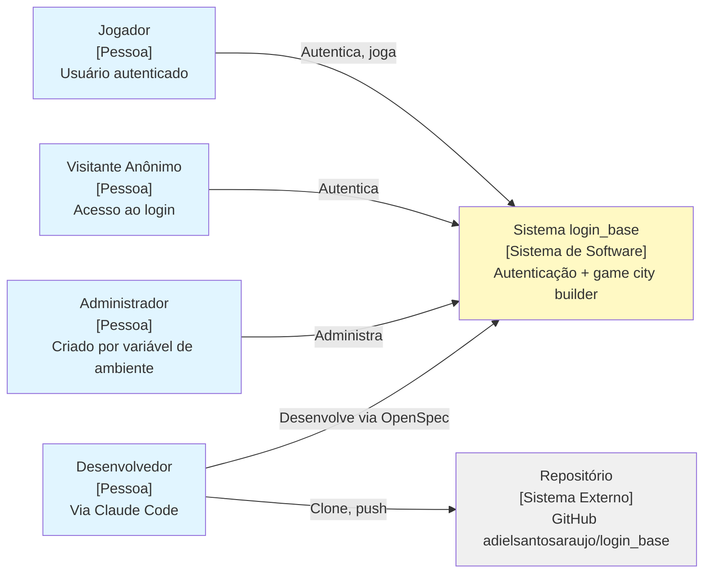
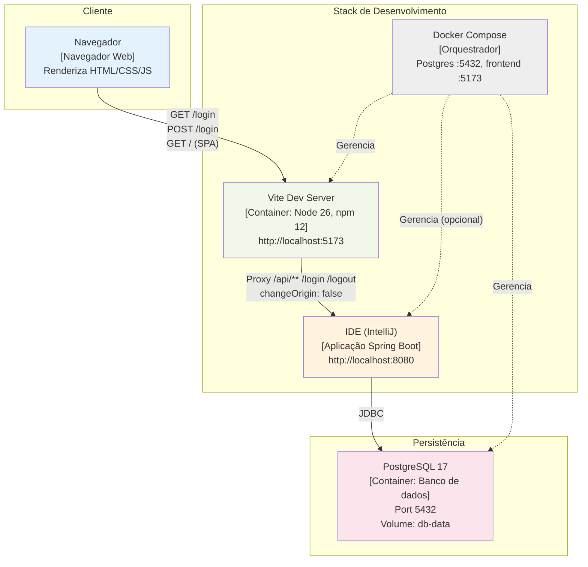
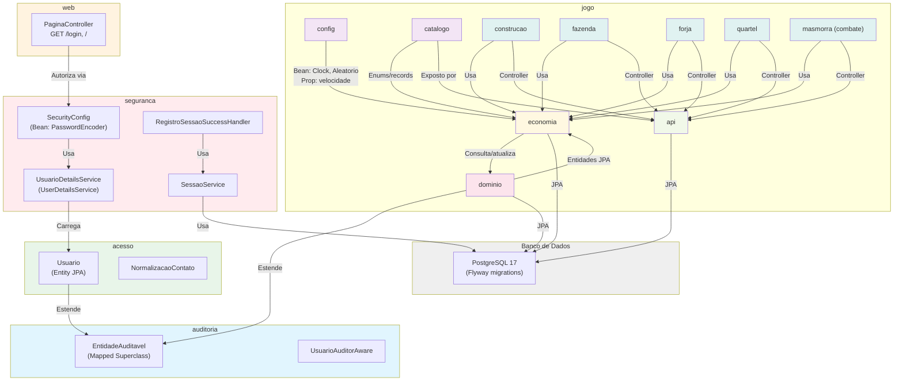
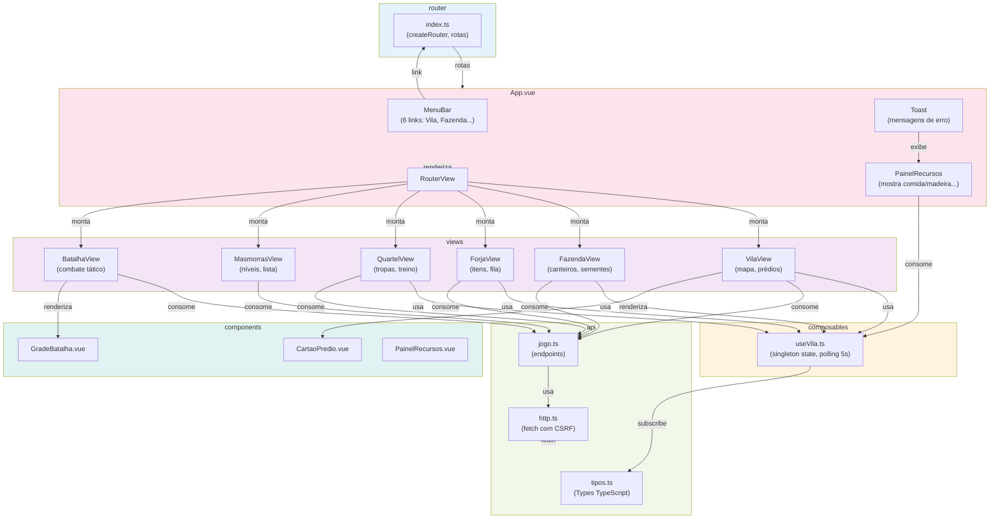
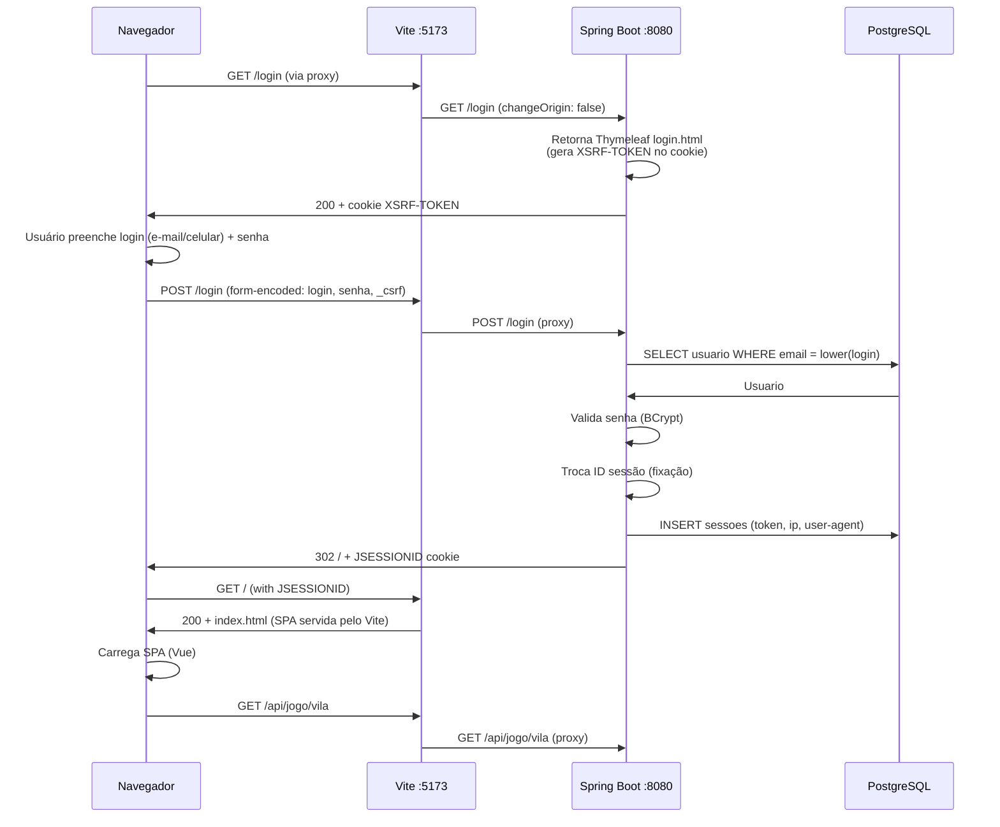
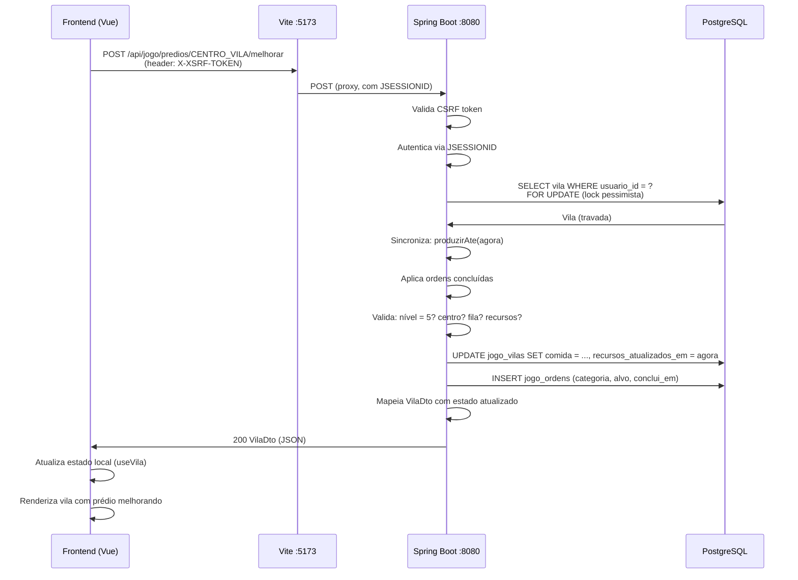
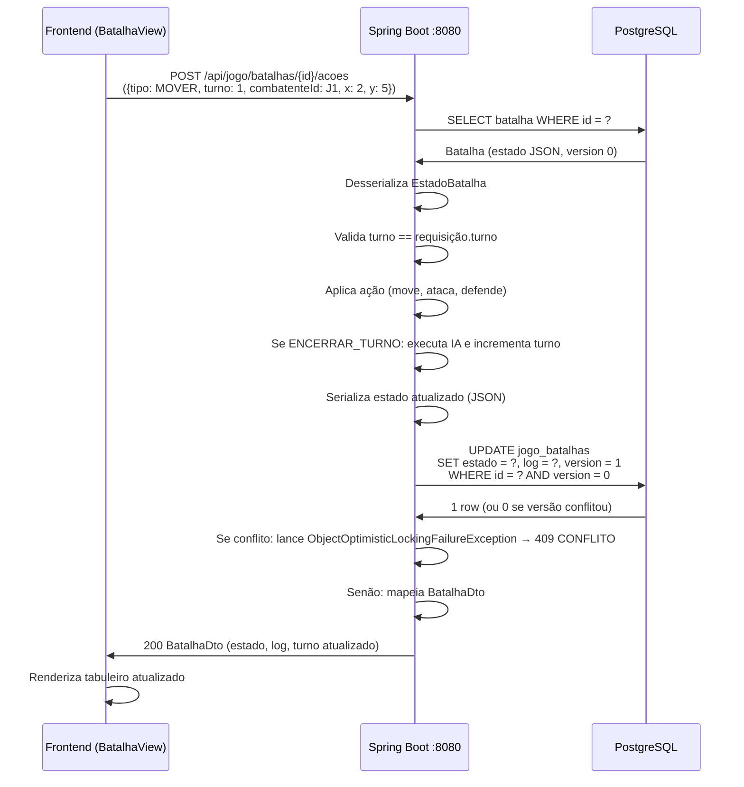
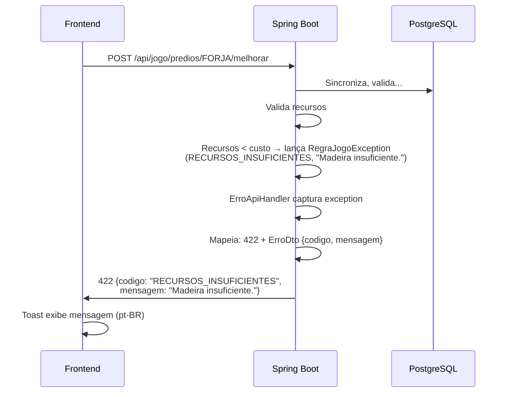

# Arquitetura do Sistema

| Campo | Valor |
|---|---|
| Versão | 1.0.0 |
| Data | 2026-09-27 |
| Status | Vigente — baseline do commit `454ae58` |
| Modelo/norma | arc42 (versão 2024.1) + C4 (níveis 1–3 em Mermaid) |
| Público | desenvolvedores, arquitetos, revisores |
| Fontes | Especificações OpenSpec; `design.md` do jogo; código-fonte em `src/main`; `pom.xml`; `docker-compose.yml`; `Dockerfile`; `frontend/` |

> Parte da [documentação do login_base](README.md). Descreve a estrutura técnica, topologia, componentes e decisões arquiteturais do sistema de jogo construído sobre infraestrutura de autenticação Spring Boot + SPA Vue.

---

## 1. Introdução e Objetivos

### Propósito

Este documento apresenta a arquitetura do login_base em cinco níveis: contexto (o que o sistema faz), contêineres (backend, frontend, banco), componentes internos (pacotes, serviços), visão de tempo de execução (fluxos principais) e conceitos transversais (segurança, persistência, tratamento de erros).

### Requisitos de Qualidade Top 5

1. **Segurança**: autenticação, autorização e isolamento por usuário.
2. **Testabilidade e determinismo**: motor de jogo e loot reproduzíveis, `Clock` e `Aleatorio` injetáveis.
3. **Consistência sob concorrência**: lock pessimista por vila, versionamento otimista em combate.
4. **Manutenibilidade**: pacotes por domínio, esquema via Flyway, `ddl-auto=validate`.
5. **Reprodutibilidade do ambiente**: Docker Compose com profiles, executado no WSL2.

### Stakeholders

- Jogador: interface web reativa, sem cálculos de regras no cliente.
- Desenvolvedor: ambiente reproduzível, skill `dev-subagentes`, documentação em Markdown.
- Revisor/arquiteto: decisões registradas em ADRs (MADR 4.0), rastreabilidade requisito-código-teste.
- Operação: Compose com profiles, variáveis de ambiente documentadas.

---

## 2. Restrições

### Técnicas

- **Backend**: Java 25, Spring Boot 4.1.1, Spring Security 7.1.1, Hibernate 7, Maven Wrapper.
- **Banco de dados**: PostgreSQL 17, migrações via Flyway, `ddl-auto=validate`.
- **Frontend**: Vue 3.5, TypeScript 6, Vite 8, PrimeVue 5 (Aura), Node 26, npm 12.
- **Containerização**: Docker Compose no WSL2, profiles por serviço.
- **Dependências externas**: nenhuma em runtime além do registro de licença PrimeUI (chave local).

### Organizacionais

- Processo: OpenSpec com spec-driven development, subagentes por tipo (Opus/Sonnet/Haiku).
- Idioma: português do Brasil (código, mensagens, documentação).
- Pacote Java: `com.example.loginbase`.
- Versionamento: `0.0.1-SNAPSHOT` (sem tags de release).

---

## 3. Contexto e Escopo — C4 Nível 1

### Diagrama de Contexto



**Legenda**: Atores externos (Pessoa) interagem com o Sistema (Software de software). Desenvolvedor interage com o repositório e o sistema em paralelo.

### Usuários e Atores

- **Jogador**: usuário autenticado com perfil vigente, pode consultar vila, construir, forjar, treinar, lutar.
- **Visitante anônimo**: acesso a `/login`; tentativa de qualquer outra rota redireciona para login.
- **Administrador inicial**: criado na inicialização via `ApplicationRunner`, usando `ADMIN_EMAIL` e `ADMIN_PASSWORD`.
- **Desenvolvedor**: escreve código, executa testes, roda ambiente via `make`.
- **Sistema (relógio)**: sincroniza ordens vencidas e produção sob demanda (sem jobs em background).

---

## 4. Estratégia de Solução

### Monólito Spring Boot + SPA Proxy

A solução é um **monólito Spring Boot** que:

1. Serve a página de login e autenticação em Thymeleaf (`/login`), responsável pela sessão HTTP.
2. Fornece uma API REST (`/api/jogo/**`) que valida autorização (autenticado, isolamento por dono).
3. Proxy da SPA (Vue) via Vite durante desenvolvimento: requisições `/` e `/fazenda` etc. servem a SPA, requerindo autenticação.

### Sessão Stateful

- **JSESSIONID** em cookie `HttpOnly`, `SameSite=Lax`, `Secure` (configurável).
- Troca de ID no login (contra fixação).
- Expiração: 30 minutos de inatividade.
- Registro em tabela `sessoes` com SHA-256 do ID.

### Cálculo Lazy e Catálogo em Código

- **Produção**: calculada sob demanda por trechos de tempo entre ordens concluídas (sem threads de background).
- **Catálogo** (prédios, itens, tropas, masmorras): definido em enums/records Java, tipado, testável. Exposto por `GET /api/jogo/catalogo`.
- **Velocidade do jogo** (`JOGO_VELOCIDADE`): multiplica taxas e divide tempos, configurável por variável de ambiente.

### Motor Determinístico

- **Aleatoriedade**: abstrata via interface `Aleatorio`; implementação padrão usa `RandomGenerator`; testes usam `AleatorioSequencia`.
- **Tempo**: abstraído via `Clock` injetável (implementação padrão: `Clock.systemUTC()`; testes: `RelogioAjustavel`).
- **IA dos inimigos**: determinística com critérios de desempate fixos (menor HP, menor id).

---

## 5. Visão de Blocos — C4 Nível 2

### Diagrama de Contêineres



**Legenda**: 
- **Navegador** acessa a SPA pelo Vite em porta 5173.
- **Vite Dev Server** faz proxy de `/api`, `/login`, `/logout` para o backend em 8080 (mesma origem, sem CORS).
- **Spring Boot (IDE ou container)** conecta ao PostgreSQL.
- **Docker Compose** orquestra os contêineres (db, frontend, app opcional).

### Portas e Volumes

| Serviço | Porta | Imagem | Volume |
|---|---|---|---|
| `db` | 5432 | `postgres:17-trixie` | `db-data` |
| `app` | 8080 | Build multi-stage (Maven + JRE alpine) | — |
| `frontend` | 5173 | `node:26-trixie-slim` | `frontend-node-modules` (dev) |

---

## 6. Visão de Blocos — C4 Nível 3 (Backend)

### Diagrama de Componentes — Pacotes Java



**Legenda**: 
- **seguranca**: configuração de segurança, autenticação, gerenciamento de sessão.
- **acesso**: entidades de usuário/perfil/permissão.
- **auditoria**: superclasse com campos `criado_em/por`, `alterado_em/por`.
- **web**: controladores Thymeleaf.
- **jogo.config**: Beans de `Clock`, `Aleatorio`, propriedades.
- **jogo.catalogo**: enums/records de jogo (tipos, custos, regras).
- **jogo.dominio**: entidades JPA (Vila, Predio, Ordem, Batalha, etc.).
- **jogo.economia**: serviço principal, cálculo lazy, sincronização.
- **jogo.construcao|fazenda|forja|quartel|masmorra**: serviços de domínio.
- **jogo.api**: controladores REST, DTOs, mapeadores.

### Pacotes do Backend

| Pacote | Responsabilidade | Principais classes |
|---|---|---|
| `com.example.loginbase.seguranca` | Autenticação, autorização, sessão | `SecurityConfig`, `UsuarioDetailsService`, `SessaoService` |
| `com.example.loginbase.acesso` | Usuários, perfis, permissões | `Usuario`, `Perfil`, `Permissao`, `UsuarioRelPerfil` |
| `com.example.loginbase.auditoria` | Rastreabilidade | `EntidadeAuditavel`, `UsuarioAuditorAware` |
| `com.example.loginbase.web` | Controladores Thymeleaf | `PaginaController` |
| `com.example.loginbase.jogo.config` | Configuração de jogo | `JogoConfig`, `JogoProperties`, `Clock`, `Aleatorio` |
| `com.example.loginbase.jogo.catalogo` | Enums, regras estáticas | `TipoPredio`, `Cultivo`, `ModeloItem`, `TipoTropa`, `Masmorra` |
| `com.example.loginbase.jogo.dominio` | Entidades JPA, repositórios | `Vila`, `Predio`, `Orden`, `Batalha`, `VilaRepository` |
| `com.example.loginbase.jogo.economia` | Produção, sincronização, vila | `VilaService`, `CalculadoraProducao`, `Estoque` |
| `com.example.loginbase.jogo.construcao` | Melhorias de prédios | `ConstrucaoService` |
| `com.example.loginbase.jogo.fazenda` | Cultivos e sementes | `FazendaService` |
| `com.example.loginbase.jogo.forja` | Forja de itens | `ForjaService` |
| `com.example.loginbase.jogo.quartel` | Treinamento de tropas | `QuartelService` |
| `com.example.loginbase.jogo.masmorra.combate` | Motor determinístico | `MotorCombate`, `Caminhos`, `EstadoBatalha` |
| `com.example.loginbase.jogo.masmorra` | Masmorras, loot, IA | `MasmorraService`, `GeradorLoot`, `Loot` |
| `com.example.loginbase.jogo.api` | Controladores REST, DTOs | `VilaController`, `AcoesVilaController`, `MasmorraController`, `JogoMapper` |

---

## 7. Visão de Blocos — C4 Nível 3 (Frontend)

### Estrutura Vue 3 + Vite + PrimeVue



**Legenda**:
- **router**: rotas em history mode (`/`, `/fazenda`, `/forja`, `/quartel`, `/masmorras`, `/batalhas/:id`).
- **api**: cliente HTTP, tipos TypeScript, endpoints.
- **composables**: `useVila` — estado singleton, polling a cada 5 s para obter estado atual da vila.
- **App.vue**: MenuBar, PainelRecursos (fixo), Toast, RouterView.
- **views**: uma por área (vila, fazenda, forja, quartel, masmorras, batalha tática).
- **components**: CartaoPredio (prédio com ações), GradeBatalha (8×8 tática).

### Fluxo de Autenticação no Frontend

1. Ao iniciar, `App.vue` tenta `GET /api/jogo/vila` (cria vila se 1º acesso).
2. Se 401 → `http.ts` redireciona para `/login` (lê cookie `XSRF-TOKEN` do login Thymeleaf).
3. Após autenticação, retorna ao `/` (SPA).
4. Polling do `useVila` atualiza estado a cada 5 s.

---

## 8. Visão de Tempo de Execução — Sequências

### Sequência 1: Login via Proxy



**Fluxo**: Login Thymeleaf no backend, redireção para `/`, SPA carregada.

### Sequência 2: POST de Ação da Vila (ex.: melhorar prédio)



**Fluxo**: Validação de CSRF, lock pessimista, sincronização lazy, atualização do banco, resposta com estado.

### Sequência 3: Ação de Combate



**Fluxo**: Validação de turno, motor determinístico, versionamento otimista, persistência de estado.

### Sequência 4: Erro (ex.: recursos insuficientes)



**Fluxo**: Validação de negócio, exceção controlada, resposta com código de erro.

---

## 9. Conceitos Transversais

### Segurança

Descrito em detalhe em [07-seguranca.md](07-seguranca.md). Resumo:

- **Autenticação**: form login Thymeleaf, e-mail ou celular, `DelegatingPasswordEncoder` (BCrypt).
- **Autorização**: papel (role) `ROLE_<perfil>` por vínculo `usuario_rel_perfis` com vigência.
- **API**: anônimo em `/api/**` recebe 401 sem redirecionamento.
- **CSRF**: cookie `XSRF-TOKEN` para SPA, parâmetro `_csrf` para formulário.
- **Sessão**: JSESSIONID `HttpOnly`, `SameSite=Lax`, `Secure` (configurável), 30 min, troca de ID no login.
- **Auditoria**: `criado_por/em`, `alterado_por/em` em todas as tabelas.

### Persistência e Migrações

- **Flyway**: migrações versionadas em `src/main/resources/db/migration/`.
  - `V1__controle_acesso.sql`: usuários, perfis, permissões, sessões.
  - `V2__perfil_admin.sql`: insere perfil `ADMIN`.
  - `V3__jogo.sql`: tabelas do jogo (vila, prédios, ordens, batalhas, etc.).
- **Hibernate**: `ddl-auto=validate` (não gera DDL).
- **Enums**: mapeados como `varchar` com `@Enumerated(EnumType.STRING)`.
- **Auditoria**: `EntidadeAuditavel` (Mapped Superclass) com campos não nulos; `UsuarioAuditorAware` popula `criado_por` do `Authentication`.

### Tratamento de Erros

```
RegraJogoException(CodigoErro, mensagem pt-BR)
    ↓
ErroApiHandler captura
    ↓
Mapeamento:
    422 UNPROCESSABLE_ENTITY (exceto TURNO_DESATUALIZADO → 409)
    404 NOT_FOUND
    400 BAD_REQUEST (validação, parse)
    500 INTERNAL_SERVER_ERROR
    
Resposta JSON: { "codigo": "...", "mensagem": "..." }
```

Códigos: `RECURSOS_INSUFICIENTES`, `FILA_OCUPADA`, `NIVEL_MAXIMO`, `REQUISITO_NAO_ATENDIDO`, `CANTEIRO_INEXISTENTE`, `SEMENTE_INDISPONIVEL`, `ITEM_INDISPONIVEL`, `CAPACIDADE_EXERCITO`, `MASMORRA_BLOQUEADA`, `BATALHA_EM_ANDAMENTO`, `UNIDADE_INDISPONIVEL`, `ESQUADRAO_INVALIDO`, `ACAO_INVALIDA`, `BATALHA_ENCERRADA`, `TURNO_DESATUALIZADO`, `CONFLITO`, `NAO_ENCONTRADO`, `REQUISICAO_INVALIDA`, `ERRO_INTERNO` (literal).

### Transações

- **Todos os serviços de jogo**: `@Transactional` (modo padrão READ_WRITE, no banco).
- **Lock pessimista**: `VilaRepository.findByUsuarioIdParaAtualizacao` com `@Lock(PESSIMISTIC_WRITE)`.
- **Criação concorrente de vila**: `unique(usuario_id)` + retry em `DataIntegrityViolationException` com propagação `REQUIRES_NEW`.
- **Versionamento otimista**: `jogo_batalhas.version` com `@Version`; violação → 409.

### Tempo e Aleatoriedade

- **Clock**: abstrato (interface), injetado em `JogoConfig` como Bean.
  - Implementação padrão: `Clock.systemUTC()`.
  - Testes: `RelogioAjustavel` (mutável).
- **Aleatorio**: abstrato (interface), injetado.
  - Implementação padrão: `AleatorioPadrao` (usa `RandomGenerator`).
  - Testes: `AleatorioSequencia` (determinístico).
- **Determinismo**: motor de combate e loot determinísticos; playtests reproduzíveis.

### Velocidade do Jogo

- **Propriedade**: `app.jogo.velocidade=${JOGO_VELOCIDADE:1}` (inteiro ≥ 1).
- **Efeito**: taxas de produção × velocidade; tempos ÷ velocidade (com `ceil`).
- **Exemplo**: `JOGO_VELOCIDADE=60` faz produção 60× mais rápida, tempos 60× mais curtos (1 minuto real = 1 hora no jogo).
- **Frontend**: recebe `JOGO_VELOCIDADE` via variável de ambiente no compose, mas **não a utiliza** (D-07); contagem regressiva visual é puramente do backend.

### Serialização JSON

- **Jackson 3**: declarado no starter parent Spring Boot 4.1.1.
- **DTOs**: records para tipos simples, classes anotadas com `@JsonProperty` quando necessário.
- **Serialização da batalha**: `MasmorraService` serializa `EstadoBatalha` e `Loot` com `ObjectMapper` (Jackson) em colunas `text`; `log` é texto com linhas separadas por `\n`. `JsonConverter` existe como base abstrata, mas não é usado por nenhum atributo.

### Idioma

- **Código Java**: nomes de classes, enums em inglês (convenção); comentários em pt-BR.
- **Mensagens**: erros e logs em pt-BR.
- **Frontend**: componentes em inglês (Vue); textos em pt-BR via strings.
- **Banco**: nomes de colunas em pt-BR (`criado_por`, `recursos_atualizados_em`, `plantado_em`).

---

## 10. Requisitos de Qualidade

### Árvore de Qualidade

```
Sistema login_base
├─ Segurança (RNF-SEG-*)
│  ├─ Autenticidade: toda rota exige autenticação (RNF-SEG-001)
│  ├─ Integridade: CSRF em POST (RNF-SEG-002)
│  ├─ Confidencialidade: BCrypt, cookie Secure (RNF-SEG-003/004)
│  └─ Não repúdio: mensagem genérica de erro (RNF-SEG-005)
├─ Testabilidade (RNF-TES-001)
│  ├─ Motor e loot determinísticos
│  └─ Clock e Aleatorio injetáveis
├─ Confiabilidade (RNF-CON-001/002)
│  ├─ Lock pessimista por vila
│  ├─ Versionamento otimista em combate
│  └─ Constraints de banco
├─ Manutenibilidade (RNF-MAN-001/002)
│  ├─ Flyway (sem DDL manual)
│  └─ Pacotes por domínio
└─ Portabilidade (RNF-POR-001)
   └─ Docker Compose WSL2
```

### Cenários de Qualidade Principais

| Requisito | Cenário | Verificação |
|---|---|---|
| RNF-SEG-001 | Acesso anônimo a `/api/vila` | 401 sem redirecionamento |
| RNF-SEG-002 | POST `/logout` sem CSRF | 403 |
| RNF-TES-001 | Mesma sequência aleatória, mesmos resultados | Teste `AleatorioSequencia` |
| RNF-CON-001 | Duas ações simultâneas na mesma vila | Segunda aguarda lock; nenhuma corrupção de dados |
| RNF-MAN-001 | Schema alterado sem migração | Startup falha com `ddl-auto=validate` |

---

## 11. Riscos e Dívidas Técnicas

Ver [17-riscos-divida-roadmap.md](17-riscos-divida-roadmap.md) para registro completo.

**Riscos principais**:
- [Cálculo lazy pode gerar discrepâncias se clock do servidor mudar] → Clock injetável mitiga.
- [Lock pessimista serializa toda ação do usuário] → Aceitável (1 vila/usuário, ações rápidas).
- [JSON em `text` sem índices] → Suficiente em dev; JSONB seria melhor em produção.

**Dívidas técnicas principais**:
- Sem CI/CD.
- HATEOAS declarado mas não usado.
- Sem testes de frontend.
- `UsuarioAtual` com campo estático.
- Change do jogo não arquivada (specs principais desatualizadas).

---

## 12. Decisões Arquiteturais

Cada decisão é registrada como ADR em `docs/adr/0001-…-0022.md` (formato MADR 4.0).

| Nº | Título | Data | Status |
|---|---|---|---|
| [0001](adr/0001-spring-boot-java-25-maven.md) | Spring Boot 4.1 + Java 25 + Maven Wrapper | 2026-09-23 | Vigente |
| [0002](adr/0002-ambiente-hibrido-ide-docker.md) | Backend na IDE contra Postgres no Docker | 2026-09-23 | Vigente |
| [0003](adr/0003-compose-profiles-makefile.md) | Profiles por variável + Makefile | 2026-09-23 | Vigente |
| [0004](adr/0004-frontend-vue-vite-primevue.md) | Vue 3 + TS + Vite + PrimeVue 5 | 2026-09-23 | Vigente |
| [0005](adr/0005-subagentes-por-tipo-de-trabalho.md) | Orquestração por subagentes | 2026-09-23 | Vigente |
| [0006](adr/0006-openspec-tasks-em-arquivos.md) | Spec-driven com OpenSpec | 2026-09-25 | Vigente |
| [0007](adr/0007-flyway-ddl-validate.md) | Flyway + `ddl-auto=validate` | 2026-09-24 | Vigente |
| [0008](adr/0008-pacotes-por-dominio.md) | Pacotes por domínio | 2026-09-24 | Vigente |
| [0009](adr/0009-auditoria-jpa-auditing.md) | Spring Data JPA Auditing | 2026-09-24 | Vigente |
| [0010](adr/0010-login-formulario-sessao.md) | Form login + sessão HTTP stateful | 2026-09-24 | Vigente |
| [0011](adr/0011-senhas-delegating-encoder.md) | `DelegatingPasswordEncoder` (BCrypt) | 2026-09-24 | Vigente |
| [0012](adr/0012-registro-sessoes-tabela-propria.md) | Tabela `sessoes` com SHA-256 | 2026-09-24 | Vigente |
| [0013](adr/0013-admin-inicial-por-ambiente.md) | Admin por `ApplicationRunner` | 2026-09-24 | Vigente |
| [0014](adr/0014-spa-mesma-origem-proxy-vite.md) | SPA via proxy do Vite | 2026-09-26 | Vigente |
| [0015](adr/0015-api-401-e-csrf-spa.md) | `/api/**` → 401 sem cache + CSRF SPA | 2026-09-26 | Vigente |
| [0016](adr/0016-catalogo-em-codigo.md) | Catálogo em enums/records Java | 2026-09-26 | Vigente |
| [0017](adr/0017-calculo-preguicoso-milesimos.md) | Cálculo lazy + milésimos | 2026-09-26 | Vigente |
| [0018](adr/0018-concorrencia-lock-pessimista.md) | Lock pessimista por vila | 2026-09-26 | Vigente |
| [0019](adr/0019-estado-batalha-json-text.md) | Estado/log/loot em JSON `text` | 2026-09-26 | Vigente |
| [0020](adr/0020-determinismo-clock-aleatorio.md) | Motor puro + Clock/Aleatorio injetáveis | 2026-09-26 | Vigente |
| [0021](adr/0021-velocidade-configuravel.md) | `JOGO_VELOCIDADE` multiplica taxas | 2026-09-26 | Vigente |
| [0022](adr/0022-testes-postgres-compose.md) | Testes contra Postgres do compose | 2026-09-24/26 | Vigente |

---

## 13. Glossário

Termos-chave; ver [14-glossario.md](14-glossario.md) para lista completa.

- **Vila**: agregado raiz do domínio jogo; 1 por usuário; contém prédios, canteiros, sementes, itens, unidades, ordens, batalhas.
- **Lock pessimista**: SELECT ... FOR UPDATE (Postgres); garante isolamento contra leitura suja.
- **Milésimo**: unidade interna para recursos (1 unidade = 1000 milésimos); API exibe em unidades.
- **DTO**: Data Transfer Object; serializado para JSON; ex.: `VilaDto`, `BatalhaDto`.
- **Catálogo**: enums/records Java com tipos, custos, regras; exposto por `/api/jogo/catalogo`.
- **Motor de combate**: `MotorCombate` (puro, determinístico); aplica ações, calcula dano, executa IA.

---

## 14. Histórico de Revisões

| Versão | Data | Descrição | Autor |
|---|---|---|---|
| 1.0.0 | 2026-09-27 | Versão inicial | Adiel, com apoio de agentes Claude |
