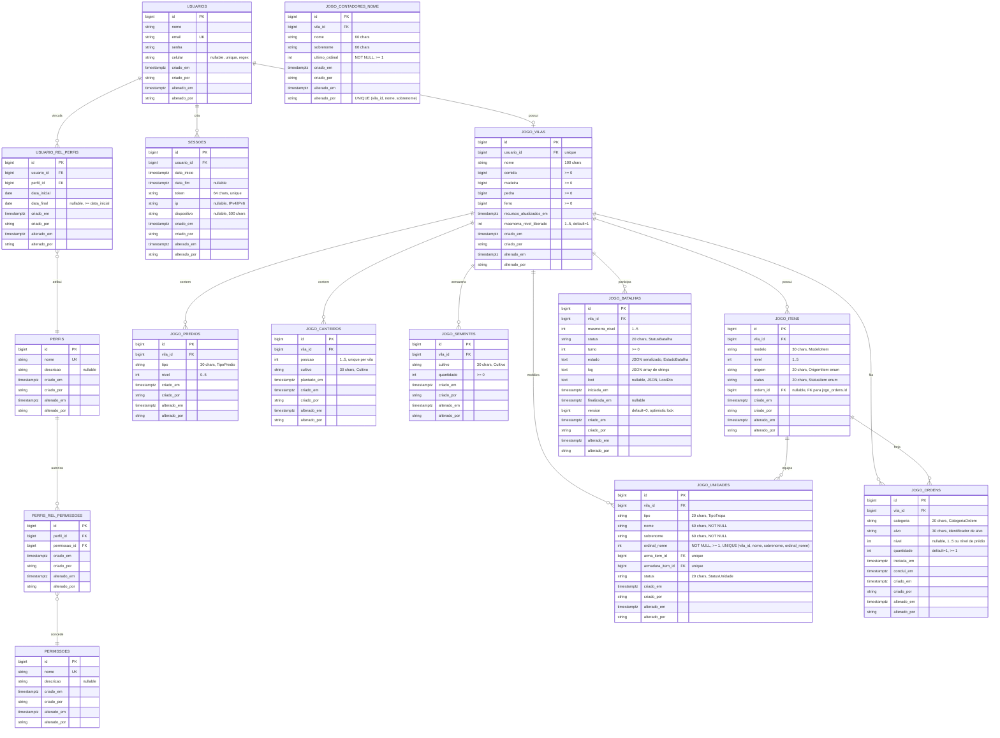

# 05 — Modelo de Dados

| Campo | Valor |
|---|---|
| Versão | 1.1.0 |
| Data | 2026-09-28 |
| Status | Vigente — baseline do commit `454ae58` + change `add-soldier-names-batch-slots` implementada |
| Modelo/norma | ER + dicionário de dados |
| Público | Desenvolvedores, DBAs |
| Fontes | `src/main/resources/db/migration/V1__controle_acesso.sql`, `V2__perfil_admin.sql`, `V3__jogo.sql`, `V4__unidade_nome_e_lote_treino.sql`; `src/main/java/com/example/loginbase/jogo/dominio/*.java` |

> Parte da [documentação do login_base](README.md). Apresenta o esquema do banco de dados, dicionário de tabelas, enumerações, estruturas JSON de batalhas e regras de integridade.

---

## Índice

1. [Diagrama de Entidade-Relacionamento](#diagrama-de-entidade-relacionamento)
2. [Dicionário de Tabelas](#dicionário-de-tabelas)
3. [Enumerações e Tipos Especiais](#enumerações-e-tipos-especiais)
4. [Estrutura JSON — Batalhas](#estrutura-json--batalhas)

---

## Diagrama de Entidade-Relacionamento



---

## Dicionário de Tabelas

### V1 — Controle de Acesso (Autenticação, Sessões, Permissões)

#### T1. `usuarios`

**Propósito:** Registra usuários da aplicação, com credenciais de autenticação.

| Campo | Tipo | Constraints | Descrição |
|-------|------|-------------|-----------|
| `id` | `bigint` | PK, identity | Identificador único, sequencial |
| `nome` | `varchar(150)` | NOT NULL | Nome completo ou apelido do usuário |
| `email` | `varchar(150)` | NOT NULL, UK | E-mail único (case-insensitive, índice `ux_usuarios_email_lower`) |
| `senha` | `varchar(255)` | NOT NULL | Hash bcrypt da senha (algoritmo delegado) |
| `celular` | `varchar(11)` | UNIQUE, nullable, regex `^[0-9]{11}$` | Celular (DDD + número, 11 dígitos, só números) para login alternativo |
| `criado_em` | `timestamptz` | NOT NULL | Marca de criação, preenchida pela aplicação (JPA Auditing) |
| `criado_por` | `varchar(150)` | NOT NULL | Usuário/sistema que criou o registro |
| `alterado_em` | `timestamptz` | NOT NULL | Última alteração |
| `alterado_por` | `varchar(150)` | NOT NULL | Quem alterou por último |

**Índices:**
- Primária: `pk_usuarios`
- Única (case-insensitive): `ux_usuarios_email_lower`
- Única: `uk_usuarios_celular`

---

#### T2. `perfis`

**Propósito:** Define papéis (roles) do sistema para controle de acesso baseado em papéis.

| Campo | Tipo | Constraints | Descrição |
|-------|------|-------------|-----------|
| `id` | `bigint` | PK, identity | Identificador único |
| `nome` | `varchar(100)` | NOT NULL, UK | Nome do perfil (único perfil semeado: `ADMIN`) |
| `descricao` | `varchar(255)` | nullable | Descrição textual do propósito do perfil |
| `criado_em` | `timestamptz` | NOT NULL | Marca de criação |
| `criado_por` | `varchar(150)` | NOT NULL | Quem criou |
| `alterado_em` | `timestamptz` | NOT NULL | Última alteração |
| `alterado_por` | `varchar(150)` | NOT NULL | Quem alterou |

**Seed V2:**
- `id=1, nome='ADMIN', descricao='Administrador do sistema'`

---

#### T3. `permissoes`

**Propósito:** Registra permissões discretas (ex.: `LISTAR_USUARIOS`, `EDITAR_JOGO`), associadas a perfis.

| Campo | Tipo | Constraints | Descrição |
|-------|------|-------------|-----------|
| `id` | `bigint` | PK, identity | Identificador único |
| `nome` | `varchar(100)` | NOT NULL, UK | Nome da permissão (nenhuma permissão é semeada) |
| `descricao` | `varchar(255)` | nullable | Descrição da permissão |
| `criado_em` | `timestamptz` | NOT NULL | Marca de criação |
| `criado_por` | `varchar(150)` | NOT NULL | Quem criou |
| `alterado_em` | `timestamptz` | NOT NULL | Última alteração |
| `alterado_por` | `varchar(150)` | NOT NULL | Quem alterou |

---

#### T4. `usuario_rel_perfis`

**Propósito:** Associa usuários a perfis com vigência temporal (data_inicial / data_final).

| Campo | Tipo | Constraints | Descrição |
|-------|------|-------------|-----------|
| `id` | `bigint` | PK, identity | Identificador único |
| `usuario_id` | `bigint` | FK → `usuarios.id`, NOT NULL | Referência ao usuário |
| `perfil_id` | `bigint` | FK → `perfis.id`, NOT NULL | Referência ao perfil |
| `data_inicial` | `date` | NOT NULL | Data de início da validade |
| `data_final` | `date` | nullable, CHECK `data_final >= data_inicial` | Data de fim (nulo = sem expiração) |
| `criado_em` | `timestamptz` | NOT NULL | Marca de criação |
| `criado_por` | `varchar(150)` | NOT NULL | Quem criou |
| `alterado_em` | `timestamptz` | NOT NULL | Última alteração |
| `alterado_por` | `varchar(150)` | NOT NULL | Quem alterou |

**Índices:**
- Primária: `pk_usuario_rel_perfis`
- Comum: `ix_usuario_rel_perfis_usuario`

**Observação:** Permite que um usuário tenha múltiplos perfis, cada um com validade independente.

---

#### T5. `perfis_rel_permissoes`

**Propósito:** Associa permissões a perfis (relação muitos-para-muitos).

| Campo | Tipo | Constraints | Descrição |
|-------|------|-------------|-----------|
| `id` | `bigint` | PK, identity | Identificador único |
| `perfil_id` | `bigint` | FK → `perfis.id`, NOT NULL | Referência ao perfil |
| `permissao_id` | `bigint` | FK → `permissoes.id`, NOT NULL | Referência à permissão |
| `criado_em` | `timestamptz` | NOT NULL | Marca de criação |
| `criado_por` | `varchar(150)` | NOT NULL | Quem criou |
| `alterado_em` | `timestamptz` | NOT NULL | Última alteração |
| `alterado_por` | `varchar(150)` | NOT NULL | Quem alterou |

**Constraint único:** `(perfil_id, permissao_id)` — um perfil não pode ter permissão duplicada.

---

#### T6. `sessoes`

**Propósito:** Registra sessões HTTP ativas de usuários autenticados (auditoria de acesso).

| Campo | Tipo | Constraints | Descrição |
|-------|------|-------------|-----------|
| `id` | `bigint` | PK, identity | Identificador único |
| `usuario_id` | `bigint` | FK → `usuarios.id`, NOT NULL | Qual usuário logou |
| `data_inicio` | `timestamptz` | NOT NULL | Timestamp de login |
| `data_fim` | `timestamptz` | nullable | Fim da sessão: logout, expiração ou fechamento no startup (nulo = sessão aberta) |
| `token` | `varchar(64)` | NOT NULL, UK | Hash SHA-256 (hex, 64 caracteres) do ID da sessão HTTP |
| `ip` | `varchar(45)` | nullable | Endereço IP do cliente (IPv4 ou IPv6) |
| `dispositivo` | `varchar(500)` | nullable | User-Agent ou identificação do dispositivo |
| `criado_em` | `timestamptz` | NOT NULL | Marca de criação |
| `criado_por` | `varchar(150)` | NOT NULL | Quem criou (ex.: `sistema`) |
| `alterado_em` | `timestamptz` | NOT NULL | Última alteração |
| `alterado_por` | `varchar(150)` | NOT NULL | Quem alterou |

**Índices:**
- Primária: `pk_sessoes`
- Comum: `ix_sessoes_usuario`
- Única: `uk_sessoes_token`

---

### V3 — Jogo (City Builder)

#### T7. `jogo_vilas`

**Propósito:** Estado central de cada vila (cidade) do jogo, uma por usuário.

| Campo | Tipo | Constraints | Descrição |
|-------|------|-------------|-----------|
| `id` | `bigint` | PK, identity | Identificador único |
| `usuario_id` | `bigint` | FK → `usuarios.id`, NOT NULL, UK | Relação 1:1 — cada usuário uma vila |
| `nome` | `varchar(100)` | NOT NULL | Nome da vila (ex.: "Vila do Adiel") |
| `comida` | `bigint` | NOT NULL, CHECK `>= 0` | Estoque de comida em milésimos (1 unidade = 1000) |
| `madeira` | `bigint` | NOT NULL, CHECK `>= 0` | Estoque de madeira |
| `pedra` | `bigint` | NOT NULL, CHECK `>= 0` | Estoque de pedra |
| `ferro` | `bigint` | NOT NULL, CHECK `>= 0` | Estoque de ferro |
| `recursos_atualizados_em` | `timestamptz` | NOT NULL | Última vez que produção foi aplicada |
| `masmorra_nivel_liberado` | `int` | NOT NULL, CHECK `BETWEEN 1 AND 5`, DEFAULT 1 | Nível máximo de masmorra desbloqueado (1..5) |
| `criado_em` | `timestamptz` | NOT NULL | Marca de criação |
| `criado_por` | `varchar(150)` | NOT NULL | Quem criou (ex.: `sistema` ou usuário) |
| `alterado_em` | `timestamptz` | NOT NULL | Última alteração |
| `alterado_por` | `varchar(150)` | NOT NULL | Quem alterou |

**Índices:**
- Primária: `pk_jogo_vilas`
- Única: `uk_jogo_vilas_usuario`

**Observação:** Recursos são armazenados em unidades inteiras (milésimos são handled em application-level durante cálculos de produção).

---

#### T8. `jogo_predios`

**Propósito:** Prédios construídos na vila (um de cada tipo por vila).

| Campo | Tipo | Constraints | Descrição |
|-------|------|-------------|-----------|
| `id` | `bigint` | PK, identity | Identificador único |
| `vila_id` | `bigint` | FK → `jogo_vilas.id`, NOT NULL | Qual vila |
| `tipo` | `varchar(30)` | NOT NULL, enum: `TipoPredio` | CENTRO_VILA, ARMAZEM, FAZENDA, SERRARIA, PEDREIRA, MINA_FERRO, FORJA, QUARTEL |
| `nivel` | `int` | NOT NULL, CHECK `BETWEEN 0 AND 5` | Nível de evolução (0 = não construído, 1..5 = construído) |
| `criado_em` | `timestamptz` | NOT NULL | Marca de criação |
| `criado_por` | `varchar(150)` | NOT NULL | Quem criou |
| `alterado_em` | `timestamptz` | NOT NULL | Última alteração |
| `alterado_por` | `varchar(150)` | NOT NULL | Quem alterou |

**Constraint único:** `(vila_id, tipo)` — máximo um prédio de cada tipo por vila.

**Índices:**
- Primária: `pk_jogo_predios`
- Comum: `ix_jogo_predios_vila`

---

#### T9. `jogo_canteiros`

**Propósito:** Canteiros (plantations) da fazenda, cada um com um cultivo ativo.

| Campo | Tipo | Constraints | Descrição |
|-------|------|-------------|-----------|
| `id` | `bigint` | PK, identity | Identificador único |
| `vila_id` | `bigint` | FK → `jogo_vilas.id`, NOT NULL | Qual vila |
| `posicao` | `int` | NOT NULL, CHECK `BETWEEN 1 AND 5` | Número do canteiro (1..5) |
| `cultivo` | `varchar(30)` | NOT NULL, enum: `Cultivo` | TRIGO, MILHO, BATATA, ABOBORA_DOURADA |
| `plantado_em` | `timestamptz` | NOT NULL | Quando o cultivo atual foi plantado (não há colheita; a produção é contínua) |
| `criado_em` | `timestamptz` | NOT NULL | Marca de criação |
| `criado_por` | `varchar(150)` | NOT NULL | Quem criou |
| `alterado_em` | `timestamptz` | NOT NULL | Última alteração |
| `alterado_por` | `varchar(150)` | NOT NULL | Quem alterou |

**Constraint único:** `(vila_id, posicao)` — máximo um canteiro por posição.

**Índices:**
- Primária: `pk_jogo_canteiros`
- Comum: `ix_jogo_canteiros_vila`

**Observação:** Número de canteiros disponíveis = nível da FAZENDA.

---

#### T10. `jogo_sementes`

**Propósito:** Estoque de sementes (insumos de plantio) por tipo de cultivo.

| Campo | Tipo | Constraints | Descrição |
|-------|------|-------------|-----------|
| `id` | `bigint` | PK, identity | Identificador único |
| `vila_id` | `bigint` | FK → `jogo_vilas.id`, NOT NULL | Qual vila |
| `cultivo` | `varchar(30)` | NOT NULL, enum: `Cultivo` | TRIGO, MILHO, BATATA, ABOBORA_DOURADA |
| `quantidade` | `int` | NOT NULL, CHECK `>= 0` | Número de sementes em estoque |
| `criado_em` | `timestamptz` | NOT NULL | Marca de criação |
| `criado_por` | `varchar(150)` | NOT NULL | Quem criou |
| `alterado_em` | `timestamptz` | NOT NULL | Última alteração |
| `alterado_por` | `varchar(150)` | NOT NULL | Quem alterou |

**Constraint único:** `(vila_id, cultivo)` — um registro por tipo de cultivo por vila.

**Índices:**
- Primária: `pk_jogo_sementes`
- Comum: `ix_jogo_sementes_vila`

**Observação:** TRIGO não exige semente (infinita). Outras sementes vêm do loot de masmorras.

---

#### T11. `jogo_itens`

**Propósito:** Itens forjáveis ou obtidos em batalhas (armas, armaduras, outros equipamentos).

| Campo | Tipo | Constraints | Descrição |
|-------|------|-------------|-----------|
| `id` | `bigint` | PK, identity | Identificador único |
| `vila_id` | `bigint` | FK → `jogo_vilas.id`, NOT NULL | Qual vila |
| `modelo` | `varchar(30)` | NOT NULL, enum: `ModeloItem` | ESPADA, LANCA, ARCO, ARMADURA_COURO, ARMADURA_FERRO |
| `nivel` | `int` | NOT NULL, CHECK `BETWEEN 1 AND 5` | Nível de qualidade (1..5) |
| `origem` | `varchar(20)` | NOT NULL, enum: `OrigemItem` | FORJA, MASMORRA |
| `status` | `varchar(20)` | NOT NULL, enum: `StatusItem` | DISPONIVEL, RESERVADO, EQUIPADO |
| `ordem_id` | `bigint` | FK → `jogo_ordens.id`, nullable | Ordem de treino que reservou este item (V4+) |
| `criado_em` | `timestamptz` | NOT NULL | Marca de criação |
| `criado_por` | `varchar(150)` | NOT NULL | Quem criou |
| `alterado_em` | `timestamptz` | NOT NULL | Última alteração |
| `alterado_por` | `varchar(150)` | NOT NULL | Quem alterou |

**Índices:**
- Primária: `pk_jogo_itens`
- Comum: `ix_jogo_itens_vila`, `ix_jogo_itens_ordem` (V4+)

---

#### T12. `jogo_unidades`

**Propósito:** Tropas treináveis no quartel, cada uma com arma e armadura equipadas e nome identificador.

| Campo | Tipo | Constraints | Descrição |
|-------|------|-------------|-----------|
| `id` | `bigint` | PK, identity | Identificador único |
| `vila_id` | `bigint` | FK → `jogo_vilas.id`, NOT NULL | Qual vila |
| `tipo` | `varchar(20)` | NOT NULL, enum: `TipoTropa` | SOLDADO, ARQUEIRO, LANCEIRO |
| `nome` | `varchar(60)` | NOT NULL | Primeiro nome, sorteado no treino (V4+) |
| `sobrenome` | `varchar(60)` | NOT NULL | Sobrenome, sorteado no treino (V4+) |
| `ordinal_nome` | `int` | NOT NULL, CHECK `>= 1` | Sufixo ordinal para nomes duplicados (1, 2, 3…); único com (vila_id, nome, sobrenome) (V4+) |
| `arma_item_id` | `bigint` | FK → `jogo_itens.id`, NOT NULL, UK | Arma equipada |
| `armadura_item_id` | `bigint` | FK → `jogo_itens.id`, NOT NULL, UK | Armadura equipada |
| `status` | `varchar(20)` | NOT NULL, enum: `StatusUnidade` | DISPONIVEL, EM_MASMORRA |
| `criado_em` | `timestamptz` | NOT NULL | Marca de criação |
| `criado_por` | `varchar(150)` | NOT NULL | Quem criou |
| `alterado_em` | `timestamptz` | NOT NULL | Última alteração |
| `alterado_por` | `varchar(150)` | NOT NULL | Quem alterou |

**Índices:**
- Primária: `pk_jogo_unidades`
- Comum: `ix_jogo_unidades_vila`
- Únicas: `(arma_item_id)`, `(armadura_item_id)` — cada item pode estar equipado em apenas uma unidade; `(vila_id, nome, sobrenome, ordinal_nome)` (V4+) — ordinal único por vila e nome.

**Observação:** Atributos de combate (HP, ataque, defesa, alcance, movimento) são derivados do tipo de tropa + equipamento. `nomeExibicao` em `UnidadeDto` = `"$nome $sobrenome (N)"` se ordinal > 1, senão `"$nome $sobrenome"`.

---

#### T13. `jogo_ordens`

**Propósito:** Fila de ordens (construção, forja, treino), uma ordem ativa por categoria/vila.

| Campo | Tipo | Constraints | Descrição |
|-------|------|-------------|-----------|
| `id` | `bigint` | PK, identity | Identificador único |
| `vila_id` | `bigint` | FK → `jogo_vilas.id`, NOT NULL | Qual vila |
| `categoria` | `varchar(20)` | NOT NULL, enum: `CategoriaOrdem` | CONSTRUCAO, FORJA, TREINO |
| `alvo` | `varchar(30)` | NOT NULL | Identificador do alvo (ex.: "FORJA" para tipo de prédio, "ESPADA" para modelo de item, "SOLDADO" para tipo de tropa) |
| `nivel` | `int` | nullable | Nível de construção/item/arma (nulo para treino de unidades) |
| `quantidade` | `int` | NOT NULL, DEFAULT 1 | Número de itens a forjar ou tropas a treinar |
| `iniciada_em` | `timestamptz` | NOT NULL | Timestamp de início |
| `conclui_em` | `timestamptz` | NOT NULL | Timestamp de conclusão estimada |
| `criado_em` | `timestamptz` | NOT NULL | Marca de criação |
| `criado_por` | `varchar(150)` | NOT NULL | Quem criou |
| `alterado_em` | `timestamptz` | NOT NULL | Última alteração |
| `alterado_por` | `varchar(150)` | NOT NULL | Quem alterou |

**Constraint único:** `(vila_id, categoria)` — máximo uma ordem ativa por categoria por vila.

**Índices:**
- Primária: `pk_jogo_ordens`
- Comum: `ix_jogo_ordens_vila`

**Mudança em V4**: Colunas `arma_item_id` e `armadura_item_id` removidas. Associação de itens a ordens movida para coluna `jogo_itens.ordem_id` (FK bidirecional).

---

#### T13A. `jogo_contadores_nome` (V4+)

**Propósito:** Contagem de ordinais por nome/sobrenome (sufixo para nomes duplicados). Uma linha por vila/nome/sobrenome, nunca decrementada.

| Campo | Tipo | Constraints | Descrição |
|-------|------|-------------|-----------|
| `id` | `bigint` | PK, identity | Identificador único |
| `vila_id` | `bigint` | FK → `jogo_vilas.id`, NOT NULL | Qual vila |
| `nome` | `varchar(60)` | NOT NULL | Primeiro nome |
| `sobrenome` | `varchar(60)` | NOT NULL | Sobrenome |
| `ultimo_ordinal` | `int` | NOT NULL, CHECK `>= 1` | Maior ordinal já atribuído a este nome/sobrenome nesta vila |
| `criado_em` | `timestamptz` | NOT NULL | Marca de criação |
| `criado_por` | `varchar(150)` | NOT NULL | Quem criou (ex.: `sistema`) |
| `alterado_em` | `timestamptz` | NOT NULL | Última alteração |
| `alterado_por` | `varchar(150)` | NOT NULL | Quem alterou |

**Constraint único:** `(vila_id, nome, sobrenome)` — um contador por vila e nome.

**Índices:**
- Primária: `pk_jogo_contadores_nome`
- Comum: `ix_jogo_contadores_nome_vila`

**Observação:** A morte de uma unidade apaga-a de `jogo_unidades`, mas não afeta o contador. Isso preserva a história de nomes na vila. Unidades pré-V4 não têm histórico de contagem; migração V4 semeia contadores com `count(*) sobre unidades vivas por nome`.

---

#### T14. `jogo_batalhas`

**Propósito:** Registro de batalhas em masmorras (histórico e estado em andamento).

| Campo | Tipo | Constraints | Descrição |
|-------|------|-------------|-----------|
| `id` | `bigint` | PK, identity | Identificador único |
| `vila_id` | `bigint` | FK → `jogo_vilas.id`, NOT NULL | Qual vila participa |
| `masmorra_nivel` | `int` | NOT NULL | Nível de dificuldade (1..5) |
| `status` | `varchar(20)` | NOT NULL, enum: `StatusBatalha` | EM_ANDAMENTO, VITORIA, DERROTA |
| `turno` | `int` | NOT NULL | Turno atual (começa em 1, máx. 30) |
| `estado` | `text` | NOT NULL | JSON serializado de `EstadoBatalha` (combatentes, mapa, turno) |
| `log` | `text` | NOT NULL | Texto com uma linha por evento (separador \n), não JSON |
| `loot` | `text` | nullable | JSON de `LootDto` — presente apenas se `status == VITORIA` |
| `iniciada_em` | `timestamptz` | NOT NULL | Timestamp de início |
| `finalizada_em` | `timestamptz` | nullable | Timestamp de fim (nulo = em andamento) |
| `version` | `bigint` | NOT NULL, DEFAULT 0 | Versão para optimistic locking (JPA `@Version`) |
| `criado_em` | `timestamptz` | NOT NULL | Marca de criação |
| `criado_por` | `varchar(150)` | NOT NULL | Quem criou (ex.: `sistema`) |
| `alterado_em` | `timestamptz` | NOT NULL | Última alteração |
| `alterado_por` | `varchar(150)` | NOT NULL | Quem alterou |

**Índices:**
- Primária: `pk_jogo_batalhas`
- Comum: `ix_jogo_batalhas_vila`
- Parcial (única): `ux_jogo_batalhas_vila_em_andamento ON (vila_id) WHERE status = 'EM_ANDAMENTO'` — máximo uma batalha em andamento por vila.

**Observação:** `estado` e `loot` são JSON para flexibilidade na evolução do formato de batalha.

---

### Notas sobre Migration V4 (Treino em Lote, Nomes e Sufixos)

**Change:** [`add-soldier-names-batch-slots`](../openspec/changes/add-soldier-names-batch-slots/)

**Migration:** [`V4__unidade_nome_e_lote_treino.sql`](/src/main/resources/db/migration/V4__unidade_nome_e_lote_treino.sql)

#### Mudanças de Schema

1. **Novos campos em `jogo_unidades`**: `nome`, `sobrenome`, `ordinal_nome` (NOT NULL, migração via backfill determinístico).
2. **Nova tabela `jogo_contadores_nome`**: Contadores persistidos por vila/nome/sobrenome (semear com `count(*)` de unidades vivas).
3. **Novo campo em `jogo_itens`**: `ordem_id` (FK, nullable) para associar itens a ordens de treino.
4. **Remoção em `jogo_ordens`**: Colunas `arma_item_id` e `armadura_item_id` (dados movidos para `jogo_itens.ordem_id`).

#### Arquivos de Nomes

**Localização (V4+):** [`src/main/resources/jogo/nomes/`](/src/main/resources/jogo/nomes/)

- `nome_pessoas.json`: Lista de primeiros nomes (ex.: `["Ana", "Pedro", "Maria", ...]`)
- `sobrenome_pessoas.json`: Lista de sobrenomes (ex.: `["Silva", "Santos", "Oliveira", ...]`)

**Origem:** Movidos de `docs/` via `git mv` na mudança `add-soldier-names-batch-slots`. Carregados como `ClassPathResource` na inicialização do bean `GeradorNomes`.

**ADR Relacionado:** [ADR 0024 — Listas de nomes como recurso de classpath](adr/0024-listas-nomes-classpath.md)

---

## Enumerações e Tipos Especiais

### `TipoPredio`

```
CENTRO_VILA       — Centro administrativo (base da vila)
ARMAZEM           — Armazena recursos
FAZENDA           — Produz comida em canteiros
SERRARIA          — Produz madeira
PEDREIRA          — Produz pedra
MINA_FERRO        — Produz ferro
FORJA             — Forja itens (armas, armaduras)
QUARTEL           — Treina tropas
```

**Nível máximo:** 5  
**Nível padrão (não construído):** 0  
**Custo e tempo:** Definidos per-tipo (ver `TipoPredio.java`)

---

### `Cultivo`

```
TRIGO             — Produção: 20 comida/h | Semente: Não | Nível masmorra: 0 (sempre disponível)
MILHO             — Produção: 30 comida/h | Semente: Sim | Nível masmorra: 1+
BATATA            — Produção: 45 comida/h | Semente: Sim | Nível masmorra: 2+
ABOBORA_DOURADA   — Produção: 70 comida/h | Semente: Sim | Nível masmorra: 4+
```

---

### `TipoRecurso`

```
COMIDA
MADEIRA
PEDRA
FERRO
```

**Capacidade por nível de ARMAZEM:** `500 × 2^(nível-1)` unidades por recurso (× 1000 em milésimos)

---

### `TipoTropa`

```
SOLDADO
ARQUEIRO
LANCEIRO
```

**Atributos:** arma exigida, HP, defesa base, movimento, custo em comida, tempo de treino, nível mínimo de quartel.

---

### `ModeloItem`

```
ESPADA
LANCA
ARCO
ARMADURA_COURO
ARMADURA_FERRO
```

**Nível máximo:** 5

---

### `OrigemItem`

```
FORJA         — Criado pelo jogador na forja
MASMORRA      — Obtido como drop de masmorra
```

---

### `StatusItem`

```
DISPONIVEL    — Não equipado
RESERVADO     — Reservado por ordem de treino
EQUIPADO      — Atualmente em uso por uma unidade
```

---

### `StatusUnidade`

```
DISPONIVEL    — Pronta para combate
EM_MASMORRA   — Participando de batalha em masmorra
```

---

### `StatusBatalha`

```
EM_ANDAMENTO  — Batalha em progresso
VITORIA       — Jogador venceu
DERROTA       — Jogador perdeu
```

---

### `CategoriaOrdem`

```
CONSTRUCAO    — Melhorar prédio
FORJA         — Forjar item
TREINO        — Treinar tropa
```

---

### `Lado`

```
JOGADOR       — Combatentes do jogador
INIMIGO       — Combatentes da masmorra
```

---

### `TipoInimigo`

Tipos de inimigos presentes em masmorras (enum definido em catálogo).

---

### `CategoriaItem`

```
ARMA
ARMADURA
```

---

## Estrutura JSON — Batalhas

### `EstadoBatalha` (serializado em `jogo_batalhas.estado`)

```json
{
  "masmorraNivel": 1,
  "turnoMaximo": 30,
  "turnoAtual": 5,
  "largura": 8,
  "altura": 8,
  "obstaculos": [
    { "x": 3, "y": 2 },
    { "x": 4, "y": 2 },
    { "x": 5, "y": 3 },
    { "x": 6, "y": 3 },
    { "x": 2, "y": 5 },
    { "x": 3, "y": 5 },
    { "x": 6, "y": 6 },
    { "x": 7, "y": 6 }
  ],
  "combatentes": [
    {
      "id": "J1",
      "lado": "JOGADOR",
      "tipo": "SOLDADO",
      "x": 2,
      "y": 7,
      "hp": 30,
      "hpMaximo": 30,
      "ataque": 6,
      "defesa": 3,
      "alcance": 1,
      "movimento": 3,
      "defendendo": false,
      "moveu": true,
      "agiu": true,
      "vivo": true
    },
    {
      "id": "I1",
      "lado": "INIMIGO",
      "tipo": "GOBLIN",
      "x": 3,
      "y": 0,
      "hp": 15,
      "hpMaximo": 15,
      "ataque": 6,
      "defesa": 1,
      "alcance": 1,
      "movimento": 3,
      "defendendo": false,
      "moveu": false,
      "agiu": false,
      "vivo": true
    }
  ]
}
```

### `LootDto` (serializado em `jogo_batalhas.loot`, presente apenas se vitória)

```json
{
  "recursos": {
    "COMIDA": 40,
    "MADEIRA": 50,
    "PEDRA": 50,
    "FERRO": 20
  },
  "sementes": {
    "MILHO": 1,
    "BATATA": 1
  },
  "itens": [
    {
      "id": 12345,
      "modelo": "ESPADA",
      "nivel": 2,
      "origem": "MASMORRA",
      "status": "DISPONIVEL",
      "ataque": 10,
      "defesa": 0,
      "alcance": 1
    }
  ]
}
```

---

## Auditoria e Rastreabilidade

Todas as tabelas possuem os campos:
- `criado_em` / `criado_por` — Preenchidos na criação (Spring Data JPA Auditing ou aplicação)
- `alterado_em` / `alterado_por` — Atualizados a cada modificação

Isso permite rastreamento completo de quem criou/alterou cada registro e quando.

---

## Notas Técnicas

1. **Tipos de dados:**
   - Identificadores: `bigint` (sequence)
   - Timestamps: `timestamptz` (UTC)
   - Enums: `varchar` + constraint de valor (validado também na aplicação)
   - JSON: `text` (desserializado em application-level)

2. **Constraints:**
   - Chaves primárias: identidade sequencial
   - Chaves estrangeiras: cascade delete quando apropriado
   - Unidades: Máximo um prédio/canteiro/ordem por categoria por vila

3. **Índices:**
   - Primários e estrangeiros: automáticos
   - Índices comuns em FK (vila_id) para queries frequentes
   - Índice parcial em `jogo_batalhas` para eficiência de batalhas em andamento

4. **Versioning Otimista:**
   - `jogo_batalhas.version` previne race conditions em alterações simultâneas
   - Atualizado automaticamente por JPA (`@Version`)

---

**Referências:**
- `/src/main/resources/db/migration/V1__controle_acesso.sql`
- `/src/main/resources/db/migration/V2__perfil_admin.sql`
- `/src/main/resources/db/migration/V3__jogo.sql`
- `/src/main/java/com/example/loginbase/jogo/catalogo/` — Enums e constantes
- `/src/main/java/com/example/loginbase/jogo/dominio/` — Entidades JPA

---

## Histórico de revisões

| Versão | Data | Descrição | Autor |
|---|---|---|---|
| 1.0.0 | 2026-09-27 | Versão inicial | Adiel, com apoio de agentes Claude |
