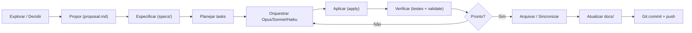

# Processo de Desenvolvimento

| Campo | Valor |
|---|---|
| Versão | 1.2.0 |
| Data | 2026-09-27 |
| Status | Vigente — baseline do commit `454ae58` + change `add-frontend-build` implementada |
| Modelo/norma | Spec-driven (OpenSpec) + docs-as-code + orquestração por subagentes |
| Público | desenvolvedores, líderes de projeto |

> Parte da [documentação do login_base](README.md). Descreve o ciclo de vida de uma change OpenSpec, fluxo de orquestração por subagentes Claude (Opus/Sonnet/Haiku), e métricas de utilização.

---

## 1. Visão do Ciclo

Cada funcionalidade é entregue como uma **change OpenSpec**, um contêiner de especificação, implementação, testes e documentação. O fluxo é:



---

## 2. OpenSpec: Estrutura e Artefatos

### 2.1 Estrutura de arquivos

```
openspec/
├── specs/                                     # Specs vigentes (archivadas)
│   ├── access-control-data/spec.md
│   ├── user-authentication/spec.md
│   ├── docker-dev-environment/spec.md
│   ├── frontend-app/spec.md
│   └── subagent-dev-workflow/spec.md
├── changes/
│   ├── archive/                               # Changes concluídas
│   │   ├── 2026-09-23-setup-java-project/
│   │   ├── 2026-09-23-add-docker-compose-profiles/
│   │   ├── 2026-09-23-add-vue-frontend/
│   │   ├── 2026-09-23-add-subagent-dev-skill/
│   │   └── 2026-09-25-add-user-authentication/
│   ├── add-city-builder-game/                 # Change Concluída (arquivada em 2026-09-27)
│   │   ├── proposal.md
│   │   ├── design.md
│   │   ├── tasks.md
│   │   ├── .openspec.yaml
│   │   ├── resumo_utilizacao_agentes.md
│   │   ├── specs/
│   │   │   ├── game-data/spec.md
│   │   │   ├── game-village/spec.md
│   │   │   ├── game-buildings/spec.md
│   │   │   ├── game-farming/spec.md
│   │   │   ├── game-forge/spec.md
│   │   │   ├── game-army/spec.md
│   │   │   ├── game-dungeon-combat/spec.md
│   │   │   ├── game-dungeon-loot/spec.md
│   │   │   ├── game-frontend/spec.md
│   │   │   ├── user-authentication/spec.md
│   │   │   └── frontend-app/spec.md
│   │   └── tasks/
│   │       ├── 1.1-seguranca-api-rest.md
│   │       ├── 1.2-migracao-v3-jogo.md
│   │       └── ... (25 tasks)
│   └── [próximas changes]
├── config.yaml                                # Regras (task autocontida, links)
└── templates/task.md                          # Template de task
```

### 2.2 Artefatos da change

**proposal.md** (Why, What, Capabilities, Impact):
- Por quê: problema, oportunidade, impacto no produto.
- O quê muda: dados, código, frontend, dependências.
- Capabilities: novas (8–11 features) + modificadas (2–3 ajustes).
- Impacto: banco, backend, frontend, config, testes.

**design.md** (Context, Goals, Decisions, Risks):
- Contexto: stack atual, restrições técnicas.
- Goals/Non-Goals: o que entra, o que não.
- Decisões (§1–§21+): cada uma com "§N — Tema" e detalhes (escolha, alternativas não registradas).
- Risks: trade-offs, lacunas, dívidas que viram de outra change.

**specs/ (11 arquivos para o jogo)**:
- Cada capability (`game-data`, `game-village`, …) em um arquivo `spec.md`.
- Estrutura: Purpose, Requirement (SHALL/MUST, critério de verificação, cenários Gherkin).
- Deltas: quando modificam spec vigente, cabeçalho `ADDED / MODIFIED / REMOVED`.

**tasks.md (índice, 25 linhas para o jogo)**:
```markdown
- [ ] 1.1 [Título curto](tasks/1.1-slug.md) — verificação: <resumo>
```

**tasks/X.Y-slug.md (1 arquivo por task, autocontido)**:
- Cabeçalho (índice, dependências, paralela com).
- Objetivo, contexto necessário, arquivos a criar/alterar, notas, critérios de aceite, verificação.
- Links: relativos para artefatos da change (`../design.md`), a partir da raiz para código (`/src/...`).
- Executor lê apenas este arquivo (+ o que está linkado nele).

**.openspec.yaml**:
- Metadados: nome da change, data de criação/conclusão, status (draft/in-progress/done/archived).

**resumo_utilizacao_agentes.md**:
- Tabela: # | Agente (description) | Função | Modelo | Status | Tool uses | Duração | Tokens.
- Por agente: Harness (skills, CLAUDE.md) | Negócio (specs, tasks, código).
- Totais por modelo (Opus, Sonnet, Haiku, orquestrador).
- Progresso: N/M tasks concluídas.

### 2.3 Convenção de links

**Autocontido:** cada task recebe APENAS seu arquivo + o que está linkado nele. Executor não lê `tasks.md` nem outras tasks.

- **Relativos da change:** `../proposal.md`, `../design.md`, `../specs/game-village/spec.md`, `../tasks.md`, outras tasks `../tasks/2.1-slug.md`.
- **Código e configs:** `/src/main/java/...java`, `/pom.xml`, `/Makefile`, `/openspec/specs/user-authentication/spec.md`.
- **Arquivo ainda não criado:** marca `(novo)` no link.
- **Âncoras:** minúsculas com hífens (ex.: `../design.md#1-game-design--recursos`).

### 2.4 Comandos e skills

| Comando | Skill | O quê |
|---|---|---|
| `/opsx:explore` | `openspec-explore` | Examinar ideia, decidir se vale uma change, escrever esboço. |
| `/opsx:propose` | `openspec-propose` | Criar change (proposal.md, design.md, specs/), gerar tasks. |
| `/opsx:apply` | `opsx:apply` ou `openspec-apply` | Executar tasks (ler cada task, código, testes). |
| `/opsx:update` | `openspec-update` | Revisar/corrigir proposal/design após feedback. |
| `/opsx:archive` | `openspec-archive-change` | Mover change de `changes/` para `changes/archive/<data>-<nome>/`, sincronizar specs vigentes. |
| `/opsx:sync` | `openspec-sync-specs` | Atualizar specs vigentes após archive. |

Todos usam a skill **`dev-subagentes`** (mandatory) para orquestração interna.

---

## 3. Orquestração por Subagentes

Regra inegociável: **a sessão principal só orquestra; não escreve código nem docs.**

### 3.1 Papéis e modelos

| Tipo de trabalho | Modelo | Exemplos |
|---|---|---|
| Pensamento, planejamento, raciocínio | **Opus** | Analisar pedido, desenhar solução, quebrar em tasks, investigar bug, revisar arquivos |
| Desenvolvimento de código, aplicação de changes | **Sonnet** | Implementar task, corrigir código, criar teste, rodar build/verify |
| Escrita de textos e docs `.md` | **Haiku** | Escrever proposal/design, specs, tasks, README, docs, relatório de tokens |

### 3.2 Sessão limpa sempre

- Cada tarefa = um subagente **novo**, sem contexto anterior.
- Para OpenSpec com pasta `tasks/`: executor recebe **APENAS** o caminho do arquivo `tasks/X.Y-slug.md`.
- Para OpenSpec legado (sem `tasks/`): executor recebe o texto da task em `tasks.md` como descrever.

### 3.3 Ondas paralelas

Tarefas **independentes** (não dependem uma da outra, não alteram mesmos arquivos) rodam **ao mesmo tempo** em uma mensagem. Ex.:

- **Onda 1:** Sonnet A escreve task 1.1 (banco), Sonnet B escreve task 1.2 (entidades) → podem correr em paralelo.
- **Onda 2:** Opus revisa, Haiku escreve relatório → dependem da onda 1.

### 3.4 Relatório final (`resumo_utilizacao_agentes.md`)

Gravado na pasta da change por subagente Haiku após todas as ondas concluírem. Não inclui o próprio agente do relatório.

**Consumo da sessão principal:** via script `/home/adiel/.claude/skills/dev-subagentes/scripts/consumo_sessao.py --sessao <session-id>`.

---

## 4. Métricas Históricas de Agentes

### 4.1 Changes arquivadas (5)

| Change | Data | Tasks | Agentes | Tokens | Status |
|---|---|---|---|---|---|
| setup-java-project | 2026-09-23 | 22 | n/d | n/d | Arquivada; sem relatório (OpenSpec anterior) |
| add-docker-compose-profiles | 2026-09-23 | 6 | n/d | n/d | Arquivada; sem relatório |
| add-vue-frontend | 2026-09-23 | 11 | n/d | n/d | Arquivada; sem relatório |
| add-subagent-dev-skill | 2026-09-23 | 6 | n/d | n/d | Arquivada; sem relatório |
| add-user-authentication | 2026-09-25 | 17 | 20 (1 Opus, 17 Sonnet, 2 Haiku) + 1 Haiku no archive | **1.215.955** + 38.809 archive | Arquivada; com relatório |

### 4.2 Change Concluída (arquivada em 2026-09-27) (1)

| Change | Data | Tasks | Agentes | Tokens | Status |
|---|---|---|---|---|---|
| add-city-builder-game | 2026-09-26 | 25 | 36 (1 Opus, 25 Sonnet, 9 Haiku, 1 orq.) | **4.268.464** | Concluída (arquivada em 2026-09-27); com relatório |

**Detalhamento do jogo:**

- Agente 1 (Opus): Planejar change — 124.676 tokens.
- Agentes 2–9 e 33 (Haiku, 9 agentes): artefatos da change e task 8.1 (README) — 658.372 tokens.
- Agentes 10–32 e 34 (Sonnet, 24 agentes): tasks de código 1.1–7.6 e ajuste do frontend ao JSON real — 3.204.944 tokens.
- Agente 35 (Sonnet): task 8.2 — n/d.
- Orquestrador (Opus): Até o início do relatório — 280.472 tokens.

**Progresso:** 25/25 tasks concluídas (100%).

### 4.3 Padrões observados

Observado em 2 changes completas (autenticação, jogo):

- **Opus:** 1 agente por change (planning). ~100–150k tokens por planejamento.
- **Sonnet:** 1 por tarefa de código (média 85–160k tokens). Tarefas críticas (motor, API) custam mais (150–200k).
- **Haiku:** 1–2 por artefato textual (proposal, design, specs). ~50–100k tokens por artefato.
- **Paralelismo:** Ondas de 4–6 agentes simultaneamente (Sonnet em paralelo) podem ser disparadas sem sobrecarga.

### 4.3 Change implementada: add-frontend-build (6 tasks, 5 concluídas; task 3.1 em conclusão)

Status: **Implementada.** Artefatos em `openspec/changes/add-frontend-build/` (proposal.md, design.md, specs/, tasks.md, resumo_utilizacao_agentes.md). Código implementado: serviço `frontend-build` no compose, script `build_front.py`, Makefile `make build_front`, .gitignore atualizado, PaginaController com fallback history mode, SecurityConfig com `/app/**` permitAll.

- **Tasks:** 1.1 (serviço e Vite) ✓, 1.2 (script build_front.py) ✓, 1.3 (make build_front e .gitignore) ✓, 2.1 (rotas e testes) ✓, 3.1 (docs) em conclusão, 4.1 (verificação) em execução.
- **Implementado:** `make build_front` em clone limpo gera `frontend/dist` → `static/app/` + template index.html, fallback do history mode no backend, build de produção com base `/app/` em Vite.

---

## 5. Fluxo Git

### 5.1 Branch principal e de trabalho

- **`main`**: branch principal. Existem também `main_v1` e `production` (remotas). Não há regra registrada de 1 commit por change (ex.: auth teve 3 commits).
- **`jogo_adiel`**: branch de trabalho inicial da change `add-city-builder-game` (arquivada em 2026-09-27). Após archive, continua recebendo commits (change `add-frontend-build` em aberto nesta branch).
- **Remoto:** GitHub (`github.com/adielsantosaraujo/login_base`).

### 5.2 Mensagens de commit

**Formato (imperativo, descritivo):**

```
<tipo>(<escopo>): <resumo em pt-BR>

<corpo (opcional, detalha o porquê)>

Co-Authored-By: Claude <modelo> <<email>>
```

**Tipos:** `feat` (nova feature), `fix` (correção), `refactor` (refatoração), `docs` (documentação), `test` (testes), `chore` (build/config).

**Escopo:** nome da change ou subsistema (`jogo`, `autenticacao`, `docs`).

**Exemplos:**

```
feat(jogo): criação do sistema de jogo
Co-Authored-By: Claude Sonnet 4.5 <noreply@anthropic.com>

refactor(autenticacao): simplifica UsuarioDetailsService
Co-Authored-By: Claude Sonnet 4.5 <noreply@anthropic.com>

docs: atualiza rastreabilidade para a change jogo
Co-Authored-By: Claude Haiku 4.5 <noreply@anthropic.com>
```

### 5.3 Push e PR

- **Não fazer commit automaticamente**: o usuário pede `git commit`.
- **Push**: apenas com consentimento do usuário.
- **PR para `main`**: criar quando change estiver pronta para merge (após verificação, testes, docs atualizados).

### 5.4 Histórico recente (11 commits desde init)

```
690f4d8 (2026-09-27) Implementa serviço `frontend-build`, script Python e integração ao backend (artefatos: change add-frontend-build)
0fd3443 (2026-09-27) Arquiva a change add-city-builder-game e sincroniza as specs
454ae58 (2026-09-27) criação do sistema de jogo
fd9405e (2026-09-26) Adiciona script `executar.py`, suporte a cores em scripts e comando `executar` ao Makefile
6ce0641 (2026-09-25) OpenSpec: tasks em arquivos separados com links clicáveis
4d45323 (2026-09-25) Arquiva a change add-user-authentication e sincroniza as specs
94609b9 (2026-09-24) Implementa autenticação de usuários (change add-user-authentication)
eb618a4 (2026-09-24) Adiciona autenticação de usuários: modelo de acesso, login, sessões e admin inicial
26b38ad (2026-09-24) Atualiza dev-subagentes: Opus planeja, Sonnet codifica, Haiku escreve .md
23d04e5 (2026-09-24) Adiciona comando para push inicial
66565dc (2026-09-24) commit inicial
```

---

## 6. Definition of Done (DoD)

Uma task / change é pronta quando:

1. **Tasks marcadas** `[x]` no índice `tasks.md` (pelo orquestrador).
2. **Testes passando:** `./mvnw test` retorna 0 falhas (239 testes no baseline; novos testes adicionados conforme implementação).
3. **Build do frontend:** `make build_front` sem erros; ou `cd frontend && npm run build` sem erros (dev/checagem).
4. **Validação OpenSpec:** `openspec validate <change> --strict` sem warnings.
5. **README/docs atualizados** com a change (seção no `README.md`, entrada em `16`, divergências em `17`).
6. **Relatório de agentes** em `resumo_utilizacao_agentes.md` com tabela e arquivos lidos.
7. **Nenhuma mudança fora de escopo:** `git status` mostra apenas `docs/` e `openspec/` (changes/ ou archive/).
8. **Artefatos ignorados não versionados:** `git status` não deve listar `build.log`, `static/app/` nem template `sistema/seguro/index.html` (quando add-frontend-build implementada).

### 6.1 Verificação pré-commit

Antes de pedido de merge:

```bash
# Rodar testes
make up  # Postgres deve estar UP
./mvnw test  # 239 testes no baseline (contagem após add-frontend-build a confirmar), 0 falhas esperadas

# Validar OpenSpec
openspec validate <change> --strict

# Build do frontend (produção)
make build_front
# ou para checagem:
cd frontend && npm run build && cd ..

# Verificar status git
git status  # Apenas docs/ e openspec/ alterados; sem build.log, static/app/, template index.html

# Verificar links (opcional, mas recomendado)
# Todos os links relativos devem resolver
```

---

## 7. Manutenção desta Documentação

### 7.1 Atualizar junto com cada change

Após submeter/arquivar uma change:

1. **Leia** `proposal.md`, `design.md`, `specs/`, `tasks.md`.
2. **Atualize** arquivos de docs afetados:
   - Novo requisito/capability → `02-requisitos.md` §3, `15-rastreabilidade.md`.
   - Nova decision → `04-arquitetura.md` §9, `adr/0023-…md`.
   - Novo endpoint → `06-api-rest.md`.
   - Novo risco/divergência/dívida → `17-riscos-divida-roadmap.md`.
   - Histórico → `16-historico-changelog.md` (nova seção com data, commits, estatísticas).
   - Glossário → `14-glossario.md` (novos termos).
3. **Verifique** links.
4. **Commit junto:** `docs: atualiza para change X` ou `docs: consolida divergências`.

### 7.2 Archive da change do jogo — 2026-09-27

A change `add-city-builder-game` foi **arquivada em 2026-09-27**. Etapas realizadas:

1. Executado `/opsx:archive add-city-builder-game`.
2. Specs movidas de `openspec/changes/archive/2026-09-27-add-city-builder-game/specs/` para `openspec/specs/`.
3. **Todos os links em `docs/`** atualizados: substituídos `../openspec/changes/archive/2026-09-27-add-city-builder-game/specs/` por `../openspec/specs/`.
4. Removido sufixo "(delta da change…)" das citações de specs.
5. Commit: `docs: atualiza links specs após archive jogo`.

### 7.3 Próximas changes (roadmap em `17`)

Quando criar nova change:

- [ ] Criar pasta `openspec/changes/<data>-<nome>/`.
- [ ] Escrever proposal, design, specs (conforme plano da change).
- [ ] Criar tasks/ com índice.
- [ ] Disparar Opus → Sonnet/Haiku (ondas paralelas).
- [ ] Ao final, Haiku escreve `resumo_utilizacao_agentes.md`.
- [ ] **Atualizar `docs/`:** não esperar até o fim; atualizar incrementalmente.

---

## 8. Ferramentas

### 8.1 Claude Code + Plugin PrimeVue

- **Plugin PrimeVue:** instalação em `~/.claude/plugins/`, diagnostic via `/skill-doctor`.
- **Skills do projeto:** `dev-subagentes`, `openspec-explore`, `openspec-propose`, `openspec-apply`, `openspec-archive-change`, `openspec-sync-specs`.
- **Commands:** `/opsx:explore`, `/opsx:propose`, `/opsx:apply`, `/opsx:update`, `/opsx:archive`, `/opsx:sync`.

### 8.2 Ambiente local

- **IntelliJ IDEA** (Java 25, Spring Boot 4.1.1).
- **VSCode** (Frontend: Vue 3, TypeScript).
- **Makefile:** `make up`, `make down`, `make e` (executar), `make build_front`.
- **Docker Compose:** 3 serviços (db, app, frontend) + `frontend-build` com profile `build`.
- **Python 3:** scripts `executar.py` (menu interativo), `scripts/build_front.py` (build do frontend).

### 8.3 Testes e validação

- **JUnit 5, Mockito, AssertJ:** testes Java.
- **spring-boot-test, spring-security-test:** integração.
- **Postgres 17 do compose:** testes contra BD real (sem Testcontainers).
- **Surefire Maven:** rodas `./mvnw test`, relatório em `target/surefire-reports/`.
- **npm run build:** validate frontend TypeScript.

---

## Histórico de revisões

| Versão | Data | Resumo | Autor |
|---|---|---|---|
| 1.2.0 | 2026-09-27 | Change add-frontend-build implementada: §4.3 change implementada, §6 DoD com make build_front vigente | Adiel, com apoio de agentes Claude |
| 1.1.0 | 2026-09-27 | Atualização para a change add-frontend-build (prevista, aberta): §4.4 change em andamento, §5.4 commits, §6 DoD com make build_front e gitignore, §8.2 ferramentas | Adiel, com apoio de agentes Claude |
| 1.0.0 | 2026-09-27 | Versão inicial | Adiel, com apoio de agentes Claude |
