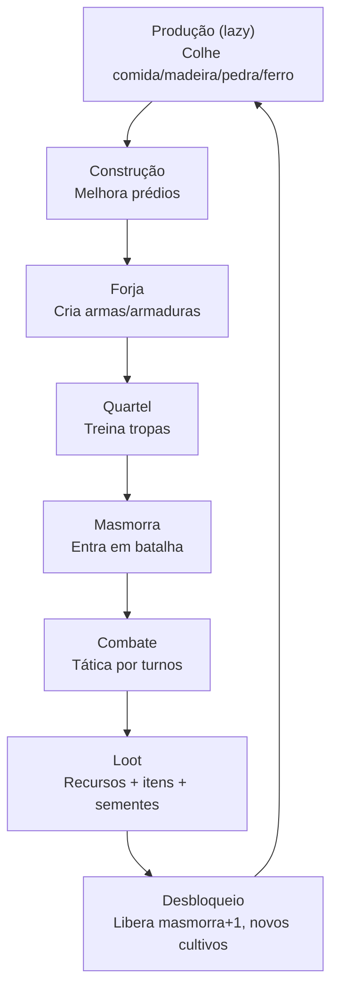

# Game Design Document

| Campo | Valor |
|---|---|
| Versão | 1.1.0 |
| Data | 2026-09-27 |
| Status | Vigente — baseline do commit `454ae58` |
| Modelo/norma | Game Design Document (GDD) |
| Público | game designers, desenvolvedores, QA |
| Fontes | `openspec/changes/archive/2026-09-27-add-city-builder-game/design.md` §1–§11; `jogo/catalogo/*.java`; `jogo/masmorra/combate/MotorCombate.java`; `jogo/masmorra/GeradorLoot.java` |

> Parte da [documentação do login_base](README.md). Especificação completa das mecânicas de jogo: progressão, recursos, construções, combate e balanceamento.

---

## 1. Conceito do jogo

**Gênero:** City builder + tática por turnos (tbs).

**Plataforma:** Web (SPA Vue 3 + backend Spring Boot).

**Público:** jogadores casual/mid-core interessados em progressão e gestão de recursos.

**Pilares de design:**
- **Progressão linear**: desbloqueia funcionalidades (masmorras, cultivos, tropas) pelo nível da masmorra vencida.
- **Gestão de recursos**: produção contínua calculada sob demanda (sem colheita manual), armazém com capacidade limitada.
- **Combate determinístico**: motor puro sem random na resolução, apenas nas rolagens de loot.

---

## 2. Core loop

---

## Índice

| Seção | Documento |
|---|---|
| 1. Conceito do jogo | [§1 neste documento](#1-conceito-do-jogo) |
| 2. Core loop | [§2 neste documento](#2-core-loop) |
| 3. Recursos e economia | [12.3 — Recursos e economia](12-gdd/12.3-gdd-recursos-e-economia.md) |
| 4. Prédios | [12.4 — Prédios](12-gdd/12.4-gdd-predios.md) |
| 5. Fazenda e sementes | [12.5 — Fazenda e sementes](12-gdd/12.5-gdd-fazenda-e-sementes.md) |
| 6. Itens e forja | [12.6 — Itens e forja](12-gdd/12.6-gdd-itens-e-forja.md) |
| 7. Tropas e quartel | [12.7 — Tropas e quartel](12-gdd/12.7-gdd-tropas-e-quartel.md) |
| 8. Masmorras | [12.8 — Masmorras](12-gdd/12.8-gdd-masmorras.md) |
| 9. Combate tático | [12.9 — Combate tático](12-gdd/12.9-gdd-combate-tatico.md) |
| 10. Loot de masmorra | [12.10 — Loot de masmorra](12-gdd/12.10-gdd-loot-de-masmorra.md) |
| 11. Interface (6 telas) | [12.11 — Interface (6 telas)](12-gdd/12.11-gdd-interface-6-telas.md) |
| 12. Simplificações intencionais | [12.12 — Simplificações intencionais](12-gdd/12.12-gdd-simplificacoes-intencionais.md) |
| 13. Extensões futuras | [12.13 — Extensões futuras](12-gdd/12.13-gdd-extensoes-futuras.md) |
| 14. Exemplos numéricos | [12.14 — Exemplos numéricos](12-gdd/12.14-gdd-exemplos-numericos.md) |

---

## Histórico de revisões

| Versão | Data | Descrição | Autor |
|---|---|---|---|
| 1.0.0 | 2026-09-27 | Versão inicial | Adiel, com apoio de agentes Claude |
| 1.1.0 | 2026-09-27 | Seções 3–14 separadas em arquivos na pasta `12-gdd/`; este documento passa a ser o índice | Adiel, com apoio de agentes Claude |
| 1.2.0 | 2026-09-27 | Nome e sobrenome sorteados na unidade; sufixo "(N)" automático em nomes repetidos (primeira sem sufixo, contagem por vila e histórica); treino em lote com quantidade e botão "Máx."; tela de detalhe com 9 slots; troca de Arma/Armadura fora da masmorra por item compatível do inventário (item retirado volta a DISPONIVEL, sem desequipar); JSONs de nomes movidos para `/src/main/resources/jogo/nomes/` (change [add-soldier-names-batch-slots](/openspec/changes/add-soldier-names-batch-slots/proposal.md)) | Adiel, com apoio de agentes Claude |
