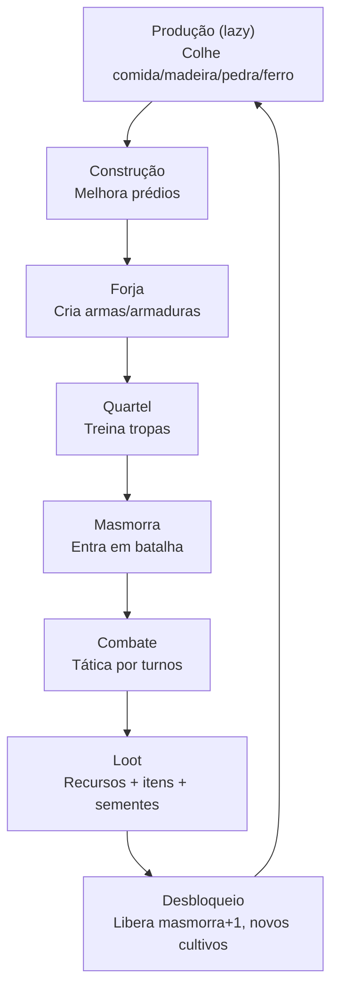

# Game Design Document

| Campo | Valor |
|---|---|
| Versão | 1.0.0 |
| Data | 2026-09-27 |
| Status | Vigente — baseline do commit `454ae58` |
| Modelo/norma | Game Design Document (GDD) |
| Público | game designers, desenvolvedores, QA |
| Fontes | `openspec/changes/archive/2026-09-27-add-city-builder-game/design.md` §1–§11; `jogo/catalogo/*.java`; `jogo/masmorra/combate/MotorCombate.java`; `jogo/masmorra/GeradorLoot.java` |

> Parte da [documentação do login_base](README.md). Especificação completa das mecânicas de jogo: progressão, recursos, construções, combate e balanceamento.

---

## 1. Conceito do jogo

**Gênero:** City builder + tática por turnos (tbs).

**Plataforma:** Web (SPA Vue 3 + backend Spring Boot).

**Público:** jogadores casual/mid-core interessados em progressão e gestão de recursos.

**Pilares de design:**
- **Progressão linear**: desbloqueia funcionalidades (masmorras, cultivos, tropas) pelo nível da masmorra vencida.
- **Gestão de recursos**: produção contínua calculada sob demanda (sem colheita manual), armazém com capacidade limitada.
- **Combate determinístico**: motor puro sem random na resolução, apenas nas rolagens de loot.

---

## 2. Core loop



---

## 3. Recursos e economia

### 3.1 Tipos de recursos

| Recurso | Papel | Estoque inicial | Capacidade (armazém nível N) |
|---|---|---|---|
| **Madeira** | Construção, forja, armas | 400 | 500 × 2^(N-1) unidades |
| **Pedra** | Construção, forja | 300 | 500 × 2^(N-1) unidades |
| **Ferro** | Forja, armas/armaduras pesadas | 50 | 500 × 2^(N-1) unidades |
| **Comida** | Treino de tropas, consumo diário | 300 | 500 × 2^(N-1) unidades |

**Nota:** recursos são armazenados em milésimos (×1000) no banco de dados, mas a API e a UI exibem valores em unidades. Ex.: 400 unidades = 400.000 milésimos.

### 3.2 Produção

Produção é **calculada sob demanda** (lazy): quando o jogador acessa a vila, a aplicação:
1. Calcula a distância de tempo desde a última sincronização.
2. Multiplica cada taxa de produção por hora pelo intervalo.
3. Aplica limite de capacidade.
4. Conclui ordens vencidas nesse intervalo.

**Taxas de produção por nível (unidades/hora):**
- **Serraria:** `30 × N` (madeira)
- **Pedreira:** `20 × N` (pedra)
- **Mina de ferro:** `10 × N` (ferro)
- **Canteiros:** cada cultivo tem taxa fixa (ver §5).

### 3.3 Velocidade

Configurável por `JOGO_VELOCIDADE` (padrão: 1). Multiplica todas as taxas de produção e divide tempos de construção/forja/treino (arredonda para cima). Exemplo: `JOGO_VELOCIDADE=60` torna o jogo 60× mais rápido.

---

## 4. Prédios

Cada vila tem **um prédio de cada tipo**, com nível 0 (não construído) a 5.

**Fórmula de custo:** `round_half_up(base × 1,5^(N-1))` unidades por recurso.  
**Fórmula de tempo:** `base × 2^(N-1)` segundos.

| Tipo | Custo base | Tempo base (s) | Efeito por nível | Pré-requisito |
|---|---|---|---|---|
| **Centro da vila** | M150 P150 | 120 | — | — |
| **Armazém** | M100 P60 | 60 | Capacidade 500×2^(N-1) por recurso | — |
| **Fazenda** | M80 P40 | 60 | N canteiros (máx. 5) | — |
| **Serraria** | M60 P40 | 60 | Madeira +30×N/h | — |
| **Pedreira** | M80 P20 | 60 | Pedra +20×N/h | — |
| **Mina de ferro** | M100 P80 | 90 | Ferro +10×N/h | — |
| **Forja** | M120 P100 F40 | 120 | Forja até nível N (máx. 5) | Mina de ferro N1 |
| **Quartel** | M150 P120 F40 | 120 | Capacidade exército +3×N | Forja N1 |

**Nota:** Todo prédio (exceto o centro) é limitado ao nível do centro da vila.

**Ordem de validação de construção (em `ConstrucaoService`):**
1. Nível máximo 5 (`NIVEL_MAXIMO`).
2. Nível-alvo ≤ nível do centro (exceto o próprio centro) (`REQUISITO_NAO_ATENDIDO`).
3. Pré-requisitos específicos (`REQUISITO_NAO_ATENDIDO`).
4. Fila de construção única (1 ordem por categoria: **CONSTRUCAO**) (`FILA_OCUPADA`).
5. Recursos suficientes (`RECURSOS_INSUFICIENTES`).

**Débito:** os recursos são debitados **no início** da ordem; o efeito é aplicado na conclusão.

### Estado inicial
- Centro (N1), Armazém (N1), Fazenda (N1), Serraria (N1), Pedreira (N1)
- Mina, Forja, Quartel (N0)
- Recursos: 300 comida, 400 madeira, 300 pedra, 50 ferro (unidades; 300.000, 400.000, 300.000, 50.000 milésimos)

---

## 5. Fazenda e sementes

Cada nível da fazenda desbloqueará N canteiros (máx. 5 em N5).

| Cultivo | Produção (comida/h) | Exige semente? | Desbloqueado em masmorra |
|---|---|---|---|
| **Trigo** | 20 | Não (infinito) | Inicial |
| **Milho** | 30 | Sim (1 por plantio) | Nível ≥1 |
| **Batata** | 45 | Sim | Nível ≥2 |
| **Abóbora dourada** | 70 | Sim | Nível ≥4 |

**Plantio:** instantâneo, consome a semente (exceto trigo), muda a produção do canteiro.

**Preservação:** trocar de cultivo mantém a produção anterior **acumulada** no canteiro.

---

## 6. Itens e forja

Itens são **armas e armaduras**, forjáveis na Forja. Cada item tem:
- **Modelo:** tipo fixo (ex.: Espada, Armadura de Couro).
- **Nível:** 1–5.
- **Status:** `DISPONIVEL` (em estoque), `RESERVADO` (em ordem de treino), `EQUIPADO` (na unidade).
- **Origem:** `FORJA` ou `MASMORRA` (loot).

### Modelos de item

| Modelo | Categoria | Custo base | Tempo base (s) | Atributos (L) |
|---|---|---|---|---|
| **Espada** | Arma | M20 F30 | 60 | Ataque: 6 + 2(L-1); Alcance: 1 |
| **Lança** | Arma | M40 F20 | 60 | Ataque: 5 + 2(L-1); Alcance: 1 |
| **Arco** | Arma | M50 F5 | 60 | Ataque: 4 + 2(L-1); Alcance: 3 |
| **Armadura de couro** | Armadura | C20 M10 F5 | 45 | Defesa: 2 + (L-1) |
| **Armadura de ferro** | Armadura | M10 F40 | 90 | Defesa: 3 + 2(L-1) |

**Limite de nível:** forjável até nível = nível da Forja.

**Receita:** `custo total = base × nível × quantidade`; `tempo = ceil(base × nível × quantidade / velocidade)`.

**Fila:** uma ordem por vez (**FORJA**). Quantidade 1–5 por ordem.

---

## 7. Tropas e quartel

Cada tropa é um **tipo fixo** (Soldado, Arqueiro, Lanceiro) + 1 arma do modelo exigido + 1 armadura, ambas `DISPONIVEL`.

| Tipo | Arma exigida | HP | Defesa base | Movimento | Comida/treino | Tempo (s) | Nível quartel |
|---|---|---|---|---|---|---|---|
| **Soldado** | Espada | 30 | 1 | 3 | 50 | 60 | 1 |
| **Arqueiro** | Arco | 22 | 0 | 3 | 50 | 60 | 2 |
| **Lanceiro** | Lança | 40 | 2 | 2 | 60 | 75 | 3 |

**Atributos finais:**
- **HP:** do tipo (restaurado a cada batalha).
- **Ataque/alcance:** da arma.
- **Defesa:** defesa base do tipo + defesa da armadura.
- **Movimento:** do tipo.

**Capacidade do exército:** `3 × nível_quartel` (unidades + em treino).

**Fila:** uma ordem de treino por vez (**TREINO**). Recursos debitados no início, arma/armadura reservadas.

---

## 8. Masmorras

Masmorras desbloqueiam-se por nível. Vencer masmorra N libera masmorra `min(5, N+1)`. Estado inicial: nível 1 desbloqueado.

### Composição de inimigos

| Nível | Inimigos | Total |
|---|---|---|
| **1** | 3× Goblin | 3 |
| **2** | 1× Esqueleto Arqueiro, 3× Goblin | 4 |
| **3** | 1× Orc, 2× Goblin, 2× Esqueleto Arqueiro | 5 |
| **4** | 3× Orc, 2× Esqueleto Arqueiro | 5 |
| **5** | 1× Troll, 2× Orc, 2× Esqueleto Arqueiro | 5 |

### Tipos de inimigo

| Tipo | HP | Ataque | Defesa | Alcance | Movimento |
|---|---|---|---|---|---|
| **Goblin** | 15 | 6 | 1 | 1 | 3 |
| **Esqueleto Arqueiro** | 12 | 6 | 0 | 3 | 2 |
| **Orc** | 30 | 9 | 3 | 1 | 2 |
| **Troll** | 70 | 13 | 5 | 1 | 2 |

### Mapa tático

Todas as masmorras usam o **mapa padrão 8×8**:

```
  0 1 2 3 4 5 6 7
0 . S4. S1. . S5.
1 . . S2. . S3. .
2 . . . # # . . .
3 . # . . . . # .
4 . # . . . . # .
5 . . . # # . . .
6 . . . . . . . .
7 . . J J J J . .
```

**Legenda:**
- `J`: posição inicial do jogador (4 posições: 2,7 / 3,7 / 4,7 / 5,7).
- `#`: obstáculo (intransponível).
- `S1..S5`: pontos de spawn de inimigos (S1, S2, S3, S4, S5).

**Obstáculos:** (3,2), (4,2), (1,3), (6,3), (1,4), (6,4), (3,5), (4,5).  
**Spawns:** S1(3,0), S2(2,1), S3(5,1), S4(1,0), S5(6,0).

---

## 9. Combate tático

Combate ocorre por turnos. O jogador age primeiro (movimento + ação), depois a IA dos inimigos age simultaneamente (em ordem de ID lexicográfica).

### Ações do jogador

| Ação | Custo | Efeito |
|---|---|---|
| **Mover** | 1 movimento | Move até `movimento` casas (caminho mais curto por BFS) |
| **Atacar** | 1 ação | Causa dano: `max(1, ataque - defesa_efetiva)` |
| **Defender** | 1 ação | Dobra defesa até fim do turno (defesa_efetiva = defesa base × 2) |
| **Encerrar turno** | — | Ativa IA, próximo turno |
| **Render-se** | — | Derrota imediata |

**Restrição:** cada combatente pode mover uma vez e agir (atacar ou defender) uma vez por turno; pode mover e depois agir, mas não mover depois de agir.

### Dano

Dano = `max(1, ataque_atacante - defesa_efetiva_alvo)`.

Quando defendendo, `defesa_efetiva = defesa_base × 2`.

### IA dos inimigos

Ao encerrar o turno, para cada inimigo vivo (ordem ID ascendente: I1..I5):
1. **Escolhe alvo:** unidade do jogador com menor distância Manhattan, desempate por menor HP, depois por menor ID.
2. **Move ou ataca:**
   - Se ao alcance, **ataca** o alvo.
   - Senão, encontra caminho mais curto até o alvo (BFS), move até ele, ataca se ficar ao alcance.

### Controle de concorrência

Cada ação informa o `turno`; se ≠ turno atual → 409 `TURNO_DESATUALIZADO`. Gravações concorrentes são barradas por `@Version` → 409 `CONFLITO`.

### Fim de batalha

**Vitória:** quando todos os inimigos morrem (durante turno do jogador).

**Derrota:**
- Todas as unidades do jogador morrem (durante turno dos inimigos).
- 30 turnos decorridos sem vitória.
- Jogador se rende.

**Nenhum loot na derrota.**

---

## 10. Loot de masmorra

Vencer masmorra N gera:
1. **Recursos garantidos (unidades):** 
   - Comida: `40 × N`
   - Madeira: `50 × N`
   - Pedra: `50 × N`
   - Ferro: `20 × N`

2. **Rolagens:** `1 + ceil(N/2)` (N1/N2 → 2 rolls; N3/N4 → 3 rolls; N5 → 4 rolls).
   Cada rolagem é um número 0–99:
   - **0–34 (35%):** semente sorteada entre as sementes liberadas pelo nível da masmorra, com pesos Milho 60, Batata 30, Abóbora Dourada 10 (renormalizados se nem todas forem desbloqueadas).
   - **35–59 (25%):** `30 × N` de ferro extra.
   - **60–99 (40%):** um dos 5 modelos de item com chance igual, nível `min(5, N + 0 ou 1)`.

---

## 11. Interface (6 telas)

| Tela | Conteúdo |
|---|---|
| **Vila** | Estado da vila, prédios com progresso, fila de construção |
| **Fazenda** | Canteiros com cultivos, estoque de sementes, plantio |
| **Forja** | Fila de forja, criação de ordens (modelo, nível, quantidade) |
| **Quartel** | Fila de treino, unidades disponíveis, criação de ordens |
| **Masmorras** | Cards de masmorras, seleção de até 4 unidades, status "Entrar" |
| **Batalha** | Mapa 8×8, unidades e inimigos, log de ações, controles de combate |

**Painel flutuante:** recursos (comida, madeira, pedra, ferro) visível em todas as telas.

**Atualização:** polling a cada 5 segundos; ações sincronizam imediatamente.

**Toast:** erro em vermelho com mensagem amigável (`CodigoErro` → pt-BR).

---

## 12. Simplificações intencionais

- **Sem upkeep:** nenhum custo recorrente de recursos.
- **Sem cancelamento:** ordens não podem ser canceladas.
- **Sem colheita manual:** comida é produzida automaticamente pelos canteiros.
- **Sem crítico/esquiva:** combate é determinístico (exceto loot).
- **Sem mapas por nível:** todas as masmorras usam o mesmo mapa.
- **Sem permutação de tropas:** esquadrão é fixo por masmorra (seleção no início).

---

## 13. Extensões futuras

- Login em Vue (sem Thymeleaf).
- Autorização por permissão nas rotas.
- Teste com Testcontainers.
- CRUD de usuários e perfis (administração).
- Recuperação de senha, bloqueio por tentativas, MFA.
- Ciclos sazonais, mapas procedurais.
- IA adaptativa, lock granular.

---

## 14. Exemplos numéricos

### Exemplo 1: Soldado equipado (N1)

**Componentes:**
- Tipo: Soldado
- Arma: Espada N1 (ataque 6)
- Armadura: Armadura de Couro N1 (defesa 2)

**Atributos finais:**
- HP: 30 (restaurado a cada batalha)
- Ataque: 6 (da arma)
- Defesa efetiva: 1 (defesa base) + 2 (armadura) = 3
- Movimento: 3 (do tipo)
- Alcance: 1 (da arma)

### Exemplo 2: Construção de Quartel N2

**Custo base:** M150 P120 F40  
**Para N2:** `round_half_up(base × 1,5^(2-1))` = `round_half_up(base × 1,5)`
- Madeira: `round_half_up(150 × 1,5)` = 225
- Pedra: `round_half_up(120 × 1,5)` = 180
- Ferro: `round_half_up(40 × 1,5)` = 60

**Tempo:** `120 × 2^(2-1)` = `120 × 2` = 240 segundos (4 minutos).

### Exemplo 3: Forja com velocidade 60

**Ordem:** Espada N3, quantidade 2.  
**Custo base:** M20 F30  
**Total:** `(M20 F30) × 3 × 2` = M120 F180  
**Tempo:** `ceil(60 × 3 × 2 / 60)` = `ceil(6)` = 6 segundos.

### Exemplo 4: Loot de Masmorra N3

**Garantido:**
- Comida: 120 (120.000 milésimos)
- Madeira: 150 (150.000 milésimos)
- Pedra: 150 (150.000 milésimos)
- Ferro: 60 (60.000 milésimos)

**3 rolagens:**
1. Rolo 1: resultado 28 → Milho (semente).
2. Rolo 2: resultado 45 → Ferro extra: `30 × 3` = 90 de ferro.
3. Rolo 3: resultado 72 → Item: um dos 5 modelos com chance igual, nível `min(5, 3 + 1)` = 4.

---

## Histórico de revisões

| Versão | Data | Descrição | Autor |
|---|---|---|---|
| 1.0.0 | 2026-09-27 | Versão inicial | Adiel, com apoio de agentes Claude |
