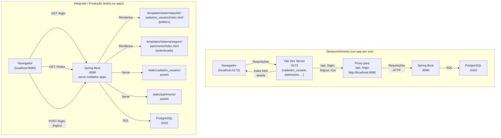

# Arquitetura

Visão geral da arquitetura do projeto em dois cenários: desenvolvimento e integrado em produção, com suporte a múltiplos frontends.

## Contexto

O login_base é uma aplicação de autenticação reutilizável que combina:

- Um **backend Java/Spring Boot** que fornece formulário de login, controle de sessões, auditoria e documentação de API.
- **Múltiplos frontends Vue 3** (público, seguro, etc.), servidos pelo mesmo backend em produção ou em desenvolvimento separado via Vite.
- Um **banco PostgreSQL** que persiste usuários, perfis, permissões e sessões.

A arquitetura é dividida em domínios (pacotes): `acesso`, `auditoria`, `seguranca` e `web`.

## Como funciona

O diagrama abaixo mostra os dois cenários principais de implantação:



### Desenvolvimento

1. **Navegador** acessa `http://localhost:5173` (Vite dev server).
2. **Vite** serve a SPA (Hot Module Reloading ativa).
3. **Proxy do Vite** encaminha `/api/**`, `/login`, `/logout` e `/css/**` para `http://localhost:8080`.
4. **Spring Boot** processa autenticação, rotas e API em porta 8080.
5. **PostgreSQL** em container armazena dados.

**Vantagem:** recarregamento instantâneo do frontend; backend e frontend desenvolvem em paralelo.

### Integrado / Produção

1. **Build dos frontends** (`make build_front` ou `python3 scripts/build_front.py`):
   - Descobre apps em `frontend/public/*/` e `frontend/seguro/*/` (via `scripts/apps_front.py`).
   - Para cada app, gera `frontend/<app>/dist/` com assets otimizados.
   - Copia assets (CSS, JS, imagens) para `src/main/resources/static/<nome>/`.
   - Copia `index.html` para `src/main/resources/templates/sistema/<area>/<nome>/index.html`.
   - Exemplo: `frontend/seguro/patrimonio/dist/` → `static/patrimonio/` e `templates/sistema/seguro/patrimonio/index.html`.

2. **Build do backend** (`./mvnw package`):
   - Empacota a aplicação Java com todos os frontends integrados no JAR.

3. **Execução**:
   - Uma única porta (8080 por padrão) serve tudo.
   - Navegador acessa `http://localhost:8080/login` (formulário HTML).
   - Apps públicos: `http://localhost:8080/cadastro_usuario/index` (sem autenticação obrigatória).
   - Apps seguros: `http://localhost:8080/patrimonio/index` (exige autenticação; pós-login redireciona aqui).
   - Cada app carrega assets de seu próprio caminho (ex.: `/patrimonio/assets/`, servidos como `static/patrimonio/`).

**Vantagem:** uma única aplicação com múltiplos apps, sem proxy, deploy mais simples. Apps isolados por escopo (público vs. seguro).

## Pacotes e responsabilidades

```
com.example.loginbase
├── acesso/
│   ├── Usuario, Perfil, Permissao     — Entidades de domínio
│   ├── UsuarioPerfil, PerfilPermissao — Associações
│   ├── Sessao                         — Registro de sessões
│   └── UsuarioRepository, ...         — Acesso a dados (Spring Data JPA)
│
├── auditoria/
│   ├── EntidadeAuditavel              — Superclasse com criado_em/por e alterado_em/por
│   ├── AuditoriaConfig                — @EnableJpaAuditing
│   └── UsuarioAuditorAware            — Provedor de usuário atual
│
├── seguranca/
│   ├── SecurityConfig                 — Cadeia de filtros, CSRF, sessão
│   ├── UsuarioDetailsService          — Carregamento para autenticação
│   ├── IdentificadorLogin             — Interpretação de e-mail ou celular
│   ├── RegistroSessaoSuccessHandler   — Registro pós-login
│   ├── SessaoService                  — Lógica de sessões
│   ├── SessoesAbertasRunner           — Fechamento na inicialização
│   ├── AdminInicialRunner             — Criação do admin inicial
│   └── SessaoEncerradaListener        — Listener de eventos
│
└── web/
    ├── PaginaController               — Rotas /login, /, /<nome>/, /<nome>/index (público e seguro)
    └── OpenApiConfig                  — Metadados OpenAPI/Swagger
```

## Fluxo de uma sessão

1. **Acesso a `/<nome>/index`** (anônimo a app seguro) → redirecionado para `/login`.
2. **Preenchimento do formulário** (e-mail/celular e senha) → POST `/login`.
3. **Validação** no `UsuarioDetailsService`:
   - `IdentificadorLogin` classifica o input (e-mail ou celular).
   - Busca na tabela `usuarios`.
   - Carrega perfis vigentes via `UsuarioPerfilRepository.findPerfisVigentesComPermissoes()`.
   - Valida senha com `PasswordEncoder` (bcrypt).
4. **Sucesso** → `RegistroSessaoSuccessHandler`:
   - Cria registro em `sessoes` com hash SHA-256 do ID.
   - Redireciona para `/patrimonio/index` (app seguro, página inicial) ou página anterior.
5. **Navegação na SPA**:
   - Vue router mapeia rotas de `/<nome>/**` (ex.: `/patrimonio/**`, `/cadastro_usuario/**`).
   - Quaisquer chamadas à API passam pelo proxy (dev) ou direto (prod).
6. **Logout**: POST `/logout` → invalida sessão, redireciona para `/login?logout`.
7. **Encerramento automático**:
   - `SessaoEncerradaListener` preenche `data_fim` quando a sessão HTTP encerra.
   - `SessoesAbertasRunner` fecha sessões pendentes na inicialização.

## Por que é assim

Decisões-chave registradas em ADRs:

- **[0001 — Stack Java, Spring Boot e Docker](./decisoes/0001-stack-java-spring-boot-e-docker-no-wsl.md):** Java 25 + Boot 4.1.1 no WSL, Maven em container.
- **[0002 — Profiles do Compose](./decisoes/0002-profiles-do-compose-controlados-por-variaveis.md):** Profiles flexíveis para db, app e frontend.
- **[0003 — Frontend Vue em container](./decisoes/0003-frontend-vue-primevue-em-container.md):** Node 26, npm 12, PrimeVue integrado.
- **[0004 — Pacotes de domínio](./decisoes/0004-organizacao-por-pacotes-de-dominio.md):** Não por camada, mas por domínio.
- **[0005 — Flyway versionado](./decisoes/0005-esquema-versionado-com-flyway.md):** Migrações no Git, `ddl-auto=validate`.
- **[0006 — Auditoria com JPA Auditing](./decisoes/0006-auditoria-com-spring-data-jpa-auditing.md):** Campos de auditoria em todas as entidades.
- **[0007 — Login por e-mail ou celular](./decisoes/0007-login-por-email-ou-celular-normalizados.md):** Validação sem enumerar usuários.
- **[0008 — Senhas com DelegatingPasswordEncoder](./decisoes/0008-senhas-com-delegating-password-encoder.md):** Bcrypt com suporte a migração futura.
- **[0009 — Registro de sessões em tabela](./decisoes/0009-registro-de-sessoes-em-tabela-propria.md):** Tabela `sessoes` com hash do token.
- **[0010 — Admin inicial por variáveis](./decisoes/0010-administrador-inicial-por-variaveis-de-ambiente.md):** `AdminInicialRunner` lê env vars.
- **[0011 — SPA servida pelo Spring](./decisoes/0011-spa-servida-pelo-spring-em-app.md):** Build integrado, não Nginx separado (substituída pela 0014).
- **[0012 — Documentação da API com springdoc](./decisoes/0012-documentacao-da-api-com-springdoc.md):** OpenAPI 3, Swagger UI integrado em `/swagger-ui.html`.
- **[0013 — Documentação em docs por público e Diátaxis](./decisoes/0013-documentacao-em-docs-por-publico-e-diataxis.md):** Estrutura por público e tipo de documento.
- **[0014 — Múltiplos frontends em public/seguro](./decisoes/0014-multiplos-frontends-em-public-seguro.md):** Organização de apps por área (público/seguro), descoberta automática, builds independentes.

## Limitações e trade-offs

- **Uma instância só:** Registro de sessões em tabela local; sem sessão externalizada ou múltiplas instâncias.
- **IP atrás de proxy:** Requer `server.forward-headers-strategy=native` (hoje desligado).
- **Sem bloqueio por tentativas:** Vulnerável a força bruta (fora do escopo, candidato a change).
- **Perfil ativa:** Usuário sem perfil vigente não consegue logar (comportamento intencional).

## Veja também

- [Autenticação e sessões](./autenticacao-e-sessoes.md)
- [Frontend integrado ao backend](./frontend-integrado-ao-backend.md)
- [Modelo de dados](../referencia/modelo-de-dados.md)
- [Rotas e segurança](../referencia/rotas-e-seguranca.md)
