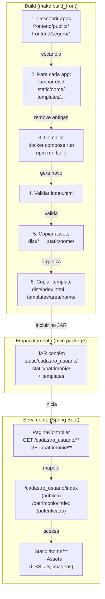

# Frontend integrado ao backend

Explicação de como múltiplos frontends Vue são integrados ao backend Spring Boot em produção, e as diferenças entre desenvolvimento e ambiente integrado.

## Contexto

O login_base usa uma estratégia de **integração em dois níveis**, com suporte a múltiplos frontends:

1. **Desenvolvimento:** Vite dev server roda em `localhost:5173` com hot reload; proxy encaminha requisições para o backend em 8080. Um app por vez.
2. **Produção:** Build de cada app Vue é copiado para dentro do JAR do backend; uma única porta (8080) serve todos os apps em seus caminhos (`/<nome>/`).

Não há Nginx separado nem CORS; todos os frontends são parte integral do backend. Cada app está em `frontend/public/<nome>/` (público) ou `frontend/seguro/<nome>/` (seguro) e servido em `/<nome>/`.

## Como funciona

O diagrama abaixo mostra o fluxo de build e servimento dos apps (exemplo com `cadastro_usuario` e `patrimonio`):



### Desenvolvimento

1. **Frontend roda em container** (ou localhost com Node). Um app por vez:
   ```bash
   make up FRONT_APP=seguro/patrimonio       # app de patrimônio (padrão)
   # ou
   make up FRONT_APP=public/cadastro_usuario  # app de cadastro
   # ou
   npm run dev  # em frontend/seguro/patrimonio/ ou frontend/public/cadastro_usuario/
   ```

2. **Vite serve em `http://localhost:5173`**:
   - Hot Module Reloading (HMR) ativo.
   - Proxy em `vite.config.ts` encaminha:
     - `/api/**`, `/login`, `/logout`, `/css/**` → `http://localhost:8080`
     - Outros → aplicação Vue local

3. **Backend roda em `http://localhost:8080`**:
   - Spring Boot serve `/login` (formulário), `/logout` e `/api/**`.
   - Não serve a SPA em dev (o frontend vem de 5173).
   - Diferentes apps rodando: para testar múltiplos, use múltiplas abas ou janelas com `npm run dev` em pasta diferentes.

4. **Fluxo**:
   - Navegador acessa `http://localhost:5173`.
   - Vite serve `index.html` do app.
   - Requisições `/api/*` são proxiadas para 8080.
   - `login` / `logout` são redirecionamentos para o formulário em 8080 (em desenvolvimento).
   - Após login bem-sucedido, volta para a SPA em 5173.

> **Nota:** Em produção, o `base: /` (dev) muda para `base: /<nomeApp>/` (vide seção vite.config.ts abaixo).

### Produção (integrado)

1. **Build de todos os apps**:
   ```bash
   make build_front
   # ou
   python3 scripts/build_front.py
   
   # Ou builds seletivos (durante desenvolvimento):
   python3 scripts/build_front.py cadastro_usuario patrimonio
   ```
   
   Este script:
   - Descobre apps em `frontend/public/*/` e `frontend/seguro/*/` (via `scripts/apps_front.py`).
   - Para cada app:
     - Remove `frontend/<app>/dist/`, `src/main/resources/static/<nome>/` e template antigo.
     - Executa `docker compose run --rm --build frontend-build` com `FRONT_APP=<area>/<nome>` e `FRONT_APP_NOME=<nome>`.
     - Valida que `dist/index.html` foi gerado (não copia antigos).
     - Copia `frontend/<app>/dist/index.html` para `src/main/resources/templates/sistema/<area>/<nome>/index.html`.
     - Copia todo o resto de `dist/` para `src/main/resources/static/<nome>/`.

2. **Build do backend**:
   ```bash
   ./mvnw -DskipTests package
   ```
   
   O JAR resultante em `target/login-base-0.0.1-SNAPSHOT.jar` contém:
   - Código Java compilado.
   - Banco de dados (migrações Flyway).
   - Templates dos apps: `BOOT-INF/classes/templates/sistema/public/<nome>/index.html` e `seguro/<nome>/index.html`.
   - Assets dos apps: `BOOT-INF/classes/static/<nome>/` (CSS, JS, imagens, fontes).

3. **Execução**:
   ```bash
   java -jar target/login-base-0.0.1-SNAPSHOT.jar
   ```
   
   O Spring Boot inicia em `http://localhost:8080`:
   - GET `/login` → template Thymeleaf (`templates/sistema/public/login.html`).
   - POST `/login` → autentica e redireciona para `/patrimonio/index`.
   - GET `/cadastro_usuario/index` → serve `templates/sistema/public/cadastro_usuario/index.html` (SPA pública).
   - GET `/cadastro_usuario/**` (rotas de 1 a 5 níveis) → serve a mesma SPA (vue-router rota no cliente), sem autenticação.
   - GET `/patrimonio/index` → serve `templates/sistema/seguro/patrimonio/index.html` (SPA segura), exige autenticação.
   - GET `/patrimonio/**` (rotas de 1 a 5 níveis) → serve a mesma SPA, exige autenticação.
   - GET `/<nome>/assets/...`, `/<nome>/...` (com extensão) → serve estáticos de `static/<nome>/`.

## Configuração dos apps

### `vite.config.ts` (cada app)

```typescript
const nomeApp = process.env.FRONT_APP_NOME ?? basename(import.meta.dirname)

export default defineConfig(({ command }) => ({
  base: command === 'build' ? `/${nomeApp}/` : '/',  // '/' em dev, '/<nome>/' em prod
  plugins: [vue()],
  server: {
    proxy: {
      '/api': { target: process.env.VITE_BACKEND_URL ?? 'http://localhost:8080', changeOrigin: false },
      '/login': { target: '...', ... },
      '/logout': { target: '...', ... },
      '/css': { target: '...', ... }
    }
  }
}))
```

**Explicação:**
- **`base`:** Em produção (após `npm run build`), define o prefixo `/<nomeApp>/` para assets; em dev, usa `/` (Vite padrão). Lê `FRONT_APP_NOME` (passado pelo `docker compose`), fallback para basename do diretório do app.
- **`changeOrigin: false`:** O navegador vê o origin como `http://localhost:5173` mesmo quando proxiado. Isso faz com que o redirecionamento pós-login volta para 5173 (não 8080).

### `frontend/<area>/<nome>/src/router/index.ts`

O vue-router mapeia rotas do app (lê `BASE_URL` do Vite):

```typescript
const router = createRouter({
  history: createWebHistory(import.meta.env.BASE_URL),  // BASE_URL = '/<nome>/' em produção, '/' em dev
  routes: [
    { path: '/', name: 'home', component: HomeView, alias: '/index' },
    // ... mais rotas
  ]
})
```

**Alias:** A rota `/` tem alias `/index` porque o backend entrega a SPA em `/<nome>/index`.

**`BASE_URL`:** Em desenvolvimento lê de `import.meta.env.BASE_URL` (padrão `/` do Vite). Em produção, `vite.config.ts` define `base: '/<nomeApp>/'`, então o router usa `/<nomeApp>/` como base, e a rota `/` vira `/<nomeApp>/` ou `/<nomeApp>/index` (via alias).

### PaginaController (servimento dos apps)

```java
@GetMapping({
    "/cadastro_usuario/index",
    "/cadastro_usuario/{s1:[^.]+}",
    // ... até 5 níveis
})
String indexCadastroUsuario() {
    return "sistema/public/cadastro_usuario/index";  // SPA pública
}

@GetMapping({
    "/patrimonio/index",
    "/patrimonio/{s1:[^.]+}",
    // ... até 5 níveis
})
String indexPatrimonio() {
    return "sistema/seguro/patrimonio/index";  // SPA segura (exige login)
}
```

**Padrões:** Para cada app, casam `/<nome>/**` até 5 níveis, mas **sem extensão** no último segmento (`[^.]+` = "sem ponto"). Rotas como `/<nome>/assets/style.css` caem fora e são servidas como estáticos. `/<nome>` e `/<nome>/` redirecionam para `/<nome>/index`.

## CSRF nas SPAs

Na produção integrada, cada SPA obtém o CSRF token de forma automática:

1. **Spring Boot gera** um cookie `XSRF-TOKEN` após `GET /login` ou após acessar o index de um app (ex.: `GET /cadastro_usuario/index` ou `GET /patrimonio/index`).
2. **A SPA (ou cliente fetch/axios)** lê o cookie `XSRF-TOKEN`.
3. **Em mutações** (POST, PUT, DELETE), inclui o cabeçalho `X-XSRF-TOKEN` com o valor do cookie.
4. **Spring Security** valida `X-XSRF-TOKEN` contra o cookie (automático com `csrf.spa()`).

Em desenvolvimento, o proxy mantém os cookies, então funciona da mesma forma.

## Por que é assim

Decisões registradas em:
- [ADR 0011 — SPA servida pelo Spring em /app](./decisoes/0011-spa-servida-pelo-spring-em-app.md) (substituída, vide abaixo)
- [ADR 0014 — Múltiplos frontends em public/seguro](./decisoes/0014-multiplos-frontends-em-public-seguro.md)

**Vantagens:**
- Uma única aplicação (um JAR para todos os apps); deploy simples.
- Múltiplos apps organizados por público (público/seguro) e por tema (`/<nome>/`).
- Não precisa de Nginx ou gerenciamento de múltiplos origins.
- Descoberta automática de apps; fácil adicionar novos.

**Desvantagens:**
- O frontend está acoplado ao backend (não pode ser deployado separadamente).
- Em desenvolvimento o proxy adiciona complexidade (mas permite hot reload).
- Build de todos os apps é obrigatório antes do package (seria possível otimizar com detecção de mudanças em CI).

**Alternativas descartadas:**
- Nginx separado: infraestrutura mais complexa.
- CORS + JWT: não é objetivo de segurança (sessões HTTP são suficientes).
- Único frontend para todos os casos: prejudicaria clareza de escopo (público vs. seguro).

## Limitações

- **Uma porta só:** Frontend e backend devem usar a mesma porta em produção (ambos em 8080).
- **Base `/<nome>/` derivada de pasta:** O nome é fixo por app, mas é fácil que cada app defina seu próprio `vite.config.ts` se necessário.
- **Sem build incremental:** O `build_front.py` sempre limpa e reconstrói tudo (garantia de limpeza); é possível filtrar apps em CI com argumentos.
- **Nomes de apps restritos:** Devem ser `^[a-z0-9_-]+$` e não coincidir com reservados (`app`, `css`, `js`, etc.).

## Veja também

- [Arquitetura](./arquitetura.md)
- [Autenticação e sessões](./autenticacao-e-sessoes.md)
- [Desenvolver o frontend](../guias/desenvolver-o-frontend.md) (guia prático)
- [Gerar o build de produção](../guias/gerar-o-build-de-producao.md)
- [Estrutura do repositório](../referencia/estrutura-do-repositorio.md)
- [ADR 0003 — Frontend Vue em container](./decisoes/0003-frontend-vue-primevue-em-container.md)
- [ADR 0014 — Múltiplos frontends em public/seguro](./decisoes/0014-multiplos-frontends-em-public-seguro.md)
