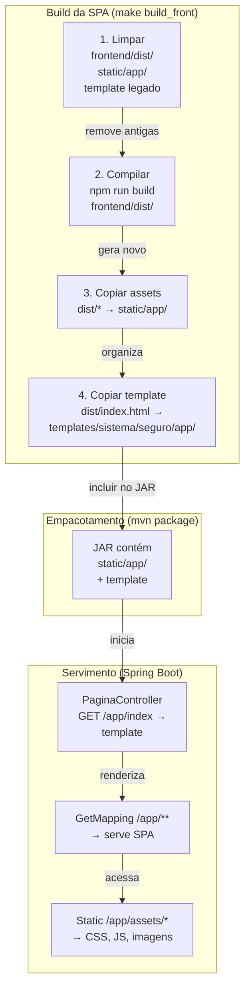

# Frontend integrado ao backend

Explicação de como o frontend Vue é integrado ao backend Spring Boot em produção, e as diferenças entre desenvolvimento e ambiente integrado.

## Contexto

O login_base usa uma estratégia de **integração em dois níveis**:

1. **Desenvolvimento:** Vite dev server roda em `localhost:5173` com hot reload; proxy encaminha requisições para o backend em 8080.
2. **Produção:** Build do Vite é copiado para dentro do JAR do backend; uma única porta (8080) serve tudo.

Não há Nginx separado nem CORS; o frontend é parte integral do backend.

## Como funciona

O diagrama abaixo mostra o fluxo de build e servimento da SPA:



### Desenvolvimento

1. **Frontend roda em container** (ou localhost com Node):
   ```bash
   docker compose up frontend
   # ou
   npm run dev  # em frontend/
   ```

2. **Vite serve em `http://localhost:5173`**:
   - Hot Module Reloading (HMR) ativo.
   - Proxy em `vite.config.ts` encaminha:
     - `/api/**`, `/login`, `/logout`, `/css/**` → `http://localhost:8080`
     - Outros → aplicação Vue local

3. **Backend roda em `http://localhost:8080`**:
   - Spring Boot serve `/login` (formulário), `/logout` e `/api/**`.
   - Não serve a SPA (o frontend vem de 5173).

4. **Fluxo**:
   - Navegador acessa `http://localhost:5173`.
   - Vite serve `index.html` da SPA.
   - Requisições `/api/*` são proxiadas para 8080.
   - `login` / `logout` são redirecionamentos para o formulário em 8080 (em desenvolvimento).
   - Após login bem-sucedido, volta para a SPA em 5173.

> **Problema conhecido:** O `docker-compose.yml` passa `BACKEND_URL`, mas o Vite lê `VITE_BACKEND_URL`. Dentro do container, o proxy cai para o padrão `http://localhost:8080` (ver `vite.config.ts`).

### Produção (integrado)

1. **Build da SPA**:
   ```bash
   make build_front
   # ou
   python3 scripts/build_front.py
   ```
   
   Este script:
   - Remove `frontend/dist/`, `src/main/resources/static/app/` e template legado.
   - Executa `docker compose run --rm --build frontend-build` (que roda `npm run build`).
   - Copia `frontend/dist/index.html` para `src/main/resources/templates/sistema/seguro/app/index.html`.
   - Copia todo o resto de `frontend/dist/` para `src/main/resources/static/app/`.

2. **Build do backend**:
   ```bash
   ./mvnw -DskipTests package
   ```
   
   O JAR resultante em `target/login-base-0.0.1-SNAPSHOT.jar` contém:
   - Código Java compilado.
   - Banco de dados (migrações Flyway).
   - Template da SPA: `BOOT-INF/classes/templates/sistema/seguro/app/index.html`.
   - Assets da SPA: `BOOT-INF/classes/static/app/` (CSS, JS, imagens, fontes).

3. **Execução**:
   ```bash
   java -jar target/login-base-0.0.1-SNAPSHOT.jar
   ```
   
   O Spring Boot inicia em `http://localhost:8080`:
   - GET `/login` → template Thymeleaf (`templates/sistema/public/login.html`).
   - POST `/login` → autentica e redireciona.
   - GET `/app/index` → serve `templates/sistema/seguro/app/index.html` (a SPA).
   - GET `/app/**` (rotas de 1 a 5 níveis) → serve a mesma SPA (vue-router rota no cliente).
   - GET `/app/assets/...` → serve estáticos de `static/app/`.

## Configuração da SPA

### `vite.config.ts` (desenvolvimento)

```typescript
proxy: {
  '/api': {
    target: process.env.VITE_BACKEND_URL ?? 'http://localhost:8080',
    changeOrigin: false  // Importante: mantém o host como localhost:5173
  },
  '/login': { target: '...', ... },
  '/logout': { target: '...', ... },
  '/css': { target: '...', ... }
}
```

**`changeOrigin: false`:** O navegador vê o origin como `http://localhost:5173` mesmo quando proxiado. Isso faz com que o redirecionamento pós-login volta para 5173 (não 8080).

### `frontend/src/router/index.ts`

O vue-router mapeia rotas de `/app/**`:

```typescript
const router = createRouter({
  history: createWebHistory(import.meta.env.BASE_URL),  // BASE_URL = '/app/' em produção, '/' em dev
  routes: [
    { path: '/', name: 'home', component: HomeView, alias: '/index' },
  ]
})
```

**Alias:** A rota `/` tem alias `/index` porque o backend entrega a SPA em `/app/index`.

**`BASE_URL`:** Em desenvolvimento lê de `import.meta.env.BASE_URL` (padrão `/` do Vite). Em produção, `vite.config.ts` define `base: '/app/'`, então o router usa `/app/` como base, e a rota `/` vira `/app/` ou `/app/index` (via alias).

### PaginaController (servimento da SPA)

```java
@GetMapping({
    "/app/index",
    "/app/{s1:[^.]+}",
    "/app/{s1}/{s2:[^.]+}",
    // ... até 5 níveis
    "/app/{s1}/{s2}/{s3}/{s4}/{s5:[^.]+}"
})
String index() {
    return "sistema/seguro/app/index";  // Template Thymeleaf
}
```

**Padrões:** Casam `/app/**` até 5 níveis, mas **sem extensão** no último segmento (`[^.]+` = "sem ponto"). Rotas como `/app/assets/style.css` caem fora e são servidas como estáticos.

## CSRF na SPA

Na produção integrada, a SPA obtém o CSRF token de forma automática:

1. **Spring Boot gera** um cookie `XSRF-TOKEN` após `GET /login` ou `GET /app/index`.
2. **A SPA (ou cliente fetch/axios)** lê o cookie `XSRF-TOKEN`.
3. **Em mutações** (POST, PUT, DELETE), inclui o cabeçalho `X-XSRF-TOKEN` com o valor do cookie.
4. **Spring Security** valida `X-XSRF-TOKEN` contra o cookie (automático com `csrf.spa()`).

Em desenvolvimento, o proxy mantém os cookies, então funciona da mesma forma.

## Por que é assim

Decisão registrada em [ADR 0011 — SPA servida pelo Spring](./decisoes/0011-spa-servida-pelo-spring-em-app.md):

- **Vantagem:** Uma única aplicação; deploy simples; não precisa de Nginx ou gerenciamento de múltiplos origins.
- **Desvantagem:** O frontend está acoplado ao backend (não pode ser deployado separadamente); em desenvolvimento o proxy adiciona complexidade (mas permite hot reload).
- **Alternativas descartadas:**
  - Nginx separado: infraestrutura mais complexa.
  - CORS + JWT: não é objetivo de segurança (sessões HTTP são suficientes para este projeto).

## Limitações

- **Uma porta só:** Frontend e backend devem usar a mesma porta em produção (ambos em 8080).
- **Base `/app/` fixa:** Não é fácil servir a SPA em um caminho diferente (seria necessário ajustar `vite.config.ts`, `PaginaController` e `vue-router`).
- **Sem build incremental:** O `build_front.py` sempre limpa e reconstrói tudo (garantia de limpeza).

## Veja também

- [Arquitetura](./arquitetura.md)
- [Desenvolver o frontend](../guias/desenvolver-o-frontend.md) (guia prático)
- [Gerar o build de produção](../guias/gerar-o-build-de-producao.md)
- [ADR 0003 — Frontend Vue em container](./decisoes/0003-frontend-vue-primevue-em-container.md)
- [ADR 0011 — SPA servida pelo Spring](./decisoes/0011-spa-servida-pelo-spring-em-app.md)
