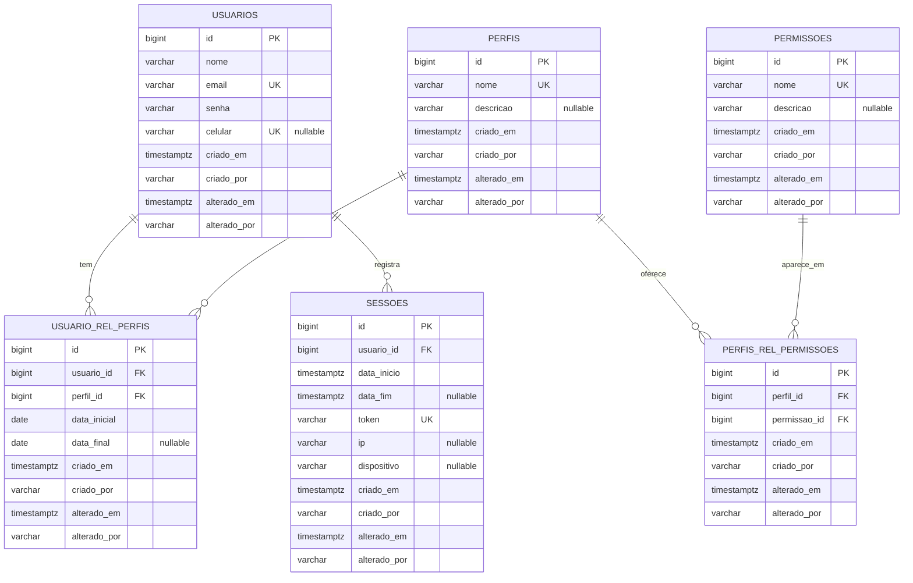

# Modelo de dados

Diagrama e referência das tabelas de controle de acesso, com colunas, tipos, restrições e relacionamentos.

O diagrama abaixo mostra as seis tabelas principais, seus atributos e os relacionamentos entre elas:

## Tabelas

### `usuarios`

Registro de usuários do sistema.

| Coluna | Tipo | Nulo | Restrições | Observações |
|---|---|---|---|---|
| `id` | `bigint` | Não | `PRIMARY KEY`, `GENERATED ALWAYS AS IDENTITY` | Identificador único |
| `nome` | `varchar(150)` | Não | | Nome completo |
| `email` | `varchar(150)` | Não | Índice único em `lower(email)` | Identificador de login; normalizado em minúsculas e sem espaços |
| `senha` | `varchar(255)` | Não | | Hash bcrypt com prefixo `{bcrypt}` |
| `celular` | `varchar(11)` | Sim | `UNIQUE`, `CHECK (celular ~ '^[0-9]{11}$')` | 11 dígitos opcionais; identificador de login alternativo |
| `criado_em` | `timestamptz` | Não | | Preenchido pelo JPA Auditing |
| `criado_por` | `varchar(150)` | Não | | E-mail do usuário ou `"sistema"` |
| `alterado_em` | `timestamptz` | Não | | Preenchido pelo JPA Auditing |
| `alterado_por` | `varchar(150)` | Não | | E-mail do usuário ou `"sistema"` |

**Entidade Java:** [`Usuario`](../../../src/main/java/com/example/loginbase/acesso/Usuario.java)

### `perfis`

Papéis ou grupos de usuários.

| Coluna | Tipo | Nulo | Restrições | Observações |
|---|---|---|---|---|
| `id` | `bigint` | Não | `PRIMARY KEY`, `GENERATED ALWAYS AS IDENTITY` | Identificador único |
| `nome` | `varchar(100)` | Não | `UNIQUE` | Nome do perfil (ex.: `ADMIN`) |
| `descricao` | `varchar(255)` | Sim | | Descrição legível |
| `criado_em` | `timestamptz` | Não | | Preenchido pelo JPA Auditing |
| `criado_por` | `varchar(150)` | Não | | E-mail do usuário ou `"sistema"` |
| `alterado_em` | `timestamptz` | Não | | Preenchido pelo JPA Auditing |
| `alterado_por` | `varchar(150)` | Não | | E-mail do usuário ou `"sistema"` |

**Entidade Java:** [`Perfil`](../../../src/main/java/com/example/loginbase/acesso/Perfil.java)

**Seed:** A migração V2 insere o perfil `ADMIN` com `criado_por = "sistema"`.

### `permissoes`

Capacidades ou ações que um perfil pode conceder.

| Coluna | Tipo | Nulo | Restrições | Observações |
|---|---|---|---|---|
| `id` | `bigint` | Não | `PRIMARY KEY`, `GENERATED ALWAYS AS IDENTITY` | Identificador único |
| `nome` | `varchar(100)` | Não | `UNIQUE` | Nome da permissão (ex.: `ver_dashboard`—hipotético) |
| `descricao` | `varchar(255)` | Sim | | Descrição legível |
| `criado_em` | `timestamptz` | Não | | Preenchido pelo JPA Auditing |
| `criado_por` | `varchar(150)` | Não | | E-mail do usuário ou `"sistema"` |
| `alterado_em` | `timestamptz` | Não | | Preenchido pelo JPA Auditing |
| `alterado_por` | `varchar(150)` | Não | | E-mail do usuário ou `"sistema"` |

**Entidade Java:** [`Permissao`](../../../src/main/java/com/example/loginbase/acesso/Permissao.java)

### `usuario_rel_perfis`

Vínculo entre usuários e perfis com vigência temporal.

| Coluna | Tipo | Nulo | Restrições | Observações |
|---|---|---|---|---|
| `id` | `bigint` | Não | `PRIMARY KEY`, `GENERATED ALWAYS AS IDENTITY` | Identificador único |
| `usuario_id` | `bigint` | Não | `FOREIGN KEY` → `usuarios.id` | Usuário |
| `perfil_id` | `bigint` | Não | `FOREIGN KEY` → `perfis.id` | Perfil |
| `data_inicial` | `date` | Não | `CHECK (data_final IS NULL OR data_final >= data_inicial)` | Primeira data em que o perfil é válido |
| `data_final` | `date` | Sim | (idem check) | Última data em que o perfil é válido; `NULL` = sem fim |
| `criado_em` | `timestamptz` | Não | | Preenchido pelo JPA Auditing |
| `criado_por` | `varchar(150)` | Não | | E-mail do usuário ou `"sistema"` |
| `alterado_em` | `timestamptz` | Não | | Preenchido pelo JPA Auditing |
| `alterado_por` | `varchar(150)` | Não | | E-mail do usuário ou `"sistema"` |

**Entidade Java:** [`UsuarioPerfil`](../../../src/main/java/com/example/loginbase/acesso/UsuarioPerfil.java)

**Regra de vigência:** Um perfil é válido para um usuário se `data_inicial <= data_atual` E (`data_final` é nula OU `data_final >= data_atual`).

### `perfis_rel_permissoes`

Vínculo entre perfis e permissões.

| Coluna | Tipo | Nulo | Restrições | Observações |
|---|---|---|---|---|
| `id` | `bigint` | Não | `PRIMARY KEY`, `GENERATED ALWAYS AS IDENTITY` | Identificador único |
| `perfil_id` | `bigint` | Não | `FOREIGN KEY` → `perfis.id` | Perfil |
| `permissao_id` | `bigint` | Não | `FOREIGN KEY` → `permissoes.id` | Permissão |
| `criado_em` | `timestamptz` | Não | | Preenchido pelo JPA Auditing |
| `criado_por` | `varchar(150)` | Não | | E-mail do usuário ou `"sistema"` |
| `alterado_em` | `timestamptz` | Não | | Preenchido pelo JPA Auditing |
| `alterado_por` | `varchar(150)` | Não | | E-mail do usuário ou `"sistema"` |

**Entidade Java:** [`PerfilPermissao`](../../../src/main/java/com/example/loginbase/acesso/PerfilPermissao.java)

**Restrição:** A constraint `uk_perfis_rel_permissoes unique (perfil_id, permissao_id)` impede associar a mesma permissão duas vezes a um perfil (V1).

### `sessoes`

Registro de aberturas e encerramentos de sessões autenticadas.

| Coluna | Tipo | Nulo | Restrições | Observações |
|---|---|---|---|---|
| `id` | `bigint` | Não | `PRIMARY KEY`, `GENERATED ALWAYS AS IDENTITY` | Identificador único |
| `usuario_id` | `bigint` | Não | `FOREIGN KEY` → `usuarios.id` | Usuário autenticado |
| `data_inicio` | `timestamptz` | Não | | Início da sessão (após login bem-sucedido) |
| `data_fim` | `timestamptz` | Sim | | Fim da sessão (logout ou expiração); `NULL` = sessão aberta |
| `token` | `varchar(64)` | Não | `UNIQUE` | Hash SHA-256 do ID de sessão HTTP (em hexadecimal) |
| `ip` | `varchar(45)` | Sim | | Endereço IP de origem (sem headers forward) |
| `dispositivo` | `varchar(500)` | Sim | | User-Agent truncado |
| `criado_em` | `timestamptz` | Não | | Preenchido pelo JPA Auditing |
| `criado_por` | `varchar(150)` | Não | | E-mail do usuário ou `"sistema"` |
| `alterado_em` | `timestamptz` | Não | | Preenchido pelo JPA Auditing |
| `alterado_por` | `varchar(150)` | Não | | E-mail do usuário ou `"sistema"` |

**Entidade Java:** [`Sessao`](../../../src/main/java/com/example/loginbase/acesso/Sessao.java)

**Segurança:** O `token` é um hash SHA-256 do ID da sessão HTTP, não o ID em si. Isso permite rastrear uma sessão sem expor um valor reutilizável para sequestro.

## Campos comuns de auditoria

Todas as seis tabelas têm as mesmas quatro colunas de auditoria (`criado_em`, `criado_por`, `alterado_em`, `alterado_por`). Elas são preenchidas automaticamente pelo [Spring Data JPA Auditing](../explicacoes/auditoria.md):

- **`criado_em` / `alterado_em`:** `timestamptz`, preenche-se na inserção e atualização via `@CreatedDate` / `@LastModifiedDate`.
- **`criado_por` / `alterado_por`:** `varchar(150)`, preenche-se com o e-mail do usuário autenticado via `@CreatedBy` / `@LastModifiedBy`, ou `"sistema"` quando anônimo/ausente.

## Veja também

- [Auditoria](../explicacoes/auditoria.md)
- [Autenticação e sessões](../explicacoes/autenticacao-e-sessoes.md)
- [Criar uma migração Flyway](../guias/criar-uma-migracao-flyway.md)
