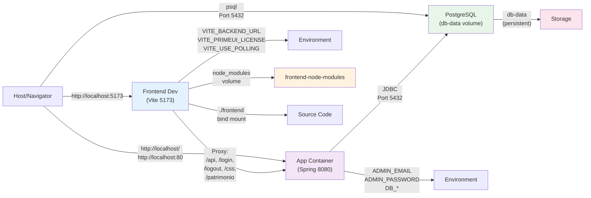

# Serviços Docker Compose

Lista dos serviços gerenciados pelo `docker-compose.yml`, com imagens, profiles, portas, volumes e comportamento.

## Serviços

| Serviço | Imagem/Build | Profile | Portas | Volumes | Observações |
|---|---|---|---|---|---|
| `db` | `postgres:17-trixie` | `PROFILE_DB` (padrão: `local`) | `5432:5432` | `db-data:/var/lib/postgresql/data` | Banco PostgreSQL. Sempre deve estar ativo para desenvolvimento/testes. Variáveis: `POSTGRES_DB`, `POSTGRES_USER`, `POSTGRES_PASSWORD`. |
| `app` | Build: `.` (Dockerfile) | `PROFILE_APP` (padrão: `desativado`) | `80:80` | nenhum | Aplicação Spring Boot compilada. Depende de `db`. Recebe variáveis: `DB_*`, `ADMIN_*`, `JOGO_*`. **Problema conhecido:** porta mapeada é 80, mas app escuta em 8080 (não repassado). |
| `frontend` | Build: `./frontend/${FRONT_APP:-seguro/patrimonio}` | `PROFILE_FRONTEND` (padrão: `local`) | `5173:5173` | `./frontend/${FRONT_APP}:/app`, `frontend-node-modules:/app/node_modules` | Dev server Vite/Vue de um app. `FRONT_APP` seleciona qual app (ex.: `seguro/patrimonio`). Recebe `VITE_*`, `BACKEND_URL` e `JOGO_*`. Hot reload habilitado. Volume `frontend-node-modules` é compartilhado entre apps; ao trocar de app pode ser preciso `make down_v`. |
| `frontend-build` | Build: `./frontend/${FRONT_APP:-seguro/patrimonio}` | `build` (profile especial) | nenhuma | `./frontend/${FRONT_APP}:/app`, `/app/node_modules` (anônimo) | Container auxiliar para `npm run build` (build de produção). Recebe `FRONT_APP_NOME` para o vite. Usado por `scripts/build_front.py` uma vez por app. |

## Volumes

| Volume | Tipo | Conteúdo | Ciclo de vida |
|---|---|---|---|
| `db-data` | Nomeado | Dados do PostgreSQL (`/var/lib/postgresql/data`) | Persiste entre restarts; removível com `make down_v` ou `docker volume rm`. |
| `frontend-node-modules` | Nomeado | Dependências Node.js instaladas em `/app/node_modules` | Persiste entre restarts; compartilhado entre todos os apps (pode ser removido se defasado: `docker volume rm login_base_frontend-node-modules`). **Atenção:** ao trocar de `FRONT_APP`, pode ser preciso `make down_v` para sincronizar. |
| `./frontend/${FRONT_APP}:/app` (bind) | Bind mount | Código-fonte do app selecionado | Mapeado ao diretório do host. Permite edição em tempo real. |
| `/app/node_modules` (anônimo em `frontend-build`) | Anônimo | Dependências temporárias durante o build | Descartado após o build. |

## Diagrama de arquitetura

O diagrama abaixo mostra a relação entre os serviços e como se comunicam:



**Problemas conhecidos do diagrama:**

> **Problema conhecido:** O mapeamento de portas `80:80` não funciona conforme esperado. A aplicação escuta internamente em `8080`, mas `SERVER_PORT` não é repassado ao container `app` no `docker-compose.yml`. (fonte: docker-compose.yml, application.properties)

> **Problema conhecido:** O `docker-compose.yml` passa `BACKEND_URL` (sem prefixo `VITE_`) ao serviço `frontend`, mas Vite espera variáveis com prefixo `VITE_`. O proxy do container aponta para `localhost:8080` do próprio container. (fonte: docker-compose.yml, frontend/vite.config.ts)

## Profiles e como ativá-los

Um profile é um nome que agrupa serviços relacionados. Apenas serviços com `profiles` que correspondem ao(s) profile(s) ativado(s) são iniciados.

- **`PROFILE=local`** (padrão): Ativa todos os serviços com `profiles: ["${PROFILE_DB:-local}"]`, `["${PROFILE_APP:-...}"]`, etc.
- **Ativar manualmente:** `docker compose --profile local up -d` ou via Makefile: `make up`.

Exemplos:

```bash
# Sobe db e frontend (padrão)
make up

# Sobe só db (sem frontend)
make up PROFILE_FRONTEND=desativado

# Sobe db, app e frontend
make up PROFILE_APP=local
```

## Variáveis de ambiente por serviço

> **Nota:** Os valores listados abaixo são os **padrões sem `.env`**. Se você copia `.env.example` para `.env` e o edita, os valores podem ser diferentes. Consulte [`docs/operacao/referencia/variaveis-de-ambiente.md`](variaveis-de-ambiente.md) para definições completas e exemplos.

### `db` (PostgreSQL)

```
POSTGRES_DB=login_base           # Nome do banco
POSTGRES_USER=login_base         # Usuário
POSTGRES_PASSWORD=login_base     # Senha
```

### `app` (Spring Boot)

```
DB_HOST=db                       # Hostname (dentro da rede Docker)
DB_NAME=login_base
DB_USER=login_base
DB_PASSWORD=login_base
ADMIN_EMAIL=admin@loginbase.local
ADMIN_PASSWORD=                  # Vazio = não cria admin
JOGO_VELOCIDADE=1                # Sem uso (a confirmar)
JOGO_EXPOENTE_CURVA=1.5          # Sem uso (a confirmar)
```

### `frontend` (Vite/Vue)

```
VITE_PRIMEUI_LICENSE=            # Vazio = aviso de licença no console
VITE_USE_POLLING=true            # Habilita polling para WSL/DrvFs
BACKEND_URL=http://host.docker.internal  # URL do backend (problema: lê VITE_BACKEND_URL)
JOGO_VELOCIDADE=1                # Passado mas sem uso (a confirmar)
```

### `frontend-build` (Vite/Vue, build)

```
FRONT_APP_NOME=<nome>            # Nome do app (vite.config.ts usa para base: /<nome>/)
```

## Veja também

- [`docs/operacao/referencia/variaveis-de-ambiente.md`](variaveis-de-ambiente.md) — detalhe de cada variável.
- [`docs/operacao/guias/subir-e-derrubar-o-ambiente-docker.md`](../guias/subir-e-derrubar-o-ambiente-docker.md) — como usar o compose.
