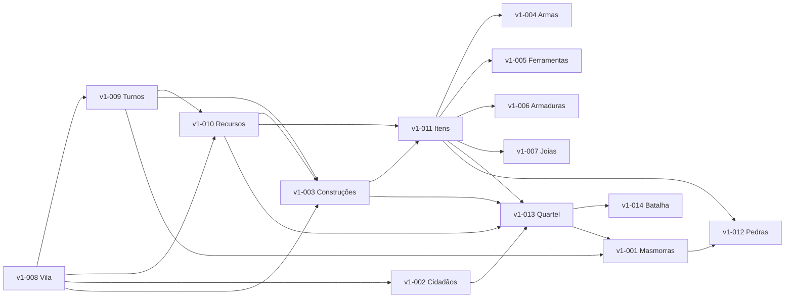

# Roadmap — Jogo de Vila v1

## Visão

Jogo de browser multiusuário e por turnos (1 turno = 1 mês de jogo). Cada jogador autenticado gerencia uma vila com uma grade 4×4 de regiões, cada uma contendo 10×10 ladrilhos. A vila cresce através de construções que produzem recursos, cidadãos que trabalham em prédios e ganham experiência, e expedições a masmorras para obter tesouros e enfrentar inimigos. O jogo combina economia (produção, armazenamento, comércio), gestão populacional (famílias, casamento, reprodução, envelhecimento), fabricação de itens (armas, armaduras, ferramentas, joias), e combate automático contra tropas de inimigos.

## Princípios

- **Multiusuário autenticado**: cada usuário tem exatamente 1 vila; todas as APIs filtram pela vila do usuário logado.
- **Turno global**: todos os jogadores seguem o mesmo número de turno, processado a cada 60 minutos reais = 1 mês de jogo; 12 turnos = 1 ano.
- **Regras em validação**: todas as marcações **[proposta]** neste roadmap aguardam validação com o usuário antes de serem implementadas.

## Épicos

| ID | Épico | Doc principal | Depende de | Fase |
|---|---|---|---|---|
| v1-001 | Masmorras | [masmorras.md](jogo/v1-001-masmorras/masmorras.md) | v1-008, v1-009, v1-013 | 5 |
| v1-002 | Cidadãos | [cidadao.md](jogo/v1-002-cidadaos/cidadao.md) | v1-008 | 2 |
| v1-003 | Construções | [construcoes.md](jogo/v1-003-construcoes/construcoes.md) | v1-008, v1-009, v1-010 | 2 |
| v1-004 | Armas | [armas.md](jogo/v1-004-armas/armas.md) | v1-011 | 3 |
| v1-005 | Ferramentas | [ferramentas.md](jogo/v1-005-ferramentas/ferramentas.md) | v1-011 | 3 |
| v1-006 | Armaduras | [armaduras.md](jogo/v1-006-Armaduras/armaduras.md) | v1-011 | 3 |
| v1-007 | Joias | [joias.md](jogo/v1-007-Joias/joias.md) | v1-011 | 3 |
| v1-008 | Vila e mapa | [vila.md](jogo/v1-008-vila-e-mapa/vila.md) | — | 1 |
| v1-009 | Turnos | [turnos.md](jogo/v1-009-turnos/turnos.md) | v1-008 | 1 |
| v1-010 | Recursos e produção | [recursos.md](jogo/v1-010-recursos-e-producao/recursos.md) | v1-008, v1-009 | 1 |
| v1-011 | Itens e fabricação | [itens.md](jogo/v1-011-itens-e-fabricacao/itens.md) | v1-003, v1-010 | 3 |
| v1-012 | Pedras de bônus | [pedras-de-bonus.md](jogo/v1-012-pedras-de-bonus/pedras-de-bonus.md) | v1-001, v1-011 | 5 |
| v1-013 | Quartel e tropas | [tropas.md](jogo/v1-013-quartel-e-tropas/tropas.md) | v1-002, v1-003, v1-010, v1-011 | 4 |
| v1-014 | Batalha | [batalha.md](jogo/v1-014-batalha/batalha.md) | v1-013 | 4 |

## Fases de entrega

### Fase 1 — Fundação
Estabelecer a estrutura base da vila, mapa e ciclo de turnos.

**Épicos:**
- [v1-008 Vila e mapa](jogo/v1-008-vila-e-mapa/vila.md)
- [v1-009 Turnos](jogo/v1-009-turnos/turnos.md)
- [v1-010 Recursos e produção](jogo/v1-010-recursos-e-producao/recursos.md)

**Critério de saída:** Criação de vila com 3 regiões iniciais e tipos, grade 4×4 visualizável, turnos processados a cada 60 min, produção base de recursos.

### Fase 2 — Economia e população
Adicionar população, construções e gestão de famílias.

**Épicos:**
- [v1-003 Construções](jogo/v1-003-construcoes/construcoes.md)
- [v1-002 Cidadãos](jogo/v1-002-cidadaos/cidadao.md)

**Critério de saída:** Construir prédios em regiões, alocar trabalhadores, gerenciar famílias (casamento, reprodução, envelhecimento).

### Fase 3 — Itens e ofícios
Implantar sistema de fabricação de itens e ganho de PE por experiência.

**Épicos:**
- [v1-011 Itens e fabricação](jogo/v1-011-itens-e-fabricacao/itens.md)
- [v1-005 Ferramentas](jogo/v1-005-ferramentas/ferramentas.md)
- [v1-004 Armas](jogo/v1-004-armas/armas.md)
- [v1-006 Armaduras](jogo/v1-006-Armaduras/armaduras.md)
- [v1-007 Joias](jogo/v1-007-Joias/joias.md)

**Critério de saída:** Fabricar itens em oficinas, equipar pessoas, melhorar níveis com aprimoramento.

### Fase 4 — Militar
Adicionar sistema de tropas e combate.

**Épicos:**
- [v1-013 Quartel e tropas](jogo/v1-013-quartel-e-tropas/tropas.md)
- [v1-014 Batalha](jogo/v1-014-batalha/batalha.md)

**Critério de saída:** Formar tropas no quartel, enviar em expedição, resolver batalhas automáticas contra inimigos.

### Fase 5 — Masmorras
Incorporar masmorras, evolução de níveis e recompensas.

**Épicos:**
- [v1-001 Masmorras](jogo/v1-001-masmorras/masmorras.md)
- [v1-012 Pedras de bônus](jogo/v1-012-pedras-de-bonus/pedras-de-bonus.md)

**Critério de saída:** Masmorras surgem e evoluem em regiões não possuídas; vitória libera regiões e recompensas; derrota restaura masmorra.

## Dependências entre épicos

## Fora da v1

- Comércio entre jogadores (Mercado NPC está incluído; troca entre contas não).
- Incursões de masmorras nível 10 em regiões possuídas.
- Controle manual de tropas em batalha (v1 é automático).
- Troca de tipo de região após criação.
- Esgotamento de ladrilhos de coleta.

## Questões em aberto

1. Adjacência só ortogonal; ≥1 região Urbana obrigatória no início; tipo de região imutável.
2. Turno global de 60 min reais = 1 mês; 12 turnos = 1 ano (18 anos ≈ 9 dias reais).
3. Madeireiro ligado a Força e Vitalidade **[proposta]** (não vinha no requisito).
4. Agricultor = plantio; Fazendeiro = criação (separação de profissões).
5. Eficiência = 0,5 + 0,1 × PE efetivo (máx. 3,0); qualquer pessoa 14–64 trabalha **[proposta]**.
6. Casas N2 = 2 núcleos/10 vagas; N3 = 4 núcleos/24 vagas **[proposta]**.
7. Herança = 25% da média dos pais; pontos de crescimento distribuídos pelo jogador **[proposta]**.
8. Concepção 8%/turno, gestação 9 turnos, fértil 18–45; casal homem+mulher para reproduzir **[proposta]**.
9. Morte anual a partir de 50 anos (1% × (idade−49) − 0,2% × VIT); 90 anos = morte certa **[proposta]**.
10. Novos recursos/prédios "entre outros": Carvão, Caça, Fibra, Lã, Tábua, Tijolo, Ferro, Aço, Tecido, Couro curtido, Refeição, Ouro **[proposta]**.
11. Ferramentas: Martelo, Carrinho de mão, Enxada, Forcado, Picareta, Machado, Malho, Cutelo, Kit de costura, Faca de caça, Balança (+L PE) **[proposta]**.
12. Item Simples = 0 slots/0 bônus; 2 anéis por pessoa; aprimoramento de item permitido **[proposta]**.
13. Fórmulas de batalha (seção 10) e 30 rodadas máximas; batalha automática (sem comando manual) **[proposta]**.
14. Masmorras: 1%/região/turno, máx. 3, +1 nível a cada 18 turnos sem ataque; derrota restaura a masmorra **[proposta]**.
15. Morte de abatidos (20% na vitória, 50% na derrota) e perda de itens na derrota **[proposta]**.
